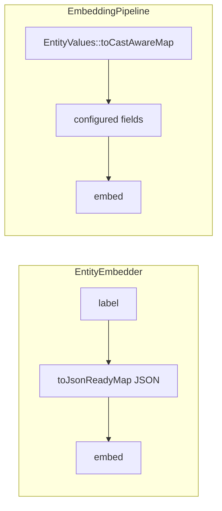

# AI Integration

<!-- Spec reviewed 2026-06-12 - mission optimistic-locking-01KTXCHY WP03 (#1647): new "Optimistic Locking on the Stock Entity Tools" section — entity.update gains the optional top-level expected_revision_id argument (integer, minimum 1; an argument, never a writable value — values.revision_id stays key-guard-refused); stale expectation → structured two-block revision_conflict error (expected + current, machine-correctable: re-read/re-diff/retry); unsupported paths (storage LogicException matrix, non-concrete repository) → distinct revision_expectation_unsupported (do not retry); dry-run with an expectation reports the byte-identical conflict payload (shared builder); success payloads carry the post-save revision_id; entity.read/entity.list expose a top-level revision_id member on revisionable entities (omitted = no expectation formable); SC-002 approve-time staleness recipe pointer to the mission quickstart as the canonical consumer pattern. No-expectation calls byte-identical. -->
<!-- Spec reviewed 2026-06-12 - mission live-entity-validation-key-protection-01KTWQT3 (#1646, alpha.204): new "Identity-Key Write Protection" section — the stock entity agent tools (entity.create / entity.update in packages/ai-tools) refuse identity-key writes whole-write via EntityKeyGuard, and surface save-time EntityValidationException as the structured validation_failed error. label/bundle never refused; revision_log stays writable via its dedicated argument; #1638 scoped writes noted as the separate broader mechanism. -->
<!-- Spec reviewed 2026-04-09k - `EmbeddingPipeline`, `McpToolExecutor`, and `SearchController` read entity fields through `EntityValues::toCastAwareMap()` / `WorkflowVisibility::isNodePublicForEntity()` (#1181 ST-8) -->
<!-- Spec reviewed 2026-04-09 ST-9 - embedding text extraction vs EntityEmbedder; MCP cast-aware payloads (#1181) -->
<!-- Spec reviewed 2026-04-09 ST-10 - EntityEmbedder / EntityEmbeddingListener / SemanticIndexWarmer use EntityValues + WorkflowVisibility::isNodePublicForEntity (#1181) -->

Waaseyaa's AI layer (architecture layer 5) provides four packages that enable AI agents to introspect, mutate, and search CMS content. All four packages sit in the `packages/` directory and follow the standard `Waaseyaa\AI\*` namespace pattern.

## Packages

| Package | Namespace | Path | Purpose |
|---------|-----------|------|---------|
| ai-schema | `Waaseyaa\AI\Schema\` | `packages/ai-schema/src/` | JSON Schema generation, MCP tool definitions, tool execution |
| ai-agent | `Waaseyaa\AI\Agent\` | `packages/ai-agent/src/` | Agent executor, audit logging, MCP server adapter |
| ai-pipeline | `Waaseyaa\AI\Pipeline\` | `packages/ai-pipeline/src/` | Processing pipelines, step orchestration, async dispatch |
| ai-vector | `Waaseyaa\AI\Vector\` | `packages/ai-vector/src/` | Vector embeddings, similarity search, distance metrics |

### Package Dependencies

```
ai-schema   -> entity
ai-agent    -> ai-schema, access
ai-pipeline -> entity, queue
ai-vector   -> entity
```

`ai-agent` depends on `ai-schema` for `McpToolExecutor` and on `access` for `AccountInterface`. `ai-pipeline` depends on `queue` for async dispatch via `QueueInterface`. `ai-vector` and `ai-schema` depend only on `entity`.

## Schema Generation

**File:** `packages/ai-schema/src/EntityJsonSchemaGenerator.php`
**Class:** `Waaseyaa\AI\Schema\EntityJsonSchemaGenerator`

Generates JSON Schema (draft 2020-12) from registered entity types. Takes an `EntityTypeManagerInterface` and inspects entity type definitions to produce a schema array.

### Constructor

```php
public function __construct(
    private readonly EntityTypeManagerInterface $entityTypeManager,
)
```

### Key Methods

- `generate(string $entityTypeId): array` -- Produces a single JSON Schema for one entity type.
- `generateAll(): array` -- Returns schemas for all registered entity types, keyed by entity type ID.

### Schema Shape

The generated schema maps entity keys to JSON Schema properties:

| Entity Key | JSON Schema Type | Required |
|------------|-----------------|----------|
| id | `['integer', 'string']` | Yes |
| uuid | `string` (format: uuid) | Yes |
| label | `string` | Yes |
| bundle | `string` | Yes |
| langcode | `string` | No |
| revision | `integer` (only if revisionable) | No |

The output always includes `'$schema' => 'https://json-schema.org/draft/2020-12/schema'` and sets `'additionalProperties' => true` to allow non-key fields.

## MCP Tool System

### McpToolDefinition

**File:** `packages/ai-schema/src/Mcp/McpToolDefinition.php`
**Class:** `Waaseyaa\AI\Schema\Mcp\McpToolDefinition`

Readonly value object matching the MCP tool registration format:

```php
final readonly class McpToolDefinition
{
    public function __construct(
        public string $name,        // snake_case, e.g. "create_node"
        public string $description, // human-readable
        public array $inputSchema,  // JSON Schema for input params
    ) {}

    public function toArray(): array; // MCP-compliant serialization
}
```

### McpToolGenerator

**File:** `packages/ai-schema/src/Mcp/McpToolGenerator.php`
**Class:** `Waaseyaa\AI\Schema\Mcp\McpToolGenerator`

For each registered entity type, generates five CRUD+query tools:

| Tool Pattern | Operation | Required Arguments |
|-------------|-----------|-------------------|
| `create_{type}` | Create entity | `attributes` |
| `read_{type}` | Read by ID | `id` |
| `update_{type}` | Update entity | `id`, `attributes` |
| `delete_{type}` | Delete by ID | `id` |
| `query_{type}` | Query with filters | (all optional) |

All tools accept optional `langcode` and `fallback` parameters for multilingual operations. The query tool supports `filters` (array of `{field, value, operator}`), `sort` (prefix `-` for descending), `limit` (default 50), and `offset` (default 0).

### TranslationToolGenerator

**File:** `packages/ai-schema/src/Mcp/TranslationToolGenerator.php`
**Class:** `Waaseyaa\AI\Schema\Mcp\TranslationToolGenerator`

Generates four translation-specific tools per entity type:

| Tool Pattern | Required Arguments |
|-------------|-------------------|
| `{type}_translations_list` | `id` |
| `{type}_translation_create` | `id`, `langcode`, `attributes` |
| `{type}_translation_update` | `id`, `langcode`, `attributes` |
| `{type}_translation_delete` | `id`, `langcode` |

### McpToolExecutor

**File:** `packages/ai-schema/src/Mcp/McpToolExecutor.php`
**Class:** `Waaseyaa\AI\Schema\Mcp\McpToolExecutor`

Executes MCP tool calls against the entity system. Parses tool names by iterating known operations (`create`, `read`, `update`, `delete`, `query`) and extracting the entity type ID from the suffix.

```php
public function execute(string $toolName, array $arguments): array
```

Returns MCP-compliant result arrays: `{content: [{type: 'text', text: JSON}]}` on success, with `isError: true` on failure. All JSON encoding uses `JSON_THROW_ON_ERROR`.

**Important:** The query operation calls `$query->accessCheck(false)` because MCP tool calls run in an AI agent context where access is managed at the agent level, not the query level.

**Important:** The update operation checks `$entity instanceof FieldableInterface` before calling `set()`. Non-fieldable entities return an error.

**Cast-aware payloads (#1181):** Successful `read`, `update`, and `query` results embed entity rows under **`data` using `EntityValues::toCastAwareMap($entity)`** so MCP clients see the same domain-shaped field values as `get()` (enums, datetimes, decoded JSON arrays). See `docs/specs/entity-system.md` and `docs/specs/jsonapi.md`.

## SchemaRegistry

**File:** `packages/ai-schema/src/SchemaRegistry.php`
**Class:** `Waaseyaa\AI\Schema\SchemaRegistry`

Central facade combining JSON Schema and MCP tool outputs. Provides a unified API for AI agents to discover the full CMS surface area.

```php
final class SchemaRegistry
{
    public function __construct(
        private readonly EntityJsonSchemaGenerator $schemaGenerator,
        private readonly McpToolGenerator $toolGenerator,
    ) {}

    public function getSchema(string $entityTypeId): array;
    public function getAllSchemas(): array;
    public function getTools(): array;          // cached via null coalescing
    public function getTool(string $name): ?McpToolDefinition;
}
```

Tool definitions are cached in-memory via `$this->toolCache ??= $this->toolGenerator->generateAll()`. The cache lives for the request lifetime only.

## Agent Execution

### AgentInterface

**File:** `packages/ai-agent/src/AgentInterface.php`
**Class:** `Waaseyaa\AI\Agent\AgentInterface`

```php
interface AgentInterface
{
    public function execute(AgentContext $context): AgentResult;
    public function dryRun(AgentContext $context): AgentResult;
    public function describe(): string;
}
```

All agents must support both `execute()` (real mutations) and `dryRun()` (preview without changes). The `describe()` method returns a human-readable summary of the agent's purpose.

### AgentContext

**File:** `packages/ai-agent/src/AgentContext.php`
**Class:** `Waaseyaa\AI\Agent\AgentContext`

```php
final readonly class AgentContext
{
    public function __construct(
        public AccountInterface $account,   // user the agent acts as
        public array $parameters = [],      // agent-specific params
        public bool $dryRun = false,
        public int $maxIterations = 25,     // max tool loop iterations
    ) {}
}
```

Agents always operate as a specific user via `AccountInterface`. The `$parameters` array carries agent-specific input data. `$maxIterations` caps the provider tool loop — `AgentExecutor` throws `MaxIterationsException` when exceeded.

### AgentResult and AgentAction

**File:** `packages/ai-agent/src/AgentResult.php`

```php
final readonly class AgentResult
{
    public bool $success;
    public string $message;
    public array $data;
    public array $actions;   // AgentAction[]

    public static function success(string $message, array $data = [], array $actions = []): self;
    public static function failure(string $message, array $data = []): self;
}
```

**File:** `packages/ai-agent/src/AgentAction.php`

```php
final readonly class AgentAction
{
    public string $type;         // 'create', 'update', 'delete', 'tool_call'
    public string $description;  // human-readable
    public array $data;          // structured action data
}
```

### AgentExecutor

**File:** `packages/ai-agent/src/AgentExecutor.php`
**Class:** `Waaseyaa\AI\Agent\AgentExecutor`

Wraps agent execution with safety guarantees and audit logging. Five execution paths:

1. `execute(AgentInterface, AgentContext): AgentResult` -- Full execution with try/catch.
2. `dryRun(AgentInterface, AgentContext): AgentResult` -- Preview mode with try/catch.
3. `executeTool(string $toolName, array $arguments, AgentContext): array` -- MCP tool call on behalf of an agent.
4. `executeWithProvider(AgentInterface, AgentContext, ProviderInterface): AgentResult` -- Multi-turn tool loop with an LLM provider. Checks `AgentContext::maxIterations` per iteration; throws `MaxIterationsException` when exceeded.
5. `streamWithProvider(AgentInterface, AgentContext, StreamingProviderInterface, callable $onChunk): AgentResult` -- Streaming variant forwarding `StreamChunk` objects in real time.

All paths log to an in-memory audit log. Exceptions are caught and converted to failure results, never propagated. The `executeTool()` method delegates to `McpToolExecutor::execute()`.

### Audit Logging

**File:** `packages/ai-agent/src/AgentAuditLog.php`

```php
final readonly class AgentAuditLog
{
    public string $agentId;    // agent FQCN or 'tool'
    public int $accountId;     // user ID the agent acted as
    public string $action;     // 'execute', 'dry_run', or 'tool_call'
    public bool $success;
    public string $message;
    public array $data;
    public int $timestamp;     // Unix timestamp
}
```

The audit log is in-memory (`AgentExecutor::$auditLog`), retrieved via `getAuditLog()`, and accumulates across multiple executions within the same executor instance.

### MCP endpoint

The framework's MCP-facing surface is `Waaseyaa\Mcp\McpServerCard` in `packages/mcp/`, wired by `McpRouteProvider` at `/.well-known/mcp.json`. See `docs/specs/mcp-endpoint.md`. The earlier `Waaseyaa\AI\Agent\McpServer` `tools/list` + `tools/call` adapter was deleted as orphan scaffolding (closes #1498); it was never reached and duplicated nothing the production path needed. If a `tools/list` / `tools/call` JSON-RPC surface becomes a requirement, it will be designed against the `McpServerCard` path, not resurrected.

## LLM Provider System

### ProviderInterface

**File:** `packages/ai-agent/src/Provider/ProviderInterface.php`

```php
interface ProviderInterface
{
    public function sendMessage(MessageRequest $request): MessageResponse;
}
```

### StreamingProviderInterface

**File:** `packages/ai-agent/src/Provider/StreamingProviderInterface.php`

```php
interface StreamingProviderInterface extends ProviderInterface
{
    /** @param callable(StreamChunk): void $onChunk */
    public function streamMessage(MessageRequest $request, callable $onChunk): MessageResponse;
}
```

### AnthropicProvider

**File:** `packages/ai-agent/src/Provider/AnthropicProvider.php`
**Implements:** `StreamingProviderInterface`

```php
final class AnthropicProvider implements StreamingProviderInterface
{
    public function __construct(
        private readonly string $apiKey,
        private readonly string $model = 'claude-sonnet-4-20250514',
    );

    public function sendMessage(MessageRequest $request): MessageResponse;
    public function streamMessage(MessageRequest $request, callable $onChunk): MessageResponse;
    public function buildRequestBody(MessageRequest $request): array;
    public function parseResponse(array $data): MessageResponse;
    public function parseSseEvents(array $lines, callable $onChunk): array;
}
```

Uses cURL for HTTP. `CURLOPT_WRITEFUNCTION` callbacks must not throw — `json_decode` is wrapped in try-catch inside callbacks. Error handling parses error bodies and handles HTTP 429 with `RateLimitException`.

### Message Block Value Objects

**File:** `packages/ai-agent/src/Provider/ToolUseBlock.php`

```php
final readonly class ToolUseBlock
{
    public function __construct(
        public string $id,
        public string $name,
        public array $input,     // array<string, mixed>
    );
}
```

**File:** `packages/ai-agent/src/Provider/ToolResultBlock.php`

```php
final readonly class ToolResultBlock
{
    public function __construct(
        public string $toolUseId,
        public string $content,
        public bool $isError = false,
    );

    public function toArray(): array;  // {type, tool_use_id, content, is_error}
}
```

**File:** `packages/ai-agent/src/Provider/StreamChunk.php`

```php
final readonly class StreamChunk
{
    public function __construct(
        public string $type,
        public string $text = '',
        public ?ToolUseBlock $toolUse = null,
    );
}
```

### Provider Exceptions

**File:** `packages/ai-agent/src/Provider/RateLimitException.php`

```php
final class RateLimitException extends \RuntimeException
{
    public function __construct(
        public readonly int $retryAfterSeconds,
        string $message = '',
    );
}
```

Thrown by `AnthropicProvider` on HTTP 429. `$retryAfterSeconds` parsed from the `retry-after` header.

**File:** `packages/ai-agent/src/Provider/MaxIterationsException.php`

```php
final class MaxIterationsException extends \RuntimeException
{
    public function __construct(int $maxIterations);
}
```

Thrown by `AgentExecutor` when the tool loop exceeds `AgentContext::$maxIterations`.

## Hybrid Search Ranking Contract

The AI vector search surface is implemented by `Waaseyaa\AI\Vector\SearchController` (`packages/ai-vector/src/SearchController.php`).

When an embedding provider is available, search runs in semantic mode and may apply relationship-context reranking:

- Base semantic score from embedding similarity.
- Graph context boost from published relationship adjacency.
- Deterministic tie-break by original semantic order.

When graph reranking changes order, JSON:API response meta includes:

- `contract_version: v1.0`
- `contract_surface: semantic_search`
- `contract_stability: stable`
- `semantic_extension_hooks: [graph_context_rerank]`
- `ranking: semantic+graph_context`
- `ranking_weights`:
  - `semantic` (default `1.0`)
  - `graph_context` (default `0.001`)
- `graph_context_counts`: per-result relationship degree used in rerank
- `score_breakdown`: per-result deterministic explainability payload:
  - `semantic`
  - `graph_context`
  - `combined`
  - `base_rank`

Workflow visibility remains enforced at search output: node entities are only returned when resolved workflow state is `published`.

## AI-Assisted Discovery Blend Contract (v1.0)

The MCP discovery surface now exposes a deterministic blend contract via the `ai_discover` tool (`Waaseyaa\Mcp\McpController`):

- Input:
  - `query` (required, non-empty)
  - `type` (optional, defaults to `node`)
  - `limit` (optional, clamped `1..100`)
  - optional anchor pair `anchor_type` + `anchor_id` (must be provided together)
- Search foundation:
  - delegates to `SearchController` to preserve semantic/keyword fallback behavior and workflow visibility (`published` only for node output).
- Explainability output:
  - recommendations include deterministic explanation fields:
    - `semantic_score`
    - `graph_context_score`
    - `combined_score`
    - `base_rank`
    - `visibility_contract` (`published_only`)
- Graph context output:
  - when anchor is present, response includes anchor graph summary (`outbound`, `inbound`, `total`, and relationship type counts) computed with published-only relationship traversal.
- Enforcement:
  - anchor entity must exist and pass `view` access checks,
  - node anchors must be public (`workflow_state=published` or equivalent status),
  - invalid params return JSON-RPC `-32602`; authorization/publicity failures return execution error `-32000`.
- Stable metadata:
  - MCP tool payloads include `meta.contract_version = v1.0` and `meta.contract_stability = stable`.
  - `search_entities` is the canonical MCP semantic search tool name; `search_teachings` is a deprecated alias retained for compatibility.

## Pipeline System

### Pipeline (Config Entity)

**File:** `packages/ai-pipeline/src/Pipeline.php`
**Class:** `Waaseyaa\AI\Pipeline\Pipeline`

Config entity (extends `ConfigEntityBase`) with entity type ID `'pipeline'` and keys `{id, label}`. Contains an ordered list of `PipelineStepConfig` objects.

Constructor accepts `array $values` with optional `description` (string) and `steps` (array of step data or `PipelineStepConfig` objects).

**Critical:** The Pipeline class uses `syncStepsToValues()` to prevent the dual-state bug pattern documented in CLAUDE.md. Step data is always kept in sync between the `$this->steps` array and `$this->values['steps']`. Any mutation (`addStep()`, `removeStep()`) calls `syncStepsToValues()` immediately.

### PipelineStepConfig

**File:** `packages/ai-pipeline/src/PipelineStepConfig.php`

```php
final readonly class PipelineStepConfig
{
    public string $id;            // step ID within the pipeline
    public string $pluginId;      // plugin ID of the step implementation
    public string $label;
    public int $weight;           // execution order (lower = first)
    public array $configuration;  // step-specific config
}
```

### PipelineStepInterface

**File:** `packages/ai-pipeline/src/PipelineStepInterface.php`

```php
interface PipelineStepInterface
{
    public function process(array $input, PipelineContext $context): StepResult;
    public function describe(): string;
}
```

Steps receive input from the previous step (or the pipeline trigger) and return a `StepResult`. The `PipelineContext` carries shared state across all steps.

### StepResult

**File:** `packages/ai-pipeline/src/StepResult.php`

Three factory methods control pipeline flow:

- `StepResult::success(array $output, string $message)` -- Continue to next step.
- `StepResult::failure(string $message, array $output)` -- Stop pipeline, mark as failed.
- `StepResult::halt(string $message, array $output)` -- Stop pipeline, mark as succeeded.

The `$stopPipeline` flag (set by `halt()`) triggers early exit without failure.

### PipelineExecutor

**File:** `packages/ai-pipeline/src/PipelineExecutor.php`
**Class:** `Waaseyaa\AI\Pipeline\PipelineExecutor`

Synchronous executor. Takes a map of `PipelineStepInterface` implementations keyed by plugin ID.

```php
public function __construct(private readonly array $stepPlugins = [])
public function execute(Pipeline $pipeline, array $input = []): PipelineResult
```

Execution flow:
1. Gets steps from the pipeline (sorted by weight).
2. Creates a `PipelineContext` with the pipeline ID and start timestamp.
3. Iterates steps in weight order. Each step's `$output` becomes the next step's `$input`.
4. Before each step, sets `_step_configuration` in the context.
5. Stops on: step failure, step halt, or missing plugin ID.
6. Returns `PipelineResult` with timing info (`hrtime(true)` for nanosecond precision).

### PipelineDispatcher (Async)

**File:** `packages/ai-pipeline/src/PipelineDispatcher.php`

Fire-and-forget async dispatch via `QueueInterface`:

```php
public function dispatch(Pipeline $pipeline, array $input = []): PipelineQueueMessage
```

Creates a `PipelineQueueMessage` with the pipeline ID, input data, and creation timestamp, then pushes it to the queue.

### PipelineResult

**File:** `packages/ai-pipeline/src/PipelineResult.php`

```php
final readonly class PipelineResult
{
    public bool $success;
    public array $stepResults;    // StepResult[]
    public array $finalOutput;    // output from last successful step
    public string $message;
    public float $durationMs;     // total execution time
}
```

## Vector Storage and Embeddings

### EmbeddingInterface

**File:** `packages/ai-vector/src/EmbeddingInterface.php`

```php
interface EmbeddingInterface
{
    public function embed(string $text): array;          // float[]
    public function embedBatch(array $texts): array;     // float[][]
    public function getDimensions(): int;
}
```

Implementations connect to embedding providers. The `getDimensions()` method returns the vector dimensionality.

### Embedding Provider Implementations

**File:** `packages/ai-vector/src/OpenAiEmbeddingProvider.php`

```php
final class OpenAiEmbeddingProvider implements EmbeddingInterface
{
    public function __construct(
        private readonly string $apiKey,
        private readonly string $model = 'text-embedding-3-small',
        private readonly string $endpoint = 'https://api.openai.com/v1/embeddings',
        private readonly mixed $transport = null,    // callable for testing
        private readonly int $dimensions = 1536,
    );
}
```

**File:** `packages/ai-vector/src/OllamaEmbeddingProvider.php`

```php
final class OllamaEmbeddingProvider implements EmbeddingInterface
{
    public function __construct(
        private readonly string $endpoint = 'http://127.0.0.1:11434/api/embeddings',
        private readonly string $model = 'nomic-embed-text',
        private readonly mixed $transport = null,    // callable for testing
        private readonly int $dimensions = 768,
    );
}
```

Both accept an optional `$transport` callable `(string $url, array $headers, array $body): array` for test injection. When null, they use real HTTP calls.

### VectorStoreInterface

**File:** `packages/ai-vector/src/VectorStoreInterface.php`

```php
interface VectorStoreInterface
{
    public function store(EntityEmbedding $embedding): void;
    public function delete(string $entityTypeId, int|string $entityId): void;
    public function search(
        array $queryVector,
        int $limit = 10,
        ?string $entityTypeId = null,
        ?string $langcode = null,
        array $fallbackLangcodes = [],
    ): array;  // SimilarityResult[]
    public function get(string $entityTypeId, int|string $entityId): ?EntityEmbedding;
    public function has(string $entityTypeId, int|string $entityId): bool;
}
```

The `search()` method supports language-aware retrieval: filter by `$langcode`, and if no results are found, try each `$fallbackLangcodes` in order.

### EntityEmbedding

**File:** `packages/ai-vector/src/EntityEmbedding.php`

```php
final readonly class EntityEmbedding
{
    public string $entityTypeId;
    public int|string $entityId;
    public array $vector;           // float[]
    public string $langcode;        // '' means language-neutral
    public array $metadata;         // e.g. {label, bundle}
    public int $createdAt;
}
```

### EntityEmbedder

**File:** `packages/ai-vector/src/EntityEmbedder.php`

High-level service that composes `EmbeddingInterface` and `VectorStoreInterface`:

```php
public function embedEntity(EntityInterface $entity): EntityEmbedding;
public function searchSimilar(string $query, int $limit = 10, ?string $entityTypeId = null): array;
public function removeEntity(string $entityTypeId, int|string $entityId): void;
```

`embedEntity()` uses `buildEntityText()`: **`$entity->label() . ' ' . json_encode(EntityValues::toJsonReadyMap($entity), JSON_THROW_ON_ERROR)`** — cast-aware keys with JSON-safe scalars (backed enums → backing value, `DateTimeInterface` → ISO-8601 ATOM, nested arrays normalized). Same layering rule as JSON:API attributes (`ResourceSerializer` delegates recursive normalization to **`EntityValues::normalizeValueForJson()`**).

**`EmbeddingPipeline` (field-focused extraction):** `packages/ai-pipeline/src/EmbeddingPipeline.php` builds text from **`EntityValues::toCastAwareMap($entity)`** and configurable field lists (`ai.embedding_fields`), concatenating string/int/float parts only. Use this pipeline when only specific fields should contribute to the embedding string.

**`EntityEmbeddingListener`:** node publish checks use **`WorkflowVisibility::isNodePublicForEntity()`**; embedding text uses **`EntityValues::toCastAwareMap()`** with the same scalar fragment rules as `EmbeddingPipeline` for `title` / `name` / `body` / `description`.

**`SemanticIndexWarmer`:** node gating uses **`isNodePublicForEntity()`** (not raw `toArray()`).



**MCP tool responses:** `McpToolExecutor` includes **`'data' => EntityValues::toCastAwareMap($entity)`** in read/update/query results so agents see cast-aware shapes aligned with JSON:API.

**Vector search guards:** `SearchController` uses **`EntityValues::toCastAwareMap`** + **`statusToInt`** when filtering relationship/public context — do not switch those paths to raw `toArray()`.

Canonical rules: `docs/specs/entity-system.md` (Casting & hydration architecture).

### InMemoryVectorStore

**File:** `packages/ai-vector/src/InMemoryVectorStore.php`

In-memory implementation for testing. Uses cosine similarity. Stores embeddings keyed by `"{entityTypeId}:{entityId}:{langcode}"`. The `delete()` method removes all langcode variants for an entity.

### DistanceMetric

**File:** `packages/ai-vector/src/DistanceMetric.php`

```php
enum DistanceMetric: string
{
    case COSINE = 'cosine';
    case EUCLIDEAN = 'euclidean';
    case DOT_PRODUCT = 'dot_product';
}
```

### FakeEmbeddingProvider (Testing)

**File:** `packages/ai-vector/src/Testing/FakeEmbeddingProvider.php`

Deterministic embedding provider for tests. Generates vectors by SHA-256 hashing the input text with HMAC iterations, then normalizing to unit magnitude. Same text always produces the same vector. Default dimensionality is 128.

## Semantic Warming + Baselines

### SemanticIndexWarmer

**File:** `packages/ai-vector/src/SemanticIndexWarmer.php`

Reusable warmer that iterates entity IDs in deterministic order, applies published-only workflow visibility for nodes, and updates/removes embeddings via `EntityEmbeddingListener`.

Contract:

- `contract_version: v1.0`
- `contract_surface: semantic_index_warm`
- stable report payload with:
  - requested entity types
  - processed/stored/removed/missing totals
  - per-type status blocks (`ok` / `missing_entity_type`)
  - measured duration

Operational behavior:

- If no embedding provider is configured, warmer returns `status=skipped_no_provider` (no writes).
- For `node`, only `published` content is indexed; non-public states are removed from the semantic index.
- Non-node types remain indexable by default.
- Candidate IDs are processed in deterministic chunks (`200` IDs per storage load) to stabilize memory and I/O under larger warming sets.

### Semantic Refresh Batch Contract

`SemanticIndexWarmer::warmBatch()` exposes resumable semantic refresh batches for operational pipelines and long-running index rebuilds.

Contract:

- `contract_version: v1.0`
- `contract_surface: semantic_index_refresh_batch`
- stable report payload with:
  - requested entity types
  - `batch_size` and `batch_processed`
  - stored/removed/missing totals for the executed batch
  - per-type status blocks (`ok` / `missing_entity_type`)
  - `next_cursor` (`{type_index, offset}`) when work remains, or `null` when complete
  - measured duration

Operational behavior:

- Cursor input is optional and clamped to non-negative values.
- Batch execution is deterministic over sorted entity IDs and entity-type order.
- If no embedding provider is configured, status is `skipped_no_provider` and no writes occur.

### CLI Warm Command

**File:** `packages/cli/src/Command/SemanticWarmCommand.php`

`semantic:warm` is the framework-level operational entry point for deterministic warming runs.

Supported options:

- `--type|-t` one or more entity type IDs (repeatable / comma-separated)
- `--limit|-l` per-type candidate limit (0 = unbounded)
- `--json` full machine-readable report output

Exit semantics:

- `0` when warming completed (including partial skips for missing entity types)
- non-zero when no embedding provider is configured (`skipped_no_provider`)

### CLI Refresh Command

**File:** `packages/cli/src/Command/SemanticRefreshCommand.php`

`semantic:refresh` is the framework-level operational entry point for resumable batch refresh runs.

Supported options:

- `--type|-t` one or more entity type IDs (repeatable / comma-separated)
- `--batch-size|-b` max entities per batch execution
- `--cursor` JSON cursor (`{"type_index":0,"offset":200}`)
- `--until-complete` loop batches until `next_cursor=null`
- `--json` machine-readable report output (`runs`, `final`, `reports`)

Exit semantics:

- `0` when refresh execution completes
- non-zero when no embedding provider is configured (`skipped_no_provider`)

### Read-Path Baseline Drift Gate

**File:** `tests/Integration/Phase15/SemanticWarmBaselineIntegrationTest.php`

Deterministic baseline gate for semantic/discovery read paths:

- warms `node` embeddings using workflow fixture corpus,
- validates semantic/discovery/MCP/SSR-navigation output shape against a versioned baseline artifact:
  - `tests/Baselines/performance_regression_v1.1.json`
- enforces latency budgets for:
  - semantic warm
  - semantic search
  - SSR relationship-navigation browse path
  - discovery topic-hub path
  - MCP `ai_discover`
- supports controlled baseline refresh for local/CI maintenance via:
  - `WAASEYAA_UPDATE_PERF_BASELINE=1`

This gate is part of the v1.0 hardening verification substrate and is intended to detect both contract drift and severe read-path performance regressions.

### Visibility Invariant

AI search/indexing surfaces use `Waaseyaa\Workflows\WorkflowVisibility` as the canonical visibility primitive for node workflow-state gating (`published` public, non-published hidden), avoiding per-surface normalization drift.

## Tool Safety

MCP tool execution has the following safety properties:

1. **Exception isolation:** `AgentExecutor` wraps all execution paths in try/catch. Exceptions never propagate to the caller; they are converted to failure results and logged.
2. **Audit trail:** Every agent execution, dry-run, and tool call is recorded in `AgentAuditLog` with the agent ID, account ID, action type, success status, message, and timestamp.
3. **User context:** Agents always execute as a specific `AccountInterface`. The account ID is logged in every audit entry.
4. **Dry-run support:** All agents must implement `dryRun()` to preview changes without mutations.
5. **Query access bypass:** `McpToolExecutor` sets `accessCheck(false)` on entity queries. Access control for MCP tool calls is expected to be enforced at the agent/endpoint level, not the individual query level.
6. **FieldableInterface check:** Updates verify the entity implements `FieldableInterface` before calling `set()`.

## Identity-Key Write Protection (stock entity tools, #1646)

Applies to the stock tools `entity.create` and `entity.update` (`packages/ai-tools/src/Entity/`, see `docs/specs/agent-executor.md` for the tool registry), over every transport that dispatches them (in-app agent, MCP). Guard implementation: `Waaseyaa\AI\Tools\Entity\EntityKeyGuard`. Canonical contract: `kitty-specs/live-entity-validation-key-protection-01KTWQT3/contracts/tool-refusal.md`.

### Refusal set

Per entity type: the registered entity-key column names for the kinds `id`, `uuid`, `revision`, `langcode`, `default_langcode` (so renamed columns like `id => nid` are refused under their real name), unioned with the literal names `uuid`, `langcode`, `default_langcode` (the floor catches translatable schema columns on types that never registered the kind). The `label` and `bundle` kinds are NEVER refused — label is ordinary content (e.g. `title`), bundle is create-time structure.

### Whole-write rejection

If the `values` payload contains ANY refused key, the tool returns an error result: no entity is constructed (create) and no field is set (update). Partial application is forbidden. On create this includes a model-supplied `id` — agent-created entities get system-assigned identity (research D3); the `enforceIsNew()` pre-set-id path remains available to non-tool callers, and consumers needing agent-driven pre-set ids ship a custom tool.

### Check order

capability → argument shape → entity-type existence → access → **identity-key refusal** → mutation/validation. The refusal must not leak entity existence to callers lacking access.

### Error shapes

Identity-key refusal (keys sorted alphabetically):

```
message: "entity.<op>: refused identity keys: <k1>, <k2> — identity fields cannot be written through this tool"
content: [ {"type": "text", "text": <message>},
           {"type": "json", "data": {"error": "identity_keys_refused", "refused_keys": ["<k1>", "<k2>"]}} ]
```

Save-time validation failure (`EntityValidationException` is caught distinctly, before the generic `\Throwable` arm; violations sorted by field name, insertion order as the stable tiebreak — NFR-003 determinism):

```
message: "entity.<op>: validation failed: <field>: <message>[; <field>: <message>...]"
content: [ {"type": "text", "text": <message>},
           {"type": "json", "data": {"error": "validation_failed",
             "violations": [ {"field": "...", "message": "...", "invalid_value_type": "..."} ]}} ]
```

Other throwables keep the generic error mapping. The tools add no private validation fork and no `validate: false` — tool writes reach `EntityRepository::save()` with default validation ON (single seam; see `docs/specs/entity-system.md` § Entity Validation).

### Dry-run and revision_log

- **dry-run** reports an identity-key refusal identically to execute — a dry run of an invalid call must not claim it would succeed.
- **`revision_log` stays writable** via its dedicated tool argument; it is content, not identity.

### Relation to scoped writes (#1638)

This guard is a fixed, non-configurable floor: identity is never agent-writable through the stock tools. Per-type/per-field configurable write scoping (allowlists for what an agent may write) is #1638's separate, broader mechanism and is out of scope here.

## Optimistic Locking on the Stock Entity Tools (#1647)

Mission `optimistic-locking-01KTXCHY`. Canonical contract:
`kitty-specs/optimistic-locking-01KTXCHY/contracts/conflict-surfaces.md`. The
tools translate the storage contract (`docs/specs/revision-system-unified.md`
§3b); they implement no conflict check of their own.

### `entity.update` — the `expected_revision_id` argument

Optional **top-level** argument (JSON Schema `integer`, `minimum: 1`):

```json
"expected_revision_id": { "type": "integer", "minimum": 1,
  "description": "Optional optimistic-locking expectation: the revision_id the caller read. The save is refused with a revision_conflict error if the entity's current revision differs. Revisionable entity types only." }
```

It is an argument, not a value: `revision_id` inside `values` stays refused by
`EntityKeyGuard` (kind `revision`, see Identity-Key Write Protection above) —
the expectation can never collide with a writable field. When present, the save
call becomes `$repository->save($entity, context:
SaveContext::default()->withExpectedRevisionId($n))`, guarded by `$repository
instanceof EntityRepository` (the only SaveContext-capable implementation —
`EntityRepositoryInterface` is deliberately not widened); a stated expectation
against any other repository implementation returns the
`revision_expectation_unsupported` error, never a silent plain save. Calls
**without** the argument are byte-identical to before (FR-003 at the tool
level). Check order is unchanged: capability → argument shape → type known →
load → entity access `update` → key-guard refusal → field set → save (the
conflict surfaces at save time, after validation).

### Error shapes (two-block, Mission 1 house shape)

Conflict — `RevisionConflictException` caught specifically, before the generic
`\Throwable` arm. **Machine-correctable: re-read (or use `current` directly),
re-diff, retry with the new revision id.**

```
content: [ {"type": "text", "text": <message>},
           {"type": "json", "data": {"error": "revision_conflict",
             "entity_type": "<type>", "id": "<id>",
             "expected": 5, "current": 6}} ]
```

`current` is `null` when no readable head exists (entity vanished, or a
pre-backfill row with no revision pointer). Deterministic: the two revision
ids plus static identity (NFR-003).

Unsupported path — the storage `\LogicException` rejection matrix (and the
non-concrete-repository case) maps to the same two-block shape. **Distinct
from `revision_conflict` — agents must NOT retry these.**

```
content: [ {"type": "text", "text": <message>},
           {"type": "json", "data": {"error": "revision_expectation_unsupported",
             "entity_type": "<type>", "reason": "<message>"}} ]
```

### Dry-run parity

A dry run carrying `expected_revision_id` loads the entity and compares the
head: a mismatch returns the **byte-identical** `revision_conflict` payload a
real call would produce (same `data` members, same values for the same world
state — one shared builder, so the bytes cannot fork); a match returns the
existing `would_update` success. A dry run without the argument is
byte-identical to today (no load happens). The dry-run check is a
read-compare — it cannot be authoritative; only the real save's guarded claim
is.

### Success payload and read exposure (FR-008)

- `entity.update` success payloads now carry `revision_id` = the post-save
  head (read back from the saved entity), so a chaining agent can state its
  next expectation without a re-read.
- `entity.read` emits a top-level `revision_id` member (duck-typed
  `getRevisionId()`; **omitted** for non-revisionable types — absence means
  "no expectation formable").
- `entity.list` items carry the same optional member (entities are already
  loaded — zero added queries).
- `entity.list_revisions` is unchanged (already exposes per-revision ids).
- Conflict payloads are themselves reads: they carry the current head, so the
  re-read-and-retry loop can skip a round-trip.

### The canonical consumer pattern

The approve-time staleness recipe (agent drafts a change, a human approves it
later, the entity may have moved in between) is documented step-by-step in the
mission quickstart —
`kitty-specs/optimistic-locking-01KTXCHY/quickstart.md` §2 (SC-002): record
`revision_id` at draft time, state it via `expected_revision_id` at approve
time, treat `revision_conflict` as the feature (re-read, re-diff, re-approve)
— the competing writer's work is never silently reverted. End-to-end pin:
`tests/Integration/AgentRun/DualWriterConflictTest.php`.

## Dual-State Bug Pattern

The Pipeline class explicitly guards against the dual-state bug pattern documented in CLAUDE.md. When entity data can exist in two locations (typed properties and the `$values` array), mutations must update both or use one canonical source.

Pipeline uses `syncStepsToValues()` to maintain a single source of truth. Called after every mutation (`addStep()`, `removeStep()`, and in the constructor). The `toConfig()` method reads from the `$this->steps` array (the canonical source) and serializes step configs inline.

**Rule:** When working on Pipeline or similar config entities with typed properties, always call the sync method after mutations. Do not read from `$this->values['steps']` directly; use `$this->getSteps()`.

## File Reference

| File | Class | Role |
|------|-------|------|
| `packages/ai-schema/src/EntityJsonSchemaGenerator.php` | `EntityJsonSchemaGenerator` | JSON Schema draft 2020-12 from entity types |
| `packages/ai-schema/src/SchemaRegistry.php` | `SchemaRegistry` | Unified schema + tool facade |
| `packages/ai-schema/src/Mcp/McpToolDefinition.php` | `McpToolDefinition` | MCP tool value object |
| `packages/ai-schema/src/Mcp/McpToolGenerator.php` | `McpToolGenerator` | CRUD tool generation per entity type |
| `packages/ai-schema/src/Mcp/McpToolExecutor.php` | `McpToolExecutor` | Tool call execution against entity system |
| `packages/ai-schema/src/Mcp/TranslationToolGenerator.php` | `TranslationToolGenerator` | Translation-specific tool generation |
| `packages/ai-agent/src/AgentInterface.php` | `AgentInterface` | Agent contract: execute, dryRun, describe |
| `packages/ai-agent/src/AgentExecutor.php` | `AgentExecutor` | Safety wrapper + audit logging |
| `packages/ai-agent/src/AgentContext.php` | `AgentContext` | Execution context with account + params |
| `packages/ai-agent/src/AgentResult.php` | `AgentResult` | Execution result with actions |
| `packages/ai-agent/src/AgentAction.php` | `AgentAction` | Single action value object |
| `packages/ai-agent/src/AgentAuditLog.php` | `AgentAuditLog` | Audit log entry |
| `packages/ai-agent/src/ToolRegistry.php` | `ToolRegistry` | Tool registration and lookup |
| `packages/ai-agent/src/ToolRegistryInterface.php` | `ToolRegistryInterface` | Tool registry contract |
| `packages/ai-agent/src/Provider/ProviderInterface.php` | `ProviderInterface` | LLM provider contract (sendMessage) |
| `packages/ai-agent/src/Provider/StreamingProviderInterface.php` | `StreamingProviderInterface` | Streaming LLM provider (extends ProviderInterface) |
| `packages/ai-agent/src/Provider/AnthropicProvider.php` | `AnthropicProvider` | Anthropic Messages API with streaming |
| `packages/ai-agent/src/Provider/MessageRequest.php` | `MessageRequest` | LLM request value object |
| `packages/ai-agent/src/Provider/MessageResponse.php` | `MessageResponse` | LLM response value object |
| `packages/ai-agent/src/Provider/StreamChunk.php` | `StreamChunk` | Streaming chunk (type, text, toolUse) |
| `packages/ai-agent/src/Provider/ToolUseBlock.php` | `ToolUseBlock` | Tool call from LLM (id, name, input) |
| `packages/ai-agent/src/Provider/ToolResultBlock.php` | `ToolResultBlock` | Tool result back to LLM |
| `packages/ai-agent/src/Provider/RateLimitException.php` | `RateLimitException` | HTTP 429 with retryAfterSeconds |
| `packages/ai-agent/src/Provider/MaxIterationsException.php` | `MaxIterationsException` | Tool loop safety limit exceeded |
| `packages/ai-pipeline/src/Pipeline.php` | `Pipeline` | Config entity for processing pipelines |
| `packages/ai-pipeline/src/PipelineStepInterface.php` | `PipelineStepInterface` | Step plugin contract |
| `packages/ai-pipeline/src/PipelineStepConfig.php` | `PipelineStepConfig` | Step configuration value object |
| `packages/ai-pipeline/src/PipelineContext.php` | `PipelineContext` | Shared execution state |
| `packages/ai-pipeline/src/StepResult.php` | `StepResult` | Step result (success/failure/halt) |
| `packages/ai-pipeline/src/PipelineResult.php` | `PipelineResult` | Full pipeline execution result |
| `packages/ai-pipeline/src/PipelineExecutor.php` | `PipelineExecutor` | Synchronous pipeline runner |
| `packages/ai-pipeline/src/PipelineDispatcher.php` | `PipelineDispatcher` | Async queue dispatch |
| `packages/ai-pipeline/src/PipelineQueueMessage.php` | `PipelineQueueMessage` | Queue message value object |
| `packages/ai-vector/src/EmbeddingInterface.php` | `EmbeddingInterface` | Embedding provider contract |
| `packages/ai-vector/src/OpenAiEmbeddingProvider.php` | `OpenAiEmbeddingProvider` | OpenAI embeddings (text-embedding-3-small) |
| `packages/ai-vector/src/OllamaEmbeddingProvider.php` | `OllamaEmbeddingProvider` | Ollama local embeddings (nomic-embed-text) |
| `packages/ai-vector/src/VectorStoreInterface.php` | `VectorStoreInterface` | Vector storage contract |
| `packages/ai-vector/src/EntityEmbedding.php` | `EntityEmbedding` | Embedding value object |
| `packages/ai-vector/src/SimilarityResult.php` | `SimilarityResult` | Search result with score |
| `packages/ai-vector/src/EntityEmbedder.php` | `EntityEmbedder` | High-level embed + search service |
| `packages/ai-vector/src/InMemoryVectorStore.php` | `InMemoryVectorStore` | In-memory store (cosine similarity) |
| `packages/ai-vector/src/DistanceMetric.php` | `DistanceMetric` | Distance metric enum |
| `packages/ai-vector/src/Testing/FakeEmbeddingProvider.php` | `FakeEmbeddingProvider` | Deterministic test embeddings |
| `packages/ai-vector/src/SemanticIndexWarmer.php` | `SemanticIndexWarmer` | Deterministic semantic index warming service |
| `packages/cli/src/Command/SemanticWarmCommand.php` | `SemanticWarmCommand` | Operational CLI entry point for warmer |
| `packages/cli/src/Command/SemanticRefreshCommand.php` | `SemanticRefreshCommand` | Operational CLI entry point for resumable refresh batches |

## Implementation gotchas

- **`AnthropicProvider` cURL streaming**: `CURLOPT_WRITEFUNCTION` callbacks must not throw — wrap `json_decode(..., JSON_THROW_ON_ERROR)` in try-catch inside callbacks. Error handling in `httpPostStreaming` must match `httpPost` (parse error body, handle 429 with `RateLimitException`).
