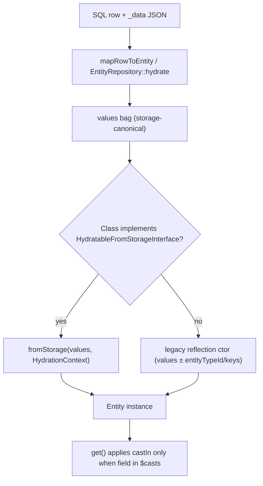
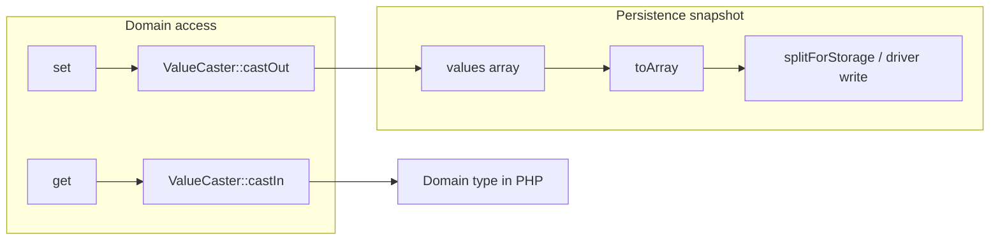

# Entity System

<!-- Spec reviewed 2026-06-04 - PR #1614 (page-builder + real content types): per-bundle typed fields land. `EntityTypeManagerInterface` gains `resolveFieldDefinitions(entityTypeId, ?bundle)` as the single bundle-aware field-resolution path (class `#[Field]` attributes + registry core fields + registry bundle fields), plus `addBundleFields()` which auto-materializes a per-bundle subtable (e.g. `node__page`) with real typed columns. New `Waaseyaa\EntityStorage\Bundle\BundleSubtableGateway` is the single bundle-persistence implementation used by BOTH `EntityRepository` (the migration/canonical write path) and `SqlEntityStorage` (the `getStorage()` admin/API path); `SqlEntityStorage`'s inline partition/upsert/read was removed so the two paths cannot drift. `SqlSchemaHandler` column derivation covers entity_reference (varchar UUID) / json / datetime / date / email. Core entity contracts (entity keys, `_data` blob, save/load lifecycle) are unchanged. -->
<!-- Spec reviewed 2026-05-19 - mission sql-entity-query-access-checking-01KRYP15 (#1495): `EntityQueryInterface` gains `setAccount(?AccountInterface): static`. `SqlEntityQuery::execute()` now runs per-row access filtering via `EntityAccessHandler::check($entity, 'view', $account)` and drops `forbidden` rows; `accessCheck(true)` is the default (the v0.1.0 stub was a no-op). Missing-account + check-enabled throws the new `Waaseyaa\EntityStorage\Exception\MissingQueryAccountException` — fail-closed. `accessCheck(false)` remains as the audited system-context bypass; `SqlEntityStorage::loadByKey()` uses it as a system-context identity primitive. `SqlEntityStorage::getQuery()` wires `withAccessHandler($accessHandler)` (optional 8th constructor param, nullable) and `withEntityLoader(loadMultiple)` so the filter is live end-to-end. Full enforcement-layer description lives in `docs/specs/access-control.md`; entity-system contracts (entity keys, `_data` blob, save/load lifecycle) are unchanged. -->
<!-- Spec reviewed 2026-05-13c - issue #1457 fix: pure test-fixture refactor (no spec-level behavioural change). `TranslatableArticleFixture` / `SqlColumnTranslatableArticleFixture` extracted from inside `SqlBlobTranslatableTest.php` / `SqlColumnTranslatableTest.php` to their own PSR-4 files under `packages/entity-storage/tests/Backend/`. The classes were previously not discoverable by composer's PSR-4 autoloader (no matching file path under the `Waaseyaa\EntityStorage\Tests\` namespace map), so `is_subclass_of($class, TranslatableInterface::class)` in `EntityType::__construct()` returned false when the parent test file had not yet been loaded as a side-effect — causing 17 `ci/unit-tests` errors on `main` after M-006 added cross-test fixture references. Entity-system pipeline, storage layout, and translatable contract are unchanged. -->
<!-- Spec reviewed 2026-05-13b - issue #1449 fix: the prior "long-term" note (widen `EntityRepository::save()` to accept SaveContext) is now shipped. `EntityRepository::save(EntityInterface $entity, bool $validate = true, ?SaveContext $context = null): int` accepts an optional third parameter; default `null` resolves to `SaveContext::default()` and preserves all pre-#1449 behaviour. The repository is now the single dispatch site for `BeforeSaveEvent` / `AfterSaveEvent` on the save path — `EntityDestination::write()` no longer self-dispatches; it threads `SaveContext::asImport()` through `save(...$context: ...)`. `EntityRepositoryInterface::save()` is intentionally left at `(EntityInterface, bool)` because `SaveContext` lives in `Waaseyaa\EntityStorage` (L1) under `Waaseyaa\Entity\Repository` — adding it to the interface would invert the layer graph. `UnitOfWork::bufferEvent()` widened from `Symfony\Contracts\EventDispatcher\Event` to `object` to buffer the lifecycle events (they implement only `EntityLifecycleEventInterface`). Revisionable backends' `setCurrentRevision()` dispatches are unchanged — they fire on the revision-pointer flip API, not the save path. -->
<!-- Spec reviewed 2026-05-13 - M-002 migration-platform-v1 (squash d92f82f): purely additive — `SaveContext` gains `isImport` readonly bool (default false) and `asImport()` factory. No change to existing SaveContext callers; default-false preserves baseline event payloads bit-identical. Used by `Waaseyaa\Migration\Plugin\Destination\EntityDestination` to signal migration writes via dispatched BeforeSave/AfterSave events (mission-internal — not §5.8 stable surface). Long-term: consider widening `EntityRepository::save()` to accept SaveContext so destinations don't need to self-dispatch coordinator events. -->
<!-- Spec reviewed 2026-05-10 - WP05 php-8.5 upgrade: @PHP8x5Migration cs-fixer pass — EntityRepository, SqlEntityStorage, FileStorage touched by octal_notation + new_expression_parentheses rules only; no semantic change to entity pipeline, storage, or lifecycle hooks. -->
<!-- Spec reviewed 2026-05-10 - WP03 php-8.5 upgrade: EntityRepositoryInterface::find/findMany/findBy/loadRevision/rollback gained #[\NoDiscard] — no change to repository semantics, storage pipeline, or entity lifecycle. -->
<!-- Spec reviewed 2026-06-09 - alpha.200/201 framework-hygiene: EntityRepositoryInterface gained the two-axis translation surface (saveTranslation / loadTranslation / listTranslationRevisions), promoted from the concrete EntityRepository — alpha.200 briefly carried all 8 two-axis methods; alpha.201 narrowed the interface to the 3 consumers actually call, the per-revision API (saveTranslationRevision(s)/loadTranslationRevision/loadTranslationTip/translationLangcodes) stays on the concrete. EntityRepository.php also dropped a useless `(int)` cast in listRevisions (getRevisionIds already returns int[]). No change to repository semantics, storage pipeline, or entity lifecycle. The interface code block below is an illustrative subset by design (omits the translation + published-revision surface); two-axis storage is specified in docs/specs/revision-system-unified.md (the live canonical; entity-storage-two-axis.md is the superseded M-004 vid model). -->
<!-- Spec reviewed 2026-06-09 - alpha.201 doc-drift: RevisionableEntityTrait usage docblock corrected `'revision' => 'vid'` -> `'revision' => 'revision_id'` (doc-comment only; the live revision key is revision_id). No semantic change to the trait, repository, or entity lifecycle. -->
<!-- Spec reviewed 2026-06-09 - alpha.202 fork fix: TranslatableInterface::language() un-deprecated (removed #[\Deprecated] + the unresolved 'since: 0.next' placeholder). language() and activeLangcode() are distinct, supported accessors — language() returns a `langcode`/'en' fallback for entities without `default_langcode`, activeLangcode() throws. No schema, storage-pipeline, or entity-lifecycle change. -->
<!-- Spec reviewed 2026-05-04 - issue #1376 (deferred WP07-A from mission #1257): EntityTypeManager constructor gained an 8th optional parameter `?\Closure $bundleSubtableExistsProbe = null` with signature `fn(string $entityTypeId, string $bundle): bool`. After a successful `addBundleFields()` registration, when a probe is configured and reports the per-bundle subtable absent, the manager emits a once-per-(entity_type_id, bundle) `[BUNDLE_SUBTABLE_MISSING]` notice via the injected logger. Probe failures are caught and logged at info — registration is never failed over an advisory check. AbstractKernel wires the probe with `$database->schema()->tableExists(SqlSchemaHandler::resolveSubtableName($entityTypeId, $bundle))`. Pre-existing callers (tests, bare bootstraps) that omit the probe stay silent. Companion to the load-side notice that landed in WP06 (SqlEntityStorage::mergeBundleSubtableRow); together they cover both registration-time and runtime detection of missing subtables. -->
<!-- Spec reviewed 2026-05-13 - M-006 entity-storage-translations-v1 (squash 0f7e1809a): substantial additive surface for single-axis translations. EntityRepository gains findTranslations() (single SQL query, NFR-005) and optional ?LanguageManagerInterface + readActiveLanguage flag (C-004). Matching findTranslations() on EntityRepositoryInterface + EntityStorageDriverInterface. SaveContext::withLangcode(string) + langcodeRequired() guard in EntityStorageCoordinator. CoordinatorLifecycleDispatcher dispatches 6 new PRE/POST_TRANSLATION_* events with langcode payload. EntitySchemaSync routes translatable entity types to either widened sql-blob PK or sibling sql-column __translation table via new TranslationSchemaHandler + SqlColumnTranslationHydrator. SqlStorageDriver + InMemoryStorageDriver gain matching translation read/write paths. Non-translatable entity types preserve baseline behavior bit-identical (NFR-001 invariant). Full canonical surface and design rationale: docs/specs/entity-storage-translations-v1.md. M-006 is BETA-GATE per stability-charter §3.2 criterion 9 (now SATISFIED). -->
<!-- Spec reviewed 2026-05-03b - autoload hygiene: `FieldAttributeRule` (a PHPStan rule that imports `PHPStan\Rules\Rule`) moved out of `packages/entity/src/PhpStan/` into `packages/entity/testing/PhpStan/`, registered under autoload-dev only. `PackageManifestCompiler::scanClasses()` no longer reflectively touches the file in production consumer installs that lack PHPStan, so kernel boot stays clean. Same fix pattern as the alpha.106 → alpha.107 graphql incident on minoo. Surfaced by skeleton-smoke (#1315) against alpha.167 immediately after the #1375 split-for-write fix landed. -->
<!-- Spec reviewed 2026-05-03 - issue #1375 fix: SqlStorageDriver now performs the same column-vs-`_data` split that SqlEntityStorage does on the legacy save path. Two new private helpers — splitForWrite() at the start of write() routes values through `$schema->fieldExists()` and packs the rest into a `_data` JSON blob; mergeFromRead() decodes `_data` and re-flattens it onto the row at every read boundary (read, readMultiple, readWithTranslation, readMultipleWithTranslation, findBy). Closes the gap where EntityRepository -> SqlStorageDriver sent raw entity values straight to DBALInsert and crashed any entity whose declarative `#[Field]` attributes lacked dedicated columns (canonical case: User's mail/email_verified/status/created). Locked by tests/Integration/EntityStorage/RepositoryUserRoundTripTest.php. First caught by skeleton-smoke CI (#1315) against a Packagist install of alpha.166. -->
<!-- Spec reviewed 2026-05-02b - mission #1257 WP10 review hardening (PR #1367 review feedback): two security-adjacent guards tightened. (1) `EntityType::fromClass()` now throws `\LogicException` when a cache hit's tenancy slot disagrees with the requested override — silently returning the cached non-tenant instance to a caller asking for community scoping (or the inverse) would disable isolation. The `framework norm: one canonical EntityType per class` cache convention still applies for presentation overrides; tenancy is treated as a security boundary. Tests in `EntityTypeFromClassTest` cover same-tenancy reuse, conflicting override, and removing-tenancy-on-second-call. (2) `AbstractKernel::resolveCommunityScope()` now distinguishes development from production: in `local`/`dev`/`development`/`testing`, missing context still logs a once-per-type warning and falls back to null scope (tests/CLI/bare bootstrap stay green); in production, it throws `[TENANCY_MISCONFIGURED] RuntimeException` to refuse silent disablement of community isolation. WP11 test file split the single missing-context test into a dev-mode and production-mode pair. -->
<!-- Spec reviewed 2026-05-02 - mission #1257 WP10 implementation: C1 declarative tenancy on EntityType complete. EntityType ctor accepts a validated `tenancy: ?array` slot (only `['scope' => 'community']` recognized today; future region/org scopes require an explicit code change), exposed via getTenancy() on EntityTypeInterface. EntityTypeManager emits one `[deprecated] HasCommunityInterface` warning per entity-type id when the registered class still carries the legacy marker but the slot is null (memoized; silenced once tenancy: ['scope' => 'community'] is declared). AbstractKernel::resolveCommunityScope() reads getTenancy() and injects CommunityScope into SqlStorageDriver when a CommunityContextInterface is bound (via $kernel->setCommunityContext()); when tenancy is declared but no context is bound, the kernel logs a once-per-type warning and falls back to a null scope rather than crashing boot. WP11's kernel-path test file gained 5 C1 assertions (slot read-back, deprecation warning, silenced-when-migrated, kernel injects scope, kernel logs on missing context) via an anonymous AbstractKernel subclass exposing publicBootDatabase / publicBootEntityTypeManager. -->
<!-- Spec reviewed 2026-05-02 - mission #1257 WP11 implementation: kernel-path integration lock complete (tests/Integration/Phase26/Mission1257KernelPathTest.php). Single test class wires DBALDatabase + FieldDefinitionRegistry + EntityTypeManager + SqlSchemaHandler + SqlEntityStorage + HealthChecker in production order and pins K1 (resolveSubtableName + addBundleFields reserved-separator guard), K2 (FieldStorage::Data round-trip on write + read), K3 (numeric-string coercion + IN-set element coercion against integer _data fields), K4 (single MISSING_BUNDLE_SUBTABLE notice per (entity_type, bundle) memoized for the storage instance lifetime), K6 (HealthChecker surfaces MISSING_BUNDLE_SUBTABLE + ORPHAN_BUNDLE_SUBTABLE diagnostics from L0 via codified exemption), K7 (EntityTypeRegistrationCollisionException::duplicate names both registrants + both classes). C1 tenancy via EntityType subsequently locked by WP10 (see entry above). WP09 portable orphan detection still SQLite-only and deferred. Mission anchor #1257 stays open per user flag. -->
<!-- Spec reviewed 2026-05-01 - mission #1257 WP06 implementation: K4 load-side bundle-load drift logging complete (SqlEntityStorage::mergeBundleSubtableRow + mergeBundleSubtableRowsBatch emit a single MISSING_BUNDLE_SUBTABLE notice per (entity_type, bundle) on the load path before the silent skip). WP07-B verified no-op (collision message already names both registrants). WP08 verified no-op (HealthChecker K6(c) exemption codified in bin/check-package-layers by mission #824). Same date WP05 implementation: K3 query-builder value coercion complete (SqlEntityQuery::condition() coerces numeric strings to declared int/float type for non-IN operators; IN against json_extract fields wraps field in CAST(... AS TEXT) and stringifies all values to commute against SQLite's strict json_extract typing and DBAL's STRING-typed array binding). Same date WP04 implementation: K2 read/write symmetry complete (SqlEntityQuery consults the same FieldStorage::Data hint as SqlEntityStorage; legacy columns no longer shadow `_data` reads). Same date WP03 implementation: K1 centralization complete (static `SqlSchemaHandler::resolveSubtableName()` is the canonical formatter; raw `__` concat at SqlEntityStorage / SqlEntityQuery removed; structural guard live at `EntityTypeManager::addBundleFields()`). Earlier review 2026-04-30 - WP02 ratification: K1-K7 conventions + C1 tenancy contract; HasCommunityInterface deprecated (declarative `tenancy:` on EntityType); see ./bundle-scoped-storage.md for K1/K4/K5 details -->
<!-- Spec reviewed 2026-04-26 - #[ContentEntityKeys], EntityMetadataReader: class-level key map + cached resolution; EntityTypeManager asserts registered keys match class metadata; ContentEntityBase throws EntityMetadataException without #[ContentEntityType] -->
<!-- Spec reviewed 2026-04-25 - #[ContentEntityType] + ContentEntityTypeReader (packages/entity/Attribute) for SSR strict app-controller entity binding; see docs/specs/app-controller-invocation.md -->
<!-- Spec reviewed 2026-04-24 - packages/entity ValueCaster: PHPStan strict-rules / control-flow cleanup only; cast-in/cast-out semantics and typed-data delegation unchanged -->
<!-- Spec reviewed 2026-04-22 - DefinesEntityType; PackageManifest attributeEntityTypes; optional config entity_auto_register in ProviderRegistry (default off) for attribute-driven type registration -->
<!-- Spec reviewed 2026-04-22 - removed reflection hydration fallback; ContentEntityBase/ConfigEntityBase implement HydratableFromStorageInterface and EntityInstantiator now requires fromStorage -->
<!-- Spec reviewed 2026-04-22 - FieldDefinitionConstraintBuilder now consumes FieldDefinitionInterface objects; FieldDefinition registry/core definitions normalize to object contracts -->
<!-- Spec reviewed 2026-04-22 - EntityType::getFieldDefinitions phpdoc covariance with EntityTypeInterface (FieldDefinitionInterface union) -->
<!-- Spec reviewed 2026-04-21 - Breaking-change cutover (alpha → stable): HydratableFromStorage + FieldDefinitionInterface-only direction; SqlEntityStorage applyFieldDefinitionDefaults extraction -->
<!-- Spec reviewed 2026-04-08 - composer manifest policy normalization for packages/config, packages/entity-storage, packages/entity, packages/field; no entity runtime behavior change -->
<!-- Spec reviewed 2026-04-08b - restored packages/config symfony/event-dispatcher floor from ^7.3 back to ^7.0; no entity/config runtime behavior change -->
<!-- Spec reviewed 2026-04-09 - packages/entity and packages/entity-storage composer.json (manifest policy); storage and entity semantics unchanged -->
<!-- Spec reviewed 2026-04-09c - readMultiple/findMany, SqlEntityQuery request-scoped result cache + save/delete invalidation (milestone 45) -->
<!-- Spec reviewed 2026-04-09d - HydratableFromStorageInterface, HydrationContext, EntityInstantiator (#1188) -->
<!-- Spec reviewed 2026-04-09k - pluggable timestamps + datetime cast storage / optional Carbon domain (#1183) -->
<!-- Spec reviewed 2026-04-09e - packages/entity Cast kernel (#1181 ST-1): ValueCaster, CastDefinition, CastException -->
<!-- Spec reviewed 2026-04-09f - EntityBase $casts + cast-aware get/set (#1181 ST-2); ContentEntityBase delegates to EntityBase -->
<!-- Spec reviewed 2026-04-09g - ST-4/ST-5 persistence: hydrate + toArray remain raw; integration tests in entity-storage -->
<!-- Spec reviewed 2026-04-09h - EntityValidator uses EntityInterface::get() for all entities (#1181 ST-6); cast-aware validation -->
<!-- Spec reviewed 2026-04-09i - packages/api ResourceSerializer attributes via get() + JSON normalization (#1181 ST-7) -->
<!-- Spec reviewed 2026-04-09j - EntityValues helper, presentation layers use cast-aware maps (#1181 ST-8) -->
<!-- Spec reviewed 2026-04-09 ST-9 - casting + hydration architecture finalization: diagrams, invariants, EntityValues/get/set/toArray/config rules (#1181) -->
<!-- Spec reviewed 2026-04-09 ST-10 - layering: EntityValues::toJsonReadyMap / normalizeValueForJson; AI vector uses cast-aware paths (#1181) -->
<!-- Spec reviewed 2026-04-09 - typed-data EntityCastCoercion + CastTokenMapper; ValueCaster delegates builtins (#1185) -->
<!-- Spec reviewed 2026-04-09 - field-definition → Symfony constraints + save merge (#1182) -->
<!-- Spec reviewed 2026-04-09 - P3 branching: duplicate/with/withValues, duplicateInstance hook, EntityValuesSnapshot, shallow-copy invariant -->
<!-- Spec reviewed 2026-04-08g - symfony/* require ^7.0 on entity + entity-storage (#1151); no entity behavior change — symfony-version-floors.md -->
<!-- Spec reviewed 2026-04-27 - enum field-type plugin landed (mission field-type-enum-plugin-01KQ6SJG); transitional 'string' + settings.enum_class bridge closed -->
<!-- Spec reviewed 2026-04-10 - waaseyaa/testing EntityTypeFixtureValues + EntityFactory::defineFromEntityType (#1186) -->
<!-- Spec reviewed 2026-04-10b - P3 duplicate constructor arity contract; Hydratable scaffold; core User/Node hydration (#1188 follow-up) -->
<!-- Spec reviewed 2026-04-16 - EntityStorageDriverInterface::write returns effective id; EntityRepository::doSave back-fills auto-increment pk before POST_SAVE (waaseyaa/giiken#57) -->
<!-- Spec reviewed 2026-04-20 - EntityTypeManager collision guard now preserves registrant provenance, distinguishes duplicate vs shadow registration, and throws EntityTypeRegistrationCollisionException (#1313) -->
<!-- Spec reviewed 2026-04-21 - FieldDefinitionRegistryInterface::mergeCoreFields for host-app core field overlays without forking package entity types -->
<!-- Spec reviewed 2026-04-22 - SqlEntityStorage + EntityType field definitions: legacy array defs or FieldDefinitionInterface objects in create(), JSON typing, timestamp auto-populate -->
<!-- Spec reviewed 2026-04-30 - EntityTypeManager reserved-namespace contract: registerEntityType rejects "core." with [NAMESPACE_RESERVED] DomainException; registerCoreEntityType is the privileged path for kernel + core providers; both share persistDefinition() (mission #824 WP04 surface A, closes #835) -->
<!-- Spec reviewed 2026-04-30b - RevisionableStorageInterface spec ↔ source parity: every signature corrected to match PHP source (entityId is always the first arg, revisionId is int, getLatestRevisionId returns ?int); getRevisionIds added; lockstep enforced by RevisionableStorageInterfaceContractTest (mission #824 WP04 surface B, closes #837) -->

Subsystem specification for the Waaseyaa entity, entity-storage, field, and config packages. Covers entity interfaces, storage implementations, query building, field definitions, config entities, and lifecycle events.

## Public Surface

Authoritative dispositions are in `docs/public-surface-map.php`, verified by `PublicSurfaceVerificationTest`.

**Public API** (stable, semver-protected):

| Package | Interfaces/Classes |
|---------|-------------------|
| entity | `EntityInterface`, `EntityBase`, `ContentEntityBase`, `ContentEntityInterface`, `ConfigEntityBase`, `ConfigEntityInterface`, `EntityTypeInterface`, `EntityType` (incl. `EntityType::fromClass()` static factory), `EntityTypeManagerInterface`, `EntityTypeRegistrationCollisionException`, `FieldableInterface`, `RevisionableInterface`, `TranslatableInterface`, `RevisionableEntityTrait`, `EntityRepositoryInterface`, `EntityEventFactoryInterface`, `EntityStorageInterface`, `RevisionableStorageInterface`, `EntityQueryInterface`, `HydratableFromStorageInterface`, `HydrationContext`, `EntityValues`, `CastDefinition`, `ValueCaster`, `CastException`, `FromArrayEntityValueInterface`, `FieldDefinitionConstraintBuilder`, `EntityTypeValidationConstraints`, `Attribute\ContentEntityType` (with `label`, `description` parameters), `Attribute\ContentEntityKeys`, `Attribute\Field`, `Attribute\EntityClassMetadata`, `Attribute\EntityMetadataReader`, `Attribute\ContentEntityTypeReader`, `Exception\EntityMetadataException` |
| entity-storage | `EntityStorageDriverInterface`, `ConnectionResolverInterface` |
| field | `FieldItemInterface`, `FieldItemListInterface`, `FieldDefinitionInterface`, `FieldStorage`, `FieldTypeInterface`, `FieldFormatterInterface`, `FieldTypeManagerInterface`, `FieldItemBase`, `ViewModeConfigInterface` |
| config | `ConfigInterface`, `ConfigFactoryInterface`, `ConfigManagerInterface`, `StorageInterface`, `TranslatableConfigFactoryInterface` |

**`@internal`** (implementation details, may change without notice):

| Package | Interface/Class | Reason |
|---------|----------------|--------|
| field | `ComputedFieldInterface` | Implementation detail for computed fields, not a consumer contract |

## Packages

| Package | Path | Namespace | Purpose |
|---------|------|-----------|---------|
| entity | `packages/entity/` | `Waaseyaa\Entity\` | Interfaces, base classes, entity type definitions, events. No storage. |
| entity-storage | `packages/entity-storage/` | `Waaseyaa\EntityStorage\` | SQL storage, schema handler, query builder, repository, unit of work. |
| field | `packages/field/` | `Waaseyaa\Field\` | Field type plugins, field definitions, field item lists. |
| config | `packages/config/` | `Waaseyaa\Config\` | Config objects, config factory, import/export, storage backends. |

## Class-level metadata (content entities)

**Identity:** Each concrete `ContentEntityBase` **must** declare `#[ContentEntityType(id: '…')]` (machine name). The constructor throws `EntityMetadataException` if the type id is still empty after resolution. Explicit `$entityTypeId` / non-empty `$entityKeys` in `__construct` remain supported for tests and `fromStorage`.

**Key map:** `#[ContentEntityKeys(…)]` is optional. Logical keys supported: `id`, `uuid`, `label`, `bundle`, `revision`, `langcode` — each parameter is a storage field name; omitted/`null` means “not overridden in this attribute pass.” After merging attributes along the class hierarchy, **identity defaults** apply for any of `id` / `uuid` / `label` still missing (`id`→`id`, `uuid`→`uuid`, `label`→`label`). `EntityMetadataReader::forClass()` returns the resolved key map; results are **cached per class-string** for the process.

**Fields:** Class attributes describe **only** entity type id and the logical→storage key map. They do **not** define field lists; `fieldDefinitions` on `EntityType`, the field registry, and YAML/config remain the source of field shape.

**Registration parity:** `EntityTypeManager` validates that, for any registered type whose `getClass()` is a `ContentEntityBase` subclass, `EntityType::id()` matches `#[ContentEntityType]`, and `EntityType::getKeys()` (sorted) exactly matches `EntityMetadataReader::forClass($class)->keys` (sorted). Mismatch throws `InvalidArgumentException` at registration time.

**SSR:** `ContentEntityTypeReader` delegates to `EntityMetadataReader` and resolves the type id from the class or its parents (see app-controller spec).

## Casting & hydration architecture (ST-9, #1181)

This section is the canonical contract for **storage-shaped values** vs **domain-shaped values**, where each applies, and how presentation layers stay consistent. Deeper package references: `packages/entity/src/Cast/`, `packages/entity/src/EntityBase.php`, `packages/entity/src/EntityValues.php`, `packages/entity-storage/src/Hydration/EntityInstantiator.php`. Casting and hydration boundary details: **#1181**; **backed enums and value-object (`FromArrayEntityValueInterface`) casts: #1184**.

### Hydration pipeline (row → instance)

No casting runs at the storage boundary. Rows are merged into a single PHP array (`_data` decoded, numeric id normalized), then the entity is constructed.



### Read vs write within an entity



### Storage vs domain value (examples)

| Field kind | Stored in `$values` / `toArray()` | Returned by `get()` when `$casts` set | Notes |
|------------|-----------------------------------|----------------------------------------|-------|
| Backed enum | Backing scalar (`string`/`int`) | Enum instance | `set()` accepts instance or backing value; `castOut` persists scalar. **Invalid backing / unknown case:** `get()` throws `CastException` (no silent null). |
| Value object (`FromArrayEntityValueInterface`) | **Same as `array` cast:** JSON string in `$values` after `set()` | VO instance | **Storage invariant (#1184):** identical pipeline to `array` — `EntityCastCoercion::castInArray` / `castOutArray` so there is no alternate encoding or schema drift. Hydrate may supply a PHP `array` or JSON string; `get()` returns the VO. **`set()`:** MUST accept a VO instance of the cast class; MAY accept an `array` (via `fromArray` then `toArray` → storage); MUST NOT accept arbitrary scalars. **Immutability:** the framework does not enforce readonly VOs; implementations **SHOULD** be immutable for predictable cast behavior. Cast spec: backed enum class-string **or** VO class-string implementing `FromArrayEntityValueInterface`, or `['type' => 'value_object', 'class' => ClassName::class]`. **Wrong class:** stable error *Value object cast requires class implementing FromArrayEntityValueInterface*. |
| `datetime_immutable` | ISO string, Unix int, or string digits | `DateTimeImmutable` | `castOut` → ISO-8601 `ATOM` |
| `array` / `json` | JSON string | `array` | `castOut` re-encodes with `JSON_THROW_ON_ERROR` |
| `int` / `float` / `bool` / `string` | Normalized scalar | Same PHP scalar (validated) | Empty string → error for numeric casts per `ValueCaster` rules |
| No `$casts` entry | Any | Same as stored | Pass-through |

### Invariants

1. **Constructor / hydration:** `$values` assigned in `EntityBase::__construct()` (or `fromStorage()`) are **never** passed through `ValueCaster`; they must already be storage-safe.
2. **`toArray()`:** Returns the internal `$values` array **without** `castIn`; callers MUST NOT treat it as domain-typed if the entity uses `$casts`.
3. **`get($name)`:** If `$casts[$name]` exists, return `castIn($name, $raw, $spec)`; otherwise return raw (or `null` if key missing).
4. **`set($name, $value)`:** If `$casts[$name]` exists, store `castOut(...)`; otherwise store the value as-is. After `set()`, `toArray()` must remain JSON- and SQL-driver-safe.
5. **Save path:** `EntityRepository::doSave()` / `SqlEntityStorage::save()` use `toArray()` only — never `get()` — so the invariant in (4) must hold for all cast fields.
6. **Load path:** `EntityInstantiator` does not invoke `ValueCaster`; casting is lazy on `get()` / presentation helpers.
7. **Tests:** Override `protected function valueCaster(): ValueCaster` on an entity subclass to inject fakes; default is `new ValueCaster()`.

### Rules for `EntityValues`

File: `packages/entity/src/EntityValues.php`

- **`toCastAwareMap(EntityInterface $entity): array`** — For each key in `array_keys($entity->toArray())`, set `$map[$key] = $entity->get($key)`. Same keys as the persistence bag, values as domain types where casts apply. Use for GraphQL, SSR field bags, MCP payloads, discovery visibility, workflow validation listeners, relationship traversal summaries, and any code that previously iterated `toArray()` expecting “real” types.
- **`toJsonReadyMap(EntityInterface $entity): array`** — `toCastAwareMap()` plus recursive JSON normalization (backed enums → scalar, `DateTimeInterface` → ISO-8601 ATOM, `JsonSerializable`, **`FromArrayEntityValueInterface` → `toArray()` then same recursion as nested arrays** — including nested VOs inside arrays, #1184). Use for embedding text construction, MCP/logging payloads, and anywhere `json_encode` must not receive raw storage scalars when casts exist. `ResourceSerializer` delegates attribute normalization to **`normalizeValueForJson(mixed $value): mixed`** (same implementation) so JSON:API and other sinks stay aligned (#1181 ST-10).
- **`statusToInt(mixed $status): int`** — Normalizes bool/int/string/`BackedEnum` to `0|1` for strict published checks; use with `$entity->get('status')` or values taken from a cast-aware map.
- **Do not use** `EntityValues` for: persistence, `SqlEntityStorage`, repository `save()`, or low-level drivers.

### Layering rules (ST-10, #1181)

| Concern | Allowed reads | Forbidden for domain semantics |
|--------|----------------|----------------------------------|
| Persistence (`entity-storage`, `EntityRepository`) | `toArray()` for save / `splitForStorage` | Calling `ValueCaster` or `EntityValues` inside drivers — hydration stays raw at the row boundary |
| Presentation (JSON:API, GraphQL, SSR, MCP, discovery, `ai-*` pipelines, workflow listeners, relationship) | `get($field)`, `EntityValues::toCastAwareMap()`, `EntityValues::toJsonReadyMap()` | `toArray()` for attribute/visibility/embedding text when the entity defines `$casts` |
| Workflow visibility | `WorkflowVisibility::isNodePublicForEntity(EntityInterface)` or an array already built with `toCastAwareMap` | `isNodePublic($entity->toArray())` for nodes with enum/bool `status` casts |

**Circular dependencies:** Package `composer.json` `require` must respect the Layer Architecture table in root `CLAUDE.md` (lower layers never depend on higher layers). `waaseyaa/entity` must not require `waaseyaa/api`; shared JSON shaping lives on `EntityValues` in `entity`.

### Rules for `get()` / `set()`

- **`get()`** — The only supported way to read cast fields as domain objects (enums, `DateTimeImmutable`, decoded arrays, **VOs implementing `FromArrayEntityValueInterface`**) without duplicating cast logic.
- **`set()`** — Accepts domain input for cast fields; always persists storage shape into `$values`. For **value-object** casts, see the table above (instance required; array optional; scalars rejected, #1184).

### Admin JSON Schema vs `$casts`

`SchemaPresenter` (`packages/api/src/Schema/SchemaPresenter.php`) builds widgets from **EntityType field definitions**, not from entity class `$casts`. A VO field may still serialize correctly over JSON:API via `EntityValues` when `$casts` is set on the entity class; **admin form schema** for structured VOs may require explicit field definition work (e.g. object / JSON widget) in a follow-up — not inferred automatically from `$casts` (#1184).
- Direct mutation of `$values` from outside the entity class is unsupported; subclasses that override `get`/`set` must preserve cast semantics or document exceptions.

### Rules for `toArray()`

- **Purpose:** Persistence and structural cloning of the storage bag.
- **Anti-pattern:** Building user-facing or API attributes solely from `toArray()` when `$casts` is non-empty — use `get()` per field or `EntityValues::toCastAwareMap()`.
- **OK uses:** `SqlEntityStorage::splitForStorage()`, export pipelines that intentionally emit raw YAML/JSON matching the DB, tests asserting stored scalars.

### Typed config entities (`ConfigEntityBase`)

`ConfigEntityBase` extends `EntityBase`, so **`$casts` applies to keys in the values bag** the same as content entities.

Additional rules specific to config:

- **`status` / `dependencies`:** The constructor copies `status` and `dependencies` from `$values` into protected properties **and** leaves them in `$values` for the parent bag. `enable()` / `disable()` / `setDependencies()` keep the object and `$values` in sync for persistence.
- **`toConfig()`:** Starts from `toArray()` (raw), then overwrites `status` with the object’s `status()` and injects `dependencies` when non-empty — export remains stable even if only the typed properties were mutated.
- **`get('status')`:** If `status` is listed in `$casts` (e.g. `bool`), `get()` returns the cast domain value; `status()` still reflects the boolean property (they should agree after `enable()`/`disable()`/`set()`).
- **JSON:API:** Config entities use string machine name as resource id when UUID is empty; attribute building still goes through cast-aware reads (`ResourceSerializer` → `EntityValues::toCastAwareMap()`).

### Worked example (content entity)

```php
// $casts includes 'published_at' => 'datetime_immutable'
$entity = $storage->load(1); // row has published_at as ISO string in _data
$entity->get('published_at'); // DateTimeImmutable
$entity->toArray()['published_at']; // still string (storage shape)

$entity->set('published_at', new DateTimeImmutable('2026-04-09T12:00:00+00:00'));
$storage->save($entity); // toArray() carries ISO string suitable for _data
```

### Cross-references

- JSON:API attribute pipeline: `docs/specs/jsonapi.md` and `docs/specs/api-layer.md` (Resource Serialization).
- Admin SPA consumes JSON:API — attributes are already normalized for JSON: `docs/specs/admin-spa.md`.
- AI/MCP/SSR/GraphQL: `docs/specs/ai-integration.md`, `docs/specs/relationship-modeling.md`.

### Query-builder boundary (K3, mission #1257)

`SqlEntityQuery::execute()` extends ST-9 to the read path. SQLite's `json_extract(...)` returns the native JSON type (integer for `13`, string for `"13"`) and SQLite has no column affinity for expression results, so a strict-typed comparison silently drops rows when the bound parameter type does not match the JSON type. K3 closes this with two coordinated mechanisms, both consulting the same `FieldDefinition::getType()` source-of-truth as ST-9:

1. **Numeric-string parameter coercion (the `=`, `<>`, `<`, `>`, `<=`, `>=`, `BETWEEN` path).** `coerceConditionValue()` looks up the registered `FieldDefinition` for the referenced field (core or bundle, via `lookupFieldDefinition()`) and casts numeric-string values to the declared PHP type — `'13'` → `13` for `integer`, `'1.5'` → `1.5` for `float`/`decimal`/`numeric`. The binder then sees an int/float and the comparison commutes. Non-numeric types (`string`, `text`, `uri`, `entity_reference`) and non-numeric-string values pass through unchanged. Boolean coercion is intentionally omitted (PHP/SQL boolean conventions diverge — `'true'`, `'1'`, `'on'`).

2. **Text-cast wrapping for `IN` against `json_extract` fields.** The underlying DBAL helper hardcodes `ArrayParameterType::STRING` for `IN`-set parameters, so PHP-side coercion alone cannot fix `IN` comparisons. When the resolved field expression is a `json_extract(...)` call, `SqlEntityQuery::execute()` wraps it in `CAST(... AS TEXT)` and stringifies every IN-set value, forcing text-vs-text equality. Detection uses `expressionResolvesViaJsonExtract()` so the wrapping covers both K2 (`FieldStorage::Data` hint) and the column-absent fallback path. Numeric ordering is preserved on `<` / `>` (those use mechanism 1, not the cast wrapping).

`CONTAINS`, `STARTS_WITH`, `LIKE`, `IS NULL`, and `IS NOT NULL` skip coercion: they are explicit string-pattern or null-check operators where coercion would surprise callers.

Reproduction case (#1257 anchor): integer `_data` field compared to a string literal. Pre-K3, the SQLite path returned an empty set silently. Post-K3, both single-value (`condition('user_id', '13')`) and IN-set (`condition('user_id', ['1', 13], 'IN')`) commute against the declared cast.

## Core Interfaces (packages/entity/src/)

### EntityInterface

File: `packages/entity/src/EntityInterface.php`

```php
interface EntityInterface
{
    public function id(): int|string|null;
    public function uuid(): string;
    public function label(): string;
    public function getEntityTypeId(): string;
    public function bundle(): string;
    public function isNew(): bool;
    public function get(string $name): mixed;
    public function set(string $name, mixed $value): static;
    public function toArray(): array;
    public function language(): string;
}
```

### FieldableInterface

File: `packages/entity/src/FieldableInterface.php`

```php
interface FieldableInterface
{
    public function hasField(string $name): bool;
    public function get(string $name): mixed;
    public function set(string $name, mixed $value): static;
    public function getFieldDefinitions(): array; // array<string, mixed>
}
```

### Field value casting (kernel)

**Diagrams, full invariant list, `EntityValues` / `get` / `set` / `toArray` / config rules:** see [Casting & hydration architecture (ST-9, #1181)](#casting--hydration-architecture-st-9-1181).

Files: `packages/entity/src/Cast/`

`CastDefinition` is a small readonly value object wrapping a cast spec: either a **string token** (`int`, `float`, `bool`, `string`, `array`, `datetime_immutable`, or a **backed enum** class-string) or an array escape hatch `['type' => 'json']` (equivalent to `array` — JSON in storage).

`ValueCaster` performs **storage → domain** (`castIn`) and **domain → storage** (`castOut`) for those specs. For **`int`**, **`float`**, **`bool`**, **`string`**, and **`array`** / **`json`**, the implementation delegates to **`Waaseyaa\TypedData\Coercion\EntityCastCoercion`** in `waaseyaa/typed-data` (#1185); **`CoercionException`** is wrapped as **`CastException`** so callers see one exception type. **`CastTokenMapper::toDataType()`** maps entity cast tokens to `TypedDataManager` data types for `int`/`float`/`bool`/`string` only (`array`/`json` → `null` — not a typed-data `map`/`list` without schema).

P0 built-ins:

| Spec | `castIn` (stored → domain) | `castOut` (domain → stored) |
|------|---------------------------|------------------------------|
| `int` / `float` / `bool` / `string` | Normalization with documented rejection rules (e.g. empty string → error for numeric casts) via `EntityCastCoercion` | Canonical scalars via `EntityCastCoercion` |
| `array` | JSON string decoded with `JSON_THROW_ON_ERROR`, or pass-through when already an array | `json_encode` with `JSON_THROW_ON_ERROR` |
| `datetime_immutable` | `DateTimeImmutable` (or `Carbon\CarbonImmutable` when `domain` is `carbon_immutable` and Carbon is installed); storage accepts ISO-8601 strings, integer / all-digit string Unix timestamps, `DateTimeInterface` | Default storage: ISO-8601 `ATOM`. Array spec `['type' => 'datetime_immutable', 'storage' => 'unix']` persists UTC Unix integers; `['type' => 'datetime_immutable', 'domain' => 'carbon_immutable']` maps domain to Carbon (optional `nesbot/carbon`) (#1183) |
| Backed enum class-string | `tryFrom` on backing value; miss → `CastException` | Enum instance or backing value → `->value` |

Non-backed enums and unknown class-strings (non-enum classes) are rejected (`CastException`). Value-object class casts are reserved for #1184.

**Storage invariant (#1181):** entity internal `values` remain storage-canonical (constructor and `toArray()` stay raw). Subclasses set `protected array $casts`; `EntityBase::get()` runs `ValueCaster::castIn`, `set()` runs `castOut`. Override `protected function valueCaster(): ValueCaster` to inject a custom caster (e.g. in tests).

**Interaction with hydration (#1188):** rows merged into `$values` at load time stay raw; casting applies when reading through the cast-aware API, not inside `EntityInstantiator`.

**Persistence (ST-4 / ST-5, #1181):**

- `EntityRepository::hydrate()` and `SqlEntityStorage::mapRowToEntity()` merge `_data` and instantiate entities with **unchanged** storage-shaped rows; no casting at load boundary.
- `EntityRepository::doSave()` and `SqlEntityStorage::save()` snapshot `$entity->toArray()`; values must remain JSON- and SQL-driver-safe. After `set()` on a cast field, `castOut` keeps scalars / JSON strings (e.g. backed enum value, `array` → JSON string) so `splitForStorage()` / driver `write()` do not see live objects in the blob.
- `SqlEntityStorage::splitForStorage()` requires no change when the invariant holds.

Integration coverage: `packages/entity-storage/tests/Unit/CastPersistenceIntegrationTest.php` (in-memory `EntityRepository` + SQLite `SqlEntityStorage`).

**JSON:API serialization (ST-7, #1181):** `Waaseyaa\Api\ResourceSerializer` builds attributes from `EntityValues::toCastAwareMap($entity)` (same keys as `toArray()`, values from `get()`), excluding `id`/`uuid` storage keys, then applies field-definition boolean/timestamp coercions and JSON normalization (enums, `DateTimeInterface`, nested arrays). See `docs/specs/jsonapi.md`. Do not build attributes from `toArray()` alone — that bypasses `$casts`.

**Presentation map (ST-8, #1181):** `Waaseyaa\Entity\EntityValues::toCastAwareMap()` returns all keys from `toArray()` with values from `get()` — use this (or `get()` per field) in GraphQL resolvers, discovery visibility, relationship policies, SSR field bags, MCP tool payloads, embedding text extraction, and workflow visibility helpers. `WorkflowVisibility::isNodePublicForEntity()` wraps the same idea for nodes. `EntityValues::statusToInt()` normalizes boolean/string/numeric status flags to `0|1` for strict published checks. Persistence, `SqlEntityStorage`, and `EntityRepository::doSave()` continue to use raw `toArray()` only.

### Branching and snapshots (P3)

Files: `packages/entity/src/EntityBase.php`, `packages/entity/src/ContentEntityBase.php`, `packages/entity/src/Snapshot/EntityValuesSnapshot.php`

**Public API:** `EntityBase::duplicate()`, `with()`, `withValues()`; readonly `EntityValuesSnapshot`. **Extension hook:** `protected function duplicateInstance(array $values): static` (not listed as public semver surface in `docs/public-surface-map.php`).

**Constructor re-entry:** `duplicate()` builds a shallow copy of the internal value bag and reconstructs the instance via `duplicateInstance()`, which must call `new $class(...)` so subclass / `ConfigEntityBase` / `ContentEntityBase` constructors run (status, dependencies, `fieldDefinitions`, etc.). Subclasses with exotic constructors may override `duplicate()` or `duplicateInstance()` explicitly; that is not the default.

**Subclass constructor arity:** `ContentEntityBase::duplicateInstance()` calls `new static($values, $entityTypeId, $entityKeys, $fieldDefinitions)`. `ConfigEntityBase` inherits `EntityBase::duplicateInstance()`, which passes `($values, $entityTypeId, $entityKeys)`. A subclass that declares only `__construct(array $values = [])` will receive **too many arguments** under PHP 8+, and `duplicate()` / `with()` / `withValues()` will throw `ArgumentCountError`. Remedies: (1) **widen** `__construct` with optional `$entityTypeId`, `$entityKeys`, and (for content) `$fieldDefinitions`, defaulting to the type’s canonical id/keys and forwarding to `parent::__construct`; (2) **override** `duplicateInstance()` to reconstruct safely (e.g. `HydratableFromStorageInterface::fromStorage()` for types that implement it, plus any extra state such as `fieldDefinitions` not carried in `HydrationContext`). Regression coverage: `tests/Integration/ShippedEntityDuplicateReentryTest.php`.

**Scaffold / greenfield content entities:** Prefer `HydratableFromStorageInterface` + `public static function fromStorage(array $values, HydrationContext $context): static` for storage hydration (`EntityInstantiator`), optional `public static function make(array $values): self` for tests, `$casts` for domain-shaped fields, and `get()`/`set()` in accessors (not raw `$this->values[…]`). Framework references: `packages/user/src/User.php`, `packages/node/src/Node.php`. CLI: `make:entity-type --content` emits a widening constructor stub and interface imports — adjust the machine name and keys to match your `EntityType` registration.

**Shallow-copy invariant:** `duplicate()` copies top-level keys only; nested arrays / JSON-shaped structures are **not** deep-cloned and remain **reference-shared** with the source entity’s bag. Deep clone is **out of scope** for P3 and needs a dedicated design (blobs, relationship metadata, performance).

**Identity:** Duplicates preserve `id`, `uuid`, and other keys in the copied bag, and preserve `enforceIsNew` from the source. `duplicate()` does not mean “blank new row” unless the source already represented that state.

**`with()` / `withValues()`:** `duplicate()` then `set()` per field. They throw the **same** exceptions as `set()` (e.g. `CastException`). When P2 enum / value-object field types land (#1184 / #1185), `with()` must accept the same domain-shaped values as `set()` and rely on `castOut` — no second error model.

**Readonly snapshot vs fork vs live entity:**

- `EntityValuesSnapshot` — storage-canonical bag at a point in time; `get()` / `has()` / `toStorageArray()` are not cast-aware. Optional **injected** cast map enables `getCastAware()` via `ValueCaster` for keys in that map only. No mutation and no rehydration helpers on the snapshot type; build a live entity via `EntityInstantiator` or entity constructors when needed.
- `duplicate()` — mutable fork sharing nested references per the shallow invariant.
- Live entity — ordinary `get()` / `set()` / `toArray()` semantics (#1181).

**Events:** `EntityRepository::doSave()` continues to pass PRE_SAVE / POST_SAVE `originalEntity` from `find($id)` (DB truth), not an in-memory `duplicate()` of the working copy. Regression coverage: `EntityRepositoryTest::preSaveOriginalEntityReflectsStoredRowNotInMemoryDuplicate`.

### ContentEntityInterface

File: `packages/entity/src/ContentEntityInterface.php`

Extends `EntityInterface` and `FieldableInterface`. No additional methods.

### ConfigEntityInterface

File: `packages/entity/src/ConfigEntityInterface.php`

```php
interface ConfigEntityInterface extends EntityInterface
{
    public function status(): bool;
    public function enable(): static;
    public function disable(): static;
    public function getDependencies(): array; // array<string, string[]>
    public function toConfig(): array;
}
```

### EntityTypeInterface

File: `packages/entity/src/EntityTypeInterface.php`

```php
interface EntityTypeInterface
{
    public function id(): string;
    public function getLabel(): string;
    public function getClass(): string;                     // class-string<EntityInterface>
    public function getStorageClass(): string;              // class-string<EntityStorageInterface>
    public function getKeys(): array;                       // array<string, string>
    public function isRevisionable(): bool;
    public function getRevisionDefault(): bool;
    public function isTranslatable(): bool;
    public function getBundleEntityType(): ?string;
    public function getConstraints(): array;                // array<string, mixed>
    public function getFieldDefinitions(): array;           // array<string, array<string, mixed>>
    public function getGroup(): ?string;                    // admin sidebar group key
    public function getDescription(): ?string;              // human-readable description
}
```

### EntityTypeManagerInterface

File: `packages/entity/src/EntityTypeManagerInterface.php`

```php
interface EntityTypeManagerInterface
{
    public function getDefinition(string $entityTypeId): EntityTypeInterface;
    public function registerEntityType(EntityTypeInterface $type, ?string $registrant = null): void;
    public function registerCoreEntityType(EntityTypeInterface $type, ?string $registrant = null): void;
    public function getDefinitions(): array;        // array<string, EntityTypeInterface>
    public function hasDefinition(string $entityTypeId): bool;
    public function getStorage(string $entityTypeId): EntityStorageInterface;
    public function getRepository(string $entityTypeId): EntityRepositoryInterface;
}
```

`getStorage()` returns the legacy `EntityStorageInterface` implementation (typically `SqlEntityStorage`) created via the optional storage factory.

`getRepository()` returns `EntityRepositoryInterface` (the driver-backed repository with hydration, validation hooks, and transactional batch APIs). The kernel registers a repository factory alongside the storage factory so consumers can wrap `EntityTypeManager::getRepository($entityTypeId)` in thin domain repositories without manually assembling `SqlStorageDriver`, `RevisionableStorageDriver`, and `EntityRepository` dependencies.

`registerEntityType()` and `registerCoreEntityType()` accept an optional registrant class so the registry can emit provenance-aware collision errors. When an entity type id is registered twice with the same class, the manager throws `EntityTypeRegistrationCollisionException` with the duplicate-registration message contract. When the same id is registered with a different class, the manager throws the shadow-collision variant naming the canonical and conflicting classes.

**Reserved-namespace contract (mission #824 WP04 surface A).** The `core.` prefix is reserved for built-in platform entity types. The two registration methods enforce this asymmetrically:

| Method | `core.*` id | Caller |
|--------|-------------|--------|
| `registerEntityType()` | rejected — throws `\DomainException` with the `[NAMESPACE_RESERVED]` diagnostic prefix and a remediation hint to use a custom namespace prefix | extensions, tenants, third-party providers |
| `registerCoreEntityType()` | accepted — bypasses the namespace guard | kernel boot code and core service providers only |

Both methods share the same `persistDefinition()` path beyond the namespace check, so collision-provenance and bundle-subtable diagnostics below apply to both. The namespace check is the single behavioural difference between the two methods — there is no other privilege escalation. Calling `registerCoreEntityType()` from extension code is a layer-discipline violation (DIR-006) but is not enforced at runtime; the convention is enforced by code review and by the fact that core registrations live exclusively in `FoundationServiceProvider` and a small named set of layer-0 providers.

**Duplicate registration (K7, mission #1257).** `EntityTypeRegistrationCollisionException::duplicate(...)` names **both** registrants — the existing one (FQCN of class + provenance) and the incoming one — so the operator can reach both call sites from one exception body. Convention only; no contract change.

**Bundle-id structural guard (K1, mission #1257).** `EntityTypeManager::addBundleFields($entityTypeId, $bundleId, $fieldDefinitions)` rejects bundle ids containing `__` at registration time. The double-underscore is reserved for the `{base}__{bundle}` subtable naming; structural validation here prevents downstream collisions in `SqlSchemaHandler` / `SqlEntityStorage` / `SqlEntityQuery`.

**Bundle-subtable absence notice (K4, mission #1257).** When the storage layer encounters a registered `(entity_type, bundle)` whose subtable is not yet materialized, it emits `LoggerInterface::notice()` with diagnostic code `MISSING_BUNDLE_SUBTABLE` once per `(entity_type, bundle)` per surface and continues — registration is pre-materialization and runtime DDL is forbidden. Three independent emit sites cover the operator-visible surfaces:

1. **Save path** (`SqlEntityStorage::save()`, mission #1257 pre-WP02): notice fires when bundle-scoped values are present but the subtable is absent at write time.
2. **Load path** (`SqlEntityStorage::mergeBundleSubtableRow()` + `mergeBundleSubtableRowsBatch()`, mission #1257 WP06): notice fires when a row's bundle has registered fields but no subtable. Memoized in `$missingBundleSubtableLoadLogged` independently of the save-time cache so the two surfaces have separate cadences.
3. **Registration path** (`EntityTypeManager::addBundleFields()`): the K4 part A notice is **deferred to a follow-up PR** (mission #1257 WP07-A). Adding the check requires injecting `LoggerInterface` and a schema accessor into `EntityTypeManager::__construct()`, which ripples through the kernel bootstrap and many call sites. The save and load notices above cover the operator-visible signal until WP07-A lands.

See [`bundle-scoped-storage.md`](./bundle-scoped-storage.md) §Lifecycle.

### EntityStorageInterface

File: `packages/entity/src/Storage/EntityStorageInterface.php`

```php
interface EntityStorageInterface
{
    public function create(array $values = []): EntityInterface;
    public function load(int|string $id): ?EntityInterface;
    public function loadByKey(string $key, mixed $value): ?EntityInterface;
    public function loadMultiple(array $ids = []): array;   // array<int|string, EntityInterface>
    public function save(EntityInterface $entity): int;     // SAVED_NEW (1) or SAVED_UPDATED (2)
    public function delete(array $entities): void;          // EntityInterface[]
    public function getQuery(): EntityQueryInterface;
    public function getEntityTypeId(): string;
}
```

`loadByKey()` is a convenience method encapsulating the common query+load pattern: query by an arbitrary unique key, limit to 1, load the result. Equivalent to `$ids = $storage->getQuery()->condition($key, $value)->range(0, 1)->execute(); return $ids ? $storage->load(reset($ids)) : null;`

### EntityQueryInterface

File: `packages/entity/src/Storage/EntityQueryInterface.php`

```php
interface EntityQueryInterface
{
    public function condition(string $field, mixed $value, string $operator = '='): static;
    public function exists(string $field): static;
    public function notExists(string $field): static;
    public function sort(string $field, string $direction = 'ASC'): static;
    public function range(int $offset, int $limit): static;
    public function count(): static;
    public function accessCheck(bool $check = true): static;
    public function execute(): array;  // array<int|string>
}
```

### RevisionableStorageInterface

File: `packages/entity/src/Storage/RevisionableStorageInterface.php`

Extends `EntityStorageInterface`. Adds:

```php
public function loadRevision(int|string $entityId, int $revisionId): ?EntityInterface;

/** @return array<int, EntityInterface> */
public function loadMultipleRevisions(int|string $entityId, array $revisionIds): array;

public function deleteRevision(int|string $entityId, int $revisionId): void;

public function getLatestRevisionId(int|string $entityId): ?int;

/** @return int[] Revision IDs in ascending order. */
public function getRevisionIds(int|string $entityId): array;
```

Every revision operation is scoped by `$entityId` first — revision IDs are unique only within a given entity. Revision IDs are typed `int` (auto-increment); the entity ID stays `int|string` to match the parent `EntityStorageInterface`. Spec ↔ source parity is enforced by `packages/entity/tests/Contract/RevisionableStorageInterfaceContractTest.php` (mission #824 WP04 surface B).

### EntityRepositoryInterface

File: `packages/entity/src/Repository/EntityRepositoryInterface.php`

Higher-level API with language fallback:

```php
interface EntityRepositoryInterface
{
    public function find(string $id, ?string $langcode = null, bool $fallback = false): ?EntityInterface;
    public function findMany(array $ids, ?string $langcode = null, bool $fallback = false): array;
    public function findBy(array $criteria, ?array $orderBy = null, ?int $limit = null): array;
    public function save(EntityInterface $entity, bool $validate = true): int;
    public function delete(EntityInterface $entity): void;
    public function exists(string $id): bool;
    public function count(array $criteria = []): int;
    public function loadRevision(string $entityId, int $revisionId): ?EntityInterface;
    public function rollback(string $entityId, int $targetRevisionId): EntityInterface;
    public function saveMany(array $entities, bool $validate = true): array;   // int[] (SAVED_NEW/SAVED_UPDATED)
    public function deleteMany(array $entities): int;
}
```

`save()` accepts `bool $validate = true`. When true and an `EntityValidator` is injected, validates against the merged map from `EntityTypeValidationConstraints::forEntityType()` (field definitions + `getConstraints()`, see “Field definitions → constraints” below) before persisting. Throws `EntityValidationException` on failure.

`saveMany()`/`deleteMany()` wrap all operations in a `UnitOfWork` transaction. Events are buffered and dispatched only after successful commit. Requires `$database` to be non-null (throws `\LogicException` otherwise).

### EntityConstants

File: `packages/entity/src/EntityConstants.php`

```php
final class EntityConstants
{
    public const SAVED_NEW = 1;
    public const SAVED_UPDATED = 2;
}
```

## EntityType Definition

File: `packages/entity/src/EntityType.php`

`EntityType` is a `final readonly class` implementing `EntityTypeInterface`. **Post-M1, the canonical entry point for content entity types is `EntityType::fromClass()`** — the class itself is the spec. The constructor no longer accepts a `fieldDefinitions:` parameter; field definitions are derived from `#[Field]`-decorated typed properties on the entity class.

### Attribute-first definition (canonical)

```php
// src/Entity/Note.php
namespace App\Entity;

use Waaseyaa\Entity\Attribute\ContentEntityKeys;
use Waaseyaa\Entity\Attribute\ContentEntityType;
use Waaseyaa\Entity\Attribute\Field;
use Waaseyaa\Entity\ContentEntityBase;

#[ContentEntityType(id: 'note', label: 'Note', description: 'Free-form authored content.')]
#[ContentEntityKeys(label: 'title', bundle: 'bundle', langcode: 'langcode')]
final class Note extends ContentEntityBase
{
    #[Field] public string $title;
    #[Field(type: 'text')] public ?string $body;
    #[Field(default: 'draft')] public string $status;
}
```

```php
// In NoteServiceProvider::register():
$this->entityType(EntityType::fromClass(Note::class));
```

`EntityType::fromClass(string $class, ...$overrides): self` reads the class-level `#[ContentEntityType]` and `#[ContentEntityKeys]` plus all `#[Field]`-decorated properties, infers the field shape from each property's PHP type (with `FieldTypeInferrer`), and returns a fully-formed `EntityType`. Named arguments after `$class` override any inferred slot (`storageClass`, `keys`, `revisionable`, `bundleEntityType`, `constraints`, etc.).

`#[Field]` accepts a `stored: FieldStorage` parameter (default `FieldStorage::Column`) that `EntityMetadataReader::resolveFields()` forwards verbatim into `FieldDefinition`. Properties that should live in the `_data` JSON blob (low-traffic universals like `status`, `created_at`, `updated_at` on bundle-partitioned entities) declare `#[Field(stored: FieldStorage::Data)]` directly — no fallback to raw `EntityType()` construction is needed.

### Static analysis of `#[Field]`

`packages/entity/src/PhpStan/FieldAttributeRule.php` is a custom PHPStan rule that lints `#[Field]` usage at static-analysis time so attribute typos and misuses surface in CI rather than at kernel boot. It mirrors `FieldTypeInferrer::infer()`'s checks exactly — error messages produced by the rule are byte-identical to the runtime `EntityMetadataException` messages you would see at registration time, enforced by a runtime cross-check in `FieldAttributeRuleTest`.

The rule emits one of these stable identifiers when a misuse is detected:

| Identifier | Triggered when |
|------------|----------------|
| `field.notEntity`        | `#[Field]` is placed on a property of a class that does not extend `ContentEntityBase` (cascade gate — suppresses the other identifiers for that property). |
| `field.nonPublic`        | `#[Field]` is on a non-public property. |
| `field.cannotInfer`      | No explicit `type:` argument is given and the property's PHP type is missing, a union, or an intersection. |
| `field.unknownType`      | An explicit `type:` value is not in `FieldTypeInferrer::VALID_TYPE_IDS` (the 16 registered field-type ids). |
| `field.incompatibleType` | An explicit `type:` is incompatible with the property's PHP type per `FieldTypeInferrer::compatibilityGroups()`. |

The rule is registered through a package-local config `packages/entity/phpstan-rules.neon`, included from this monorepo's repo-root `phpstan.neon`. Downstream apps depending on `waaseyaa/entity` opt in with one line in their own `phpstan.neon`:

```neon
includes:
    - vendor/waaseyaa/entity/phpstan-rules.neon
```

The rule depends only on PHPStan's `Rule` interface and `ReflectionProvider` — it has no dependency on the kernel, the DI container, or any runtime service, so it runs purely from source files at PHPStan-level analysis. It runs at PHPStan level 5 or higher and adds no measurable wall-clock cost (warm-run median on `packages/entity/src` is within noise of parity, well under the 10% ceiling — see `kitty-specs/attribute-first-entity-static-analysis-01KQ6XW7/notes/benchmark.md`).

The `Waaseyaa\Entity\Attribute\Field` attribute supports: `name:`, `type:`, `required:`, `default:`, `settings:`, plus other slots aligned with `FieldDefinition`. Omitted parameters fall through to inference from the PHP property type. See [`quickstart.md`](../../kitty-specs/attribute-first-entity-definition-01KQ6DXE/quickstart.md) for the full inference table.

### Raw constructor (advanced / non-content uses)

The `EntityType` constructor remains available for non-content entity types, generated registrations (e.g., from manifests), and tests. Named parameters:

```php
new EntityType(
    id: 'node',
    label: 'Content',
    class: Node::class,
    storageClass: SqlEntityStorage::class,
    keys: ['id' => 'nid', 'uuid' => 'uuid', 'label' => 'title', 'bundle' => 'type'],
    revisionable: false,
    revisionDefault: false,
    translatable: false,
    bundleEntityType: 'node_type',
    tenancy: null,
    constraints: [],
    group: null,
    description: null,
);
```

Parameters of note:
- `revisionDefault: bool` -- whether new revisions are created by default on save (when `revisionable` is true)
- `group: ?string` -- admin sidebar group key (e.g., `'content'`, `'taxonomy'`) for catalog grouping
- `description: ?string` -- human-readable description of the entity type, displayed in admin catalog
- `tenancy: ?array` -- opt-in declarative tenancy scope (C1, mission #1257); `['scope' => 'community']` enables `CommunityScope` wiring without requiring the entity class to implement `HasCommunityInterface`. `null` (default) means non-tenant. Lives next to entity-keys / bundle-entity-type. See **Community Scoping** below for wiring + deprecation cycle.

> **Note:** the constructor's previous `fieldDefinitions:` parameter was removed in M1. Tests that need to inject raw field definitions for fixture entity types can use `Waaseyaa\Entity\Tests\Helper\TestEntityType::stub()`.

For multi-bundle entity types (those declaring `bundleEntityType`), fields may additionally be registered per-bundle via `EntityTypeManager::addBundleFields()`. `ContentEntityBase::getFieldDefinitions()` returns the union of core fields plus the active bundle's fields. See [`bundle-scoped-fields.md`](./bundle-scoped-fields.md) for the full contract.

Entity types are registered explicitly with `EntityTypeManager::registerEntityType()`. The manager throws `\InvalidArgumentException` if a type ID is already registered.

### EntityTypeAttribute (future plugin discovery)

File: `packages/entity/src/Attribute/EntityTypeAttribute.php`

PHP attribute `#[EntityTypeAttribute(...)]` for class-level discovery. Extends `WaaseyaaPlugin`. Not currently used for registration (types are still registered manually via `EntityType::fromClass()` + `EntityTypeManager::registerEntityType()`); composer-classmap auto-discovery of `#[ContentEntityType]`-decorated classes is the **M2 mission** ([`attribute-entity-classmap-discovery`](../../kitty-specs/attribute-entity-classmap-discovery-01KQ6E2B/)). Once M2 lands, the explicit registration step disappears.

## Known Transitional Gaps (M1)

The M1 *attribute-first entity definition* mission shipped the canonical surface (`#[Field]`, `EntityType::fromClass()`, extended `#[ContentEntityType]`). The list below captures gaps surfaced during M1 implementation that are **deliberately deferred** to follow-on missions. Each entry names the workaround callers should use today and the mission that resolves it.

### 1. `EntityMetadataReader` cache is per-process only

`EntityMetadataReader` and `FieldTypeInferrer` cache resolved class metadata in-memory for the duration of a single PHP request/CLI process. There is **no persistent cache** in M1 — each process pays the reflection cost on first access for each entity class. This is acceptable for current load. Production deployments wanting cross-process caching can layer one of: APCu (`apcu_store`/`apcu_fetch`), opcache preloading (PHP 7.4+), or generated metadata files emitted at deploy time. **This is a deferred optimization, not an M1 deliverable** — there is no follow-on mission filed for it yet because no benchmark has demonstrated it as a hot path.

### 2. Field-type plugin gaps in M1

Two specific PHP property types map to fallbacks in M1 because the matching field-type plugins haven't been implemented yet. When the proper plugins ship, entities can update their `#[Field]` attributes from the fallback to the canonical type without any other code changes.

**`timestamp` field type missing.** Properties intended to store Unix-epoch timestamps (`User.created`, `UserBlock.created_at`, `Node.created`, `Node.changed`, the engagement and messaging timestamp fields, etc.) currently use:

```php
#[Field(type: 'integer', settings: ['subtype' => 'timestamp'])]
public int $created;
```

A future `field-type-timestamp-plugin` mission will ship the proper plugin so the canonical declaration becomes `#[Field(type: 'timestamp')] public int $created;`.

**Closed: `enum` field type missing.** Resolved by mission [`field-type-enum-plugin-01KQ6SJG`](../../kitty-specs/field-type-enum-plugin-01KQ6SJG/). Backed-enum properties now resolve to the dedicated `'enum'` field-type plugin (`packages/field/src/Item/EnumItem.php`), which owns validation against the declared cases and emits JSON Schema with explicit `enum: [...]`. The canonical declaration is:

```php
#[Field(type: 'enum', settings: ['enum_class' => CourseStatus::class])]
public CourseStatus $status;
```

`FieldTypeInferrer` emits `type: 'enum'` automatically for backed-enum-typed properties, so most callers can omit `type:` and `settings:` entirely. The transitional `'string' + settings.enum_class` bridge in `FieldDefinitionConstraintBuilder` has been removed; the setting is honored only on `'enum'`-typed fields. The `enumClass` (camelCase) settings alias has also been removed in favor of `enum_class` (snake_case).

*Documented follow-ups carried forward from this mission:* (1) the per-definition `FieldTypeInterface::jsonSchemaFor()` path is currently exercised only by tests — no production `FieldDefinition` construction site threads the `FieldTypeManager` yet, because doing so requires converting `EntityMetadataReader`'s static API to instance-based and updating its caller sites; (2) `FieldDefinition::legacyJsonSchema()` lacks an explicit `'enum'` arm and falls through to `['type' => 'string']`, which is unreached today but will need attention once production wiring lands. A follow-up mission ("plumb `FieldTypeManager` into `EntityMetadataReader` and add the `'enum'` arm to `legacyJsonSchema`") is recommended.

### 3. `#[Field]` attribute gaps surfaced by M1

**~~No `stored:` parameter on `#[Field]`.~~** **Closed in mission `field-attribute-stored-parameter-01KQ8G29`.** `#[Field]` now exposes `stored: FieldStorage` (default `FieldStorage::Column`); `EntityMetadataReader::resolveFields()` forwards it into `FieldDefinition`. The `groups/Group` entity is migrated to attribute-first declaration and `GroupsServiceProvider` registers via `EntityType::fromClass()` — the `_fieldDefinitions:` slot is no longer used here.

**~~`entity_reference` is rejected on scalar PHP types by `FieldTypeInferrer`.~~** **Closed in mission `inferrer-entity-reference-compat-01KQ6SC0`.** `FieldTypeInferrer::isCompatible()` now accepts an asymmetric override rule: `int`/`?int`/`string`/`?string` PHP types may be explicitly overridden to `#[Field(type: 'entity_reference', ...)]`. The reverse direction is still rejected — `entity_reference` is never *inferred* from a bare scalar — and `bool`/`float`/etc. continue to raise the existing conflict diagnostic. `Node.uid` and `Term.parent_id` are migrated to the typed form:

```php
#[Field(type: 'entity_reference', settings: ['target_entity_type_id' => 'user'])]
public ?int $uid = null;
```

`FieldTypeInferrer::isCompatible(string $inferred, string $explicit): bool` is the canonical public seam consumed by both runtime (`FieldTypeInferrer::infer()`) and the `FieldAttributeRule` PHPStan extension — single source of truth for compatibility decisions, including the asymmetric `entity_reference` rule. The symmetric `compatibilityGroups()` public seam is unchanged; it remains the contract for "either-side-may-override" groups.

### 4. Provider stub still emits legacy form

The CLI scaffold at `packages/cli/stubs/provider-domain.stub` still emits `new EntityType(... fieldDefinitions: ...)` because WP05 only updated the entity-class scaffold. New entities scaffolded via `bin/waaseyaa make:entity` will produce a working entity class but a service-provider stub that uses the (now-removed) `fieldDefinitions:` parameter. This is a known migration site for a small documentation / scaffolding follow-up; the entity-class portion of the scaffold is correct.

## Entity Lifecycle

### Create

1. Call `$storage->create(['title' => 'Hello'])` or `new Node(['title' => 'Hello'])`
2. `EntityBase::__construct()` auto-generates UUID via `Uuid::v4()->toRfc4122()` if not provided
3. Entity starts with `isNew() === true` (id is null)

### Save (via EntityRepository)

The `EntityRepository::save()` pipeline (used for all high-level persistence):

1. Validates entity against the combined constraint map (`EntityTypeValidationConstraints::forEntityType()`) if `$validate === true` and `EntityValidator` is injected
2. Calls `$entity->preSave($isNew)` lifecycle hook (if entity extends `EntityBase`)
3. Dispatches `EntityEvents::PRE_SAVE` event (via `EntityEventFactoryInterface`)
4. Writes to storage driver via `$driver->write()`, which returns the effective id of the persisted row (the backend-assigned pk for empty-id inserts, the caller-supplied id otherwise)
5. For new entities with an empty id, back-fills the assigned pk via `$entity->set($idKey, $writtenId)` so POST_SAVE listeners see the real id
6. Calls `$entity->enforceIsNew(false)` for new entities
7. Dispatches `EntityEvents::POST_SAVE` event
8. Calls `$entity->postSave($isNew)` lifecycle hook (if entity extends `EntityBase`)
9. Returns `EntityConstants::SAVED_NEW` (1) or `SAVED_UPDATED` (2)

### Save (via SqlEntityStorage — low-level)

1. `SqlEntityStorage::save()` detects `isNew() === true`
2. Calls `splitForStorage()` to separate schema columns from `_data` JSON blob
3. Dispatches `EntityEvents::PRE_SAVE` event
4. Runs `INSERT` via `$database->insert()`, omitting null id key (auto-increment)
5. Sets the generated ID on entity via `$entity->set($idKey, (int)$id)`
6. Calls `$entity->enforceIsNew(false)`
7. Dispatches `EntityEvents::POST_SAVE` event
8. Returns `EntityConstants::SAVED_NEW` (1)

### Delete (via EntityRepository)

1. Calls `$entity->preDelete()` lifecycle hook (if entity extends `EntityBase`)
2. Dispatches `EntityEvents::PRE_DELETE` event
3. Removes from storage driver (`$driver->remove()`)
4. Dispatches `EntityEvents::POST_DELETE` event
5. Calls `$entity->postDelete()` lifecycle hook (if entity extends `EntityBase`)

### Load

1. `SqlEntityStorage::load($id)` executes `SELECT` on entity table
2. `mapRowToEntity()` casts numeric IDs to `int`
3. Merges `_data` JSON blob back into the values array
4. Instantiates entity via `EntityInstantiator` (see **Hydration from storage** below)
5. Calls `$entity->enforceIsNew(false)` on loaded entities

## Storage Layer

### SqlEntityStorage

File: `packages/entity-storage/src/SqlEntityStorage.php`
Namespace: `Waaseyaa\EntityStorage`
Class: `final class SqlEntityStorage implements EntityStorageInterface`

Constructor:
```php
public function __construct(
    private readonly EntityTypeInterface $entityType,
    private readonly DatabaseInterface $database,
    private readonly EventDispatcherInterface $eventDispatcher,
    ?LoggerInterface $logger = null,
    ?EntityEventFactoryInterface $eventFactory = null,
    ?SqlEntityQueryResultCache $queryResultCache = null,
    ?\Waaseyaa\Entity\DateTime\EntityClockInterface $clock = null,
)
```

`$logger` defaults to `NullLogger`. `$eventFactory` defaults to `DefaultEntityEventFactory`. The logger is from `Waaseyaa\Foundation\Log\LoggerInterface` (not PSR-3).

**Query result cache**: Each storage instance holds a request-scoped `SqlEntityQueryResultCache`. `getQuery()` wires it into `SqlEntityQuery` so repeated identical `EntityQueryInterface::execute()` calls avoid round-trips. After a successful `save()` or `delete()` that touches the table, the cache for that entity type is invalidated (all fingerprints for the type), so list/count queries see new mutations.

**`loadByKey()`**: Implements `EntityStorageInterface::loadByKey()` using the query+load pattern.

**Automatic timestamp population (#1183):** `SqlEntityStorage::save()` calls `populateTimestamps()` before PRE_SAVE. It uses an injectable {@see \Waaseyaa\Entity\DateTime\EntityClockInterface} (default {@see \Waaseyaa\Entity\DateTime\UtcEntityClock}) so tests and jobs can freeze time. For each field with `'type' => 'timestamp'`, {@see \Waaseyaa\Entity\DateTime\TimestampFieldConvention} resolves:

- **Role:** `auto_populate` in the field definition (`create`, `update`, or `false` to disable). If omitted, names `created` / `created_at` imply `create` (only when the raw storage value is unset), and `changed` / `updated_at` / `modified_at` imply `update` (every save). Other timestamp fields do not auto-fill unless `auto_populate` is set.
- **Scalar shape:** If the entity defines a `datetime_immutable` cast for that field, storage passes `DateTimeImmutable` through `set()` so `ValueCaster::castOut` applies (including `storage` unix vs iso8601). Otherwise `storage_format` on the field definition selects `unix` (int) vs `iso8601` (`DateTimeInterface::ATOM` string), with defaults: `created` / `changed` → unix; `*_at` suffix → iso8601; other names → unix.

Unset detection for the `create` role uses the raw `toArray()` bag (not cast-aware `get()`), so `0` / missing key / empty string still count as unset.

Table name derived from `$entityType->id()` (e.g., entity type `'node'` maps to table `node`).

### _data JSON Blob

`SqlSchemaHandler::buildTableSpec()` adds a `_data TEXT NOT NULL DEFAULT '{}'` column to every entity table.

`SqlEntityStorage::splitForStorage()`:
- For each value key, checks if a matching column exists in the table (via `SchemaInterface::fieldExists()`, results cached in `$columnCache`)
- Values matching real columns go into `$dbValues`
- All other values go into `$extraData`, which is JSON-encoded into `_data`

`SqlEntityStorage::mapRowToEntity()`:
- If `$row['_data']` exists, `json_decode()` it and merge back into `$row`
- Remove the `_data` key from the row before entity creation

### Per-Bundle Subtables (Bundle-Scoped Storage)

Multi-bundle entity types (declaring `bundleEntityType`) may register bundle-specific fields via `EntityTypeManager::addBundleFields($entityTypeId, $bundleId, $fieldDefinitions)`. Those fields are materialized as a dedicated subtable per bundle rather than sharing the base table or the `_data` blob. By default, `SqlSchemaHandler` discovers which bundles to materialize via `FieldDefinitionRegistry::bundleNamesFor($entityTypeId)` — the same registry source `SqlEntityStorage` uses for save-time partitioning — so schema-side and write-side agree on which bundles are "known". An optional `bundleEnumerator` closure on the handler is the escape hatch for callers that need to enumerate bundles beyond the registry (declared-but-empty bundles from bundle-entity-type config, pre-flight rebuilds). See [`bundle-scoped-storage.md`](./bundle-scoped-storage.md) for the full contract; the summary below captures the substrate the spec references.

**Naming.** Subtables are named `{base_table}__{bundle}` (double-underscore separator). The canonical formatter is the static `SqlSchemaHandler::resolveSubtableName($baseTable, $bundle, ?$entityTypeId)`; the instance method `bundleSubtableName($bundle)` is a thin wrapper that supplies the handler's own base table and entity type id. The static helper is the single source of truth shared by `SqlSchemaHandler`, `SqlEntityStorage`, and `SqlEntityQuery` — there is no raw `'__'` concatenation elsewhere. Bundle ids containing `__` throw `\InvalidArgumentException` at the formatting boundary, and the structural guard at `EntityTypeManager::addBundleFields()` rejects them earlier still at registration time, so storage and query paths are never reached with a malformed bundle id (mission #1257 WP03, K1; closes #1298).

**Schema.** `SqlSchemaHandler::ensureBundleSubtable($bundleId, $fieldSchemas)` creates `{base}__{bundle}` with:
- `entity_id` column matching the base table's id key type, declared as the subtable's PRIMARY KEY.
- One column per registered bundle field (type translated via `deriveColumnSpec()`).
- Foreign key `entity_id → {base}.{idKey}` with `ON DELETE CASCADE`. FK enforcement requires `PRAGMA foreign_keys = ON` on SQLite and is default-on for MySQL/InnoDB and PostgreSQL. `HealthChecker::checkForeignKeysEnabled()` emits `FK_ENFORCEMENT_DISABLED` if the probe shows FKs off.

**Field registry partitioning.** `FieldDefinitionRegistry` (implements `FieldDefinitionRegistryInterface`, extracted for cross-package consumption under `packages/entity/src/Field/`) keeps core-field and per-bundle-field maps separate. `ContentEntityBase::getFieldDefinitions()` returns the union of core plus the active bundle; entities created with an unknown bundle see only core fields.

**Incremental core fields (`mergeCoreFields`).** Packages register their baseline core set via `registerCoreFields()`. Host applications may then call `FieldDefinitionRegistryInterface::mergeCoreFields(string $entityTypeId, array $fields)` to append additional **core** fields (same value shapes as `registerCoreFields`: metadata arrays or `FieldDefinitionInterface` instances). Use this for product-only overlays (feature flags, optional references stored in `_data`, etc.) without subclassing or replacing the package `EntityType`. New names must not collide with existing core fields; the implementation rejects duplicates. After merge, storage partitioning, schema materialization, validation, and query field resolution all treat the added definitions like any other core field.

**Field-binding invariant (alpha.171+).** Every `FieldDefinition` passed to `FieldDefinitionRegistry::registerCoreFields($entityTypeId, …)` or `registerBundleFields($entityTypeId, $bundle, …)` MUST declare `targetEntityTypeId` equal to that `$entityTypeId`. Both registration paths reject the bind with `\InvalidArgumentException` (`Core field "<name>" declares targetEntityTypeId "<actual>" but is being registered against entity type "<expected>".` for core; `FieldDefinition "<name>" …` for bundle) on any mismatch — including the empty-string default. Bundle paths additionally enforce `targetBundle === $bundle`. Metadata-array core fields synthesized by `synthesizeCoreField()` are stamped with the correct id automatically; `FieldDefinitionInterface` instances passed through `EntityType::_fieldDefinitions` (e.g. on a config bundle EntityType like `group_type` or `taxonomy_vocabulary`) must declare it explicitly at construction. See `packages/genealogy/src/GenealogyFieldDefinitions.php` for the canonical pattern (#1388).

**Write path.** `SqlEntityStorage::save()` calls `partitionBundleValues()` to split values into core (base table), active-bundle (subtable), and foreign-bundle buckets. Foreign-bundle writes throw `\InvalidArgumentException` — attempts to write fields belonging to a different bundle fail loud rather than silently populating `_data`. After the base-table row is written, `persistBundleRow()` upserts into the subtable inside the same `$database->transaction()`, so subtable failure rolls back the base insert/update and suppresses POST_SAVE. The upsert is a portable SELECT-then-INSERT-or-UPDATE (DBAL has no portable upsert); a small race window under concurrent writes surfaces as a PK collision on the loser — acceptable for current load.

**Read path.** `SqlEntityStorage::load()` merges the base row with `mergeBundleSubtableRow()`, which LEFT JOINs (or selects) the subtable matching the entity's active bundle. When the subtable is missing (mid-migration: fields registered but `ensureBundleSubtable()` not yet run), the load returns core values and emits a single `[MISSING_BUNDLE_SUBTABLE]` notice for the affected `(entity_type, bundle)` — once per storage instance, independent of the save-time notice (mission #1257 WP06, K4). `HealthChecker` continues to catch the same condition during operator scans via the `MISSING_BUNDLE_SUBTABLE` diagnostic.

**Query path.** `SqlEntityQuery` resolves bundle-scoped fields by JOINing `{base}__{bundle}` on demand. A bundle filter narrows the JOIN set; queries without a bundle filter that reference a field belonging to multiple bundles throw `BundleAmbiguousFieldException` (listing the conflicting bundles) rather than silently picking one. `UnknownFieldException` is thrown when the field resolves against neither core nor any registered bundle.

**Runtime notice follow-up.** `SqlEntityStorage::save()` now emits a `LoggerInterface::notice()` with diagnostic code `MISSING_BUNDLE_SUBTABLE` when bundle-scoped values are present but the matching `{base}__{bundle}` subtable is still absent at save time. The notice belongs on the save path rather than `addBundleFields()` because registration is pre-materialization and would false-positive on healthy boots.

**Read–write routing parity (K2, mission #1257 WP04).** `SqlEntityQuery::resolveField()` consults `SqlEntityQuery::getDataStoredCoreFieldNames()` (memoized; mirrors `SqlEntityStorage::getDataStoredCoreFieldNames()` on the write side — both iterate `FieldDefinitionRegistry::coreFieldsFor()` and check each `FieldDefinition::getStored() === FieldStorage::Data`). The registry hint wins over `SchemaInterface::fieldExists()`: when a core field has the `FieldStorage::Data` hint, `resolveField()` short-circuits to `json_extract(_data, '$.field')` *before* the column lookup, so a lingering legacy column cannot shadow the read. No silent dual-source: if a field has been promoted to `FieldStorage::Data` while a legacy column still exists in the table, both write and read paths agree the canonical home is `_data`.

**Drift diagnostics.** Three `DiagnosticCode` cases back this substrate, all surfaced by `HealthChecker`:
- `MISSING_BUNDLE_SUBTABLE` (error) — bundle has registered fields but no subtable.
- `ORPHAN_BUNDLE_SUBTABLE` (warning) — subtable exists with no matching registered bundle. Current detection queries `sqlite_master` and is SQLite-only; portable enumeration is tracked as issue #1301.
- `FK_ENFORCEMENT_DISABLED` (error) — PRAGMA probe returned `foreign_keys = 0` on SQLite.

`HealthChecker` itself sits in `packages/foundation` (layer 0) and currently imports from layer 1 (`EntityTypeInterface`, `FieldDefinitionRegistryInterface`, `SqlSchemaHandler`). The nullable registry ctor parameter mitigates coupling but not import direction; architectural cleanup is tracked as issue #1300.

### SqlSchemaHandler

File: `packages/entity-storage/src/SqlSchemaHandler.php`
Class: `final class SqlSchemaHandler`

Constructor: `(EntityTypeInterface $entityType, DatabaseInterface $database, ?FieldDefinitionRegistryInterface $fieldRegistry = null, ?\Closure $bundleEnumerator = null, ?LoggerInterface $logger = null)` — the optional logger receives `warning` events when `deriveColumnSpec()` encounters an unknown field type (see below); callers that omit it get `NullLogger`.

Key methods:
- `ensureTable(): void` -- creates entity table if it does not exist
- `ensureTranslationTable(array $translatableFieldSchemas = []): void` -- creates `{type}_translations` table
- `addFieldColumns(array $fieldSchemas): void` -- adds columns to existing entity table
- `addTranslationFieldColumns(array $fieldSchemas): void` -- adds columns to translation table
- `getTableName(): string` -- returns entity type id
- `getTranslationTableName(): string` -- returns `{type}_translations`

**Field type → SQL column.** `deriveColumnSpec(string $fieldType, array $fieldDef): array` maps field-definition type strings to column shapes consumed by the schema layer (`type`, optional `length`, etc.), including explicit handling for `text_long`, `uri`, and `entity_reference`. Unknown types log at `warning` and fall back to `text`. Full mapping table, URI length default, `FieldStorage::Data` note, and vendor nuance: [`field/column-derivation.md`](./field/column-derivation.md).

### EntitySchemaSync

File: `packages/entity-storage/src/EntitySchemaSync.php`
Class: `final class EntitySchemaSync`

Constructor: `(DatabaseInterface $database)`

Key methods:
- `syncAll(iterable $entityTypes): void` -- iterates `EntityTypeInterface` instances and calls `SqlSchemaHandler::ensureTable()` on each

Thin wrapper around `SqlSchemaHandler` so application migrations and install commands can materialize tables for many registered entity types in one call without repeating construction boilerplate. Idempotent by delegation (`ensureTable()` is a no-op when the table exists).

Default table schema (from `buildTableSpec()`):
- `{idKey}` -- `serial NOT NULL` (auto-increment primary key)
- `{uuidKey}` -- `varchar(128) NOT NULL DEFAULT ''`
- `{bundleKey}` -- `varchar(128) NOT NULL DEFAULT ''`
- `{labelKey}` -- `varchar(255) NOT NULL DEFAULT ''`
- `{langcodeKey}` -- `varchar(12) NOT NULL DEFAULT 'en'`
- `_data` -- `text NOT NULL DEFAULT '{}'`
- Primary key on `{idKey}`, unique index on UUID, index on bundle

### EntityStorageFactory

File: `packages/entity-storage/src/EntityStorageFactory.php`
Class: `final class EntityStorageFactory`

Constructor: `(DatabaseInterface $database, EventDispatcherInterface $eventDispatcher, ?EntityEventFactoryInterface $eventFactory = null)`

`getStorage(EntityTypeInterface $entityType): SqlEntityStorage` -- creates and caches SqlEntityStorage instances by entity type ID. Propagates `$eventFactory` to each SqlEntityStorage instance.

### EntityRepository

File: `packages/entity-storage/src/EntityRepository.php`
Class: `final class EntityRepository implements EntityRepositoryInterface`

Constructor:
```php
public function __construct(
    private readonly EntityTypeInterface $entityType,
    private readonly EntityStorageDriverInterface $driver,
    private readonly EventDispatcherInterface $eventDispatcher,
    private readonly ?RevisionableStorageDriver $revisionDriver = null,
    private readonly ?DatabaseInterface $database = null,
    ?EntityEventFactoryInterface $eventFactory = null,
    private readonly ?EntityValidator $validator = null,
)
```

Higher-level layer that handles:
- Entity hydration (`hydrate()` method with `_data` merge and constructor adaptation)
- Language fallback via `setFallbackChain(string[] $chain)` (default: `['en']`)
- Event dispatch via `EntityEventFactoryInterface` (defaults to `DefaultEntityEventFactory`)
- Pre-save validation via `EntityValidator` (when injected and `validate: true`) using `EntityTypeValidationConstraints::forEntityType()` (derived from field definitions plus manual `getConstraints()` per-field override)
- Entity lifecycle hooks (`preSave`, `postSave`, `preDelete`, `postDelete` on `EntityBase`)
- Batch operations via `saveMany()`/`deleteMany()` with `UnitOfWork` transaction wrapping
- Batch reads via `findMany(array $ids, ...)` delegating to `EntityStorageDriverInterface::readMultiple()`
- Revision management via `loadRevision()` and `rollback()`
- Automatic revision creation based on `EntityType::getRevisionDefault()` and per-entity `isNewRevision()` override (via `shouldCreateRevision()` internal method)

### UnitOfWork

File: `packages/entity-storage/src/UnitOfWork.php`
Class: `final class UnitOfWork`

Constructor: `(DatabaseInterface $database, EventDispatcherInterface $eventDispatcher)`

`transaction(\Closure $callback): mixed` -- wraps callback in DB transaction, buffers events during transaction, dispatches after commit. On failure, discards events and rolls back.

`bufferEvent(Event $event, string $eventName): void` -- buffers events inside transaction, dispatches immediately outside.

### Storage Drivers

#### EntityStorageDriverInterface

File: `packages/entity-storage/src/Driver/EntityStorageDriverInterface.php`

Low-level I/O SPI without entity hydration or events:

```php
public function read(string $entityType, string $id, ?string $langcode = null): ?array;
public function readMultiple(string $entityType, array $ids, ?string $langcode = null): array;
public function write(string $entityType, string $id, array $values): void;
public function remove(string $entityType, string $id): void;
public function exists(string $entityType, string $id): bool;
public function count(string $entityType, array $criteria = []): int;
public function findBy(string $entityType, array $criteria = [], ?array $orderBy = null, ?int $limit = null): array;
```

#### SqlStorageDriver

File: `packages/entity-storage/src/Driver/SqlStorageDriver.php`
Constructor: `(ConnectionResolverInterface $connectionResolver, string $idKey = 'id', ?CommunityScope $communityScope = null)`

Handles raw SQL I/O. Supports translation tables: if `{entityType}_translations` table exists, `read()` merges translation data over base values. `readMultiple()` loads many IDs in one `IN` query with the same translation merge rules as repeated `read()` calls.

When `$communityScope` is injected and active, all read/findBy/count/exists/remove operations add `WHERE community_id = ?` automatically. The `write()` method uses a scope-unaware existence check (raw ID lookup) to avoid duplicate INSERTs when the active community differs from the stored row's community, but scopes the UPDATE path to prevent cross-community overwrites. See **Community Scoping** section below.

#### InMemoryStorageDriver

File: `packages/entity-storage/src/Driver/InMemoryStorageDriver.php`
Constructor: `(?CommunityScope $communityScope = null)`

In-memory storage for testing. Accepts an optional `CommunityScope` and applies the same community isolation logic as `SqlStorageDriver` — all read/findBy/count/exists/remove operations are scoped when the context is active.

Additional methods beyond the interface:
- `writeTranslation(string $entityType, string $id, string $langcode, array $values): void`
- `deleteTranslation(string $entityType, string $id, string $langcode): void`
- `getAvailableLanguages(string $entityType, string $id): string[]`
- `clear(): void`

### Community Scoping (Multi-tenancy)

Waaseyaa supports row-level multi-tenancy via community-scoped query isolation. All entity queries are automatically restricted to the active community when a `CommunityContext` is set.

#### HasCommunityInterface / HasCommunityTrait

File: `packages/entity/src/Community/HasCommunityInterface.php`

Marker interface for entities that participate in community-scoped tenancy:

```php
interface HasCommunityInterface
{
    public function getCommunityId(): ?string;
    public function setCommunityId(string $communityId): void;
}
```

`HasCommunityTrait` provides the default implementation via `ContentEntityBase::get/set('community_id')`. Entities must declare `community_id` as a schema column.

#### CommunityScope

File: `packages/entity-storage/src/Tenancy/CommunityScope.php`

Strategy object injected into storage drivers at **wiring time**. Service providers consult `EntityType::getTenancy()` and inject `CommunityScope` when the declared scope is `'community'` (C1, mission #1257). Config entities and system entities receive no `CommunityScope`.

```php
final class CommunityScope
{
    public function __construct(CommunityContextInterface $context);
    public function isActive(): bool;
    public function getCommunityId(): string;  // throws LogicException if not active
}
```

#### Wiring pattern

```php
// In an app service provider — only for entity types declaring tenancy: ['scope' => 'community']:
$scope  = $this->resolve(CommunityScope::class);
$driver = new SqlStorageDriver($resolver, communityScope: $scope);
$repo   = new EntityRepository($entityType, $driver, $dispatcher);
```

#### Tenancy declaration (C1, mission #1257 WP10)

**Status: canonical.** Entities opt into community scoping via `EntityType` registration:

```php
new EntityType(
    id: 'group',
    class: \Waaseyaa\Groups\Group::class,
    tenancy: ['scope' => 'community'],
    // ...
);
```

`EntityType::getTenancy(): ?array` returns the declared shape (or `null` for non-tenant types). `SqlStorageDriver` and `MemoryStorageDriver` both wire `CommunityScope` based on this declaration; the entity class needs no marker interface.

**Why declarative.** Framework-shipped `final` entity classes (e.g. `Waaseyaa\Groups\Group`) cannot be marked by consumers via interface — exactly the class-hierarchy coupling that bundle-scoped fields exist to avoid. Tenancy is a **registration-site** concern, not a class-hierarchy concern.

#### Migration: `HasCommunityInterface` → declarative tenancy (mission #1257 WP10)

**Status: deprecation cycle active. Removal in next minor release.**

See `packages/groups/CHANGELOG.md` for the operator-facing migration recipe. In summary:

| Before | After |
|---|---|
| `class MyEntity extends ContentEntityBase implements HasCommunityInterface { use HasCommunityTrait; }` | `class MyEntity extends ContentEntityBase { /* no marker */ }` |
| Service provider: `is_a($entityType->getClass(), HasCommunityInterface::class, true)` | `EntityType` registration: `tenancy: ['scope' => 'community']` |

During the deprecation cycle, `HasCommunityInterface` continues to function — wiring still injects `CommunityScope` for entities that implement it. On first wiring per `(entity-type id)` per process, `LoggerInterface::warning()` emits a one-time deprecation notice naming the entity type and pointing to the migration recipe. Removal scheduled for the next minor release.

**Note for adopters mid-migration (e.g. Minoo).** Consumers running their own `App\Entity\Group` plus a composer dep on `waaseyaa/groups` should: (1) adopt `tenancy:` on their `EntityType` registration first; (2) verify cross-tenant isolation tests still pass; (3) only then collapse the local `App\Entity\Group` onto `Waaseyaa\Groups\Group`. Order matters because the `tenancy:` flip is wiring-local while the class collapse touches every call site.

### Connection Resolution

#### ConnectionResolverInterface

File: `packages/entity-storage/src/Connection/ConnectionResolverInterface.php`

```php
public function connection(?string $name = null): DatabaseInterface;
public function getDefaultConnectionName(): string;
```

Multi-tenancy seam. `SingleConnectionResolver` always returns the same connection.

## Constructor Patterns

### Base class constructor (EntityBase)

```php
public function __construct(array $values = [], string $entityTypeId = '', array $entityKeys = [])
```

Accepts `$entityTypeId` and `$entityKeys` parameters. Used when storage instantiates generic entities.

### Subclass constructor (User, Node)

Subclasses hardcode their entity type ID and keys. Only accept `(array $values)`:

```php
// User: packages/user/src/User.php
final class User extends ContentEntityBase implements AccountInterface
{
    private const ENTITY_TYPE_ID = 'user';
    private const ENTITY_KEYS = ['id' => 'uid', 'uuid' => 'uuid', 'label' => 'name'];

    public function __construct(array $values = [])
    {
        parent::__construct($values, self::ENTITY_TYPE_ID, self::ENTITY_KEYS);
    }
}

// Node: packages/node/src/Node.php
final class Node extends ContentEntityBase
{
    protected string $entityTypeId = 'node';
    protected array $entityKeys = ['id' => 'nid', 'uuid' => 'uuid', 'label' => 'title', 'bundle' => 'type'];

    public function __construct(array $values = [])
    {
        parent::__construct($values, $this->entityTypeId, $this->entityKeys);
    }
}
```

### Hydration from storage (`HydratableFromStorageInterface`)

File: `packages/entity/src/Hydration/HydratableFromStorageInterface.php`  
File: `packages/entity/src/Hydration/HydrationContext.php` (readonly value object: `entityTypeId`, `entityKeys`)

Entities that use a **domain constructor** (not `__construct(array $values)` alone) may implement `HydratableFromStorageInterface` and implement:

```php
public static function fromStorage(array $values, HydrationContext $context): static;
```

`$values` is the same normalized bag the legacy path would pass as `values:` (numeric id cast, `_data` merged, json-typed columns decoded in `SqlEntityStorage::mapRowToEntity()` where applicable). `$context` carries `EntityTypeInterface::id()` and `getKeys()` so implementations can call `ContentEntityBase::__construct($values, $context->entityTypeId, $context->entityKeys, …)`.

File: `packages/entity-storage/src/Hydration/EntityInstantiator.php` (`@internal` in public surface map)

`EntityRepository` and `SqlEntityStorage` delegate construction to `EntityInstantiator::instantiate(string $class, array $values)`:

1. If the class implements `HydratableFromStorageInterface`, invoke `ClassName::fromStorage($values, new HydrationContext(...))`. The result must implement `EntityInterface` or a `RuntimeException` is thrown.
2. Otherwise **legacy** reflection (same as pre-#1188): detect constructor parameter `entityTypeId`; if present, `new $class(values: …, entityTypeId: …, entityKeys: …)`; else `new $class(values: …)`.

Application-level naming: consumers may add `public static function make(array $values): self` that delegates to `fromStorage` for tests or manual hydration, using a `HydrationContext` built from the app’s registered `EntityType` keys.

**Interaction with field casting (#1181):** `fromStorage` should populate the internal values bag with **storage-canonical** scalars; cast-aware `get()`/`set()` apply afterward.

### SqlEntityStorage constructor detection (legacy path)

When `HydratableFromStorageInterface` is **not** implemented, `EntityInstantiator` uses reflection on the entity class constructor:

1. Reflects the entity class constructor
2. Checks if a parameter named `'entityTypeId'` exists
3. If yes, passes `(values: $values, entityTypeId: ..., entityKeys: ...)`
4. If no, passes `(values: $values)` only

This is critical: entity subclasses like User and Node only accept `(array $values)` and hardcode their type/keys.

### Breaking-change cutover (alpha → stable)

Breaking changes are acceptable while the framework is alpha if they reduce dual code paths. Target end state:

1. **Hydration:** Every `EntityType`-registered **content** class implements `HydratableFromStorageInterface` and `fromStorage()`; `EntityInstantiator::instantiateLegacy()` (reflection + optional `entityTypeId` ctor parameter) is removed. Until then, new entity types **must** implement the interface — the legacy branch exists only for in-repo types not yet migrated.
2. **Field definitions:** `EntityType::getFieldDefinitions()` returns only `FieldDefinitionInterface` instances (no associative metadata arrays with `'default'`, `'type'`, etc.). `SqlEntityStorage::create()` stops reading array-shaped definitions once the monorepo registrations are migrated; `SchemaPresenter` and validation already prefer objects.
3. **Migration checklist for consumer apps:** (a) add `fromStorage` + interface on each content entity; (b) replace array field defs with `FieldDefinition` builders or equivalent; (c) run storage/API tests; (d) remove widening constructors that relied on reflection-only hydration.

### enforceIsNew()

`EntityBase::enforceIsNew(bool $value = true): static`

When creating entities with pre-set IDs (e.g., `new User(['uid' => 2])`), call `$entity->enforceIsNew()` before `save()`. Without this, `isNew()` returns false (because `id()` is not null), and SqlEntityStorage performs UPDATE instead of INSERT, silently affecting 0 rows.

`isNew()` returns `$this->enforceIsNew || $this->id() === null`.

## Entity Keys

Entity keys map logical names to actual column/property names. Defined in `EntityType::$keys`:

| Key | Purpose | Default fallback |
|-----|---------|-----------------|
| `id` | Primary key column | `'id'` |
| `uuid` | UUID column | `'uuid'` |
| `label` | Human-readable label | `'label'` |
| `bundle` | Bundle/type discriminator | `'bundle'` |
| `langcode` | Language code | `'langcode'` |
| `revision` | Revision ID (revisionable types) | -- |

Examples:
- Node: `['id' => 'nid', 'uuid' => 'uuid', 'label' => 'title', 'bundle' => 'type']`
- User: `['id' => 'uid', 'uuid' => 'uuid', 'label' => 'name']`

`EntityBase` resolves values via keys: `$this->values[$this->entityKeys['id'] ?? 'id']`.
Bundle defaults to `$this->entityTypeId` when no bundle value exists.

## Query Pipeline

### SqlEntityQuery

File: `packages/entity-storage/src/SqlEntityQuery.php`
Class: `final class SqlEntityQuery implements EntityQueryInterface`

Constructor: `(EntityTypeInterface $entityType, DatabaseInterface $database, ?SqlEntityQueryResultCache $resultCache = null)`

Table and ID key derived from entity type. Fluent API builds conditions, sorts, and ranges. When `$resultCache` is null (direct construction in tests), results are never memoized. `SqlEntityStorage::getQuery()` passes the storage’s cache instance.

**JSON field resolution**: `resolveField()` checks if a field exists as a real table column (cached in `$columnCache`). Fields stored in the `_data` JSON blob are wrapped in `json_extract()` so they can be used in conditions, sorts, and counts transparently.

Supported operators:
- Standard SQL: `=`, `<>`, `<`, `>`, `<=`, `>=`, `IN`, `NOT IN`, `LIKE`, `NOT LIKE`
- `IS NULL` / `IS NOT NULL` -- via `exists()` and `notExists()`
- `CONTAINS` -- translated to `LIKE '%escaped_value%'`
- `STARTS_WITH` -- translated to `LIKE 'escaped_value%'`

The `IN` operator coerces non-array values to a single-element array (`is_array($value) ? $value : [$value]`), making it safe to pass either a single value or an array.

LIKE wildcard escaping: `str_replace(['%', '_'], ['\\%', '\\_'], $value)` before wrapping with `%`.

Count mode: `count()` switches `execute()` to return `[(int) $count]` instead of IDs.

`accessCheck()` is a no-op in v0.1.0.

**Memoization**: When a `SqlEntityQueryResultCache` is provided, `execute()` fingerprints conditions, sorts, range, and count mode (`xxh128` of a normalized payload), stores `{entityTypeId, fingerprint} → result`, and returns cached ID lists or `[(int)count]` on hits. There is no cross-table invalidation: cache entries for a type are dropped only when that type’s `SqlEntityStorage` completes `save()` or `delete()` that performs a write.

Usage pattern:
```php
$ids = $storage->getQuery()
    ->condition('status', 1)
    ->condition('type', 'article')
    ->sort('created', 'DESC')
    ->range(0, 10)
    ->execute();

$entities = $storage->loadMultiple($ids);
```

## Events

### EntityEvent

File: `packages/entity/src/Event/EntityEvent.php`

```php
final class EntityEvent extends Event
{
    public function __construct(
        public readonly EntityInterface $entity,
        public readonly ?EntityInterface $originalEntity = null,
    ) {}
}
```

Properties are **public readonly**. Access as `$event->entity` and `$event->originalEntity`. There are NO getter methods. Common mistake: `$event->getEntity()` does not exist.

### EntityEvents (enum)

File: `packages/entity/src/Event/EntityEvents.php`

```php
enum EntityEvents: string
{
    case PRE_SAVE = 'waaseyaa.entity.pre_save';
    case POST_SAVE = 'waaseyaa.entity.post_save';
    case PRE_DELETE = 'waaseyaa.entity.pre_delete';
    case POST_DELETE = 'waaseyaa.entity.post_delete';
    case POST_LOAD = 'waaseyaa.entity.post_load';
    case PRE_CREATE = 'waaseyaa.entity.pre_create';
    case REVISION_CREATED = 'waaseyaa.entity.revision_created';
    case REVISION_REVERTED = 'waaseyaa.entity.revision_reverted';
}
```

Dispatched with `$eventDispatcher->dispatch(new EntityEvent($entity), EntityEvents::PRE_SAVE->value)`.
Note: use `->value` to get the string from the enum.

### Domain Events (EntitySaved, EntityDeleted)

File: `packages/entity/src/Event/EntitySaved.php` -- extends `DomainEvent`, contains `$changedFields`, `$isNew`
File: `packages/entity/src/Event/EntityDeleted.php` -- extends `DomainEvent`

These are separate from `EntityEvent`. They carry aggregate metadata (`aggregateType`, `aggregateId`, `tenantId`, `actorId`).

### EntityEventFactoryInterface

File: `packages/entity/src/Event/EntityEventFactoryInterface.php`

```php
interface EntityEventFactoryInterface
{
    public function create(
        EntityInterface $entity,
        ?EntityInterface $originalEntity = null,
    ): EntityEvent;
}
```

`DefaultEntityEventFactory` (`packages/entity/src/Event/DefaultEntityEventFactory.php`) is the default implementation — simply returns `new EntityEvent($entity, $originalEntity)`. Applications can provide custom factories to attach additional context (e.g., tenant ID, actor ID) to entity events.

`EntityRepository` accepts `?EntityEventFactoryInterface` in its constructor (defaults to `DefaultEntityEventFactory`). `EntityStorageFactory` propagates the factory to storage instances.

### Entity Validation

File: `packages/entity/src/Validation/EntityValidator.php`

```php
final class EntityValidator
{
    public function __construct(private readonly ValidatorInterface $validator);

    public function validate(EntityInterface $entity, array $constraints = []): ConstraintViolationListInterface;
}
```

Validates entity field values against per-field Symfony Validator constraints. `$constraints` is keyed by field name. Values are always read with `EntityInterface::get($field)` so Symfony sees **cast-aware domain types** when the entity defines `$casts` (e.g. `Type(BackedEnum::class)` constraints). Do not use `toArray()` slices here — storage scalars would bypass casts (#1181 ST-6). `FieldableInterface` adds field metadata only; `get()`/`set()` are part of the core `EntityInterface` contract. Violations are remapped to include the field path.

File: `packages/entity/src/Validation/EntityValidationException.php`

```php
final class EntityValidationException extends \RuntimeException
{
    public function __construct(
        public readonly ConstraintViolationListInterface $violations,
        string $message = 'Entity validation failed.',
    );
}
```

Thrown by `EntityRepository::save()` when validation fails. The `$violations` property provides programmatic access to all constraint violations.

#### Field definitions → constraints (#1182)

File: `packages/entity/src/Validation/FieldDefinitionConstraintBuilder.php`

Maps `EntityType::getFieldDefinitions()` metadata to per-field Symfony `Constraint` lists (same key shape as `getConstraints()`). Supported keys on each field array:

| Metadata | Symfony constraints | Notes |
|----------|---------------------|--------|
| `required` / `required: true` | `NotBlank` for string-like `type` (`string`, `email`, `text`, `slug`, default) | |
| `required` + `boolean` / `integer` / `entity_reference` / `timestamp` / `datetime`_* | `NotNull` | So `false` and `0` remain valid when a field is required. |
| `max_length` / `maxLength`, `min_length` / `minLength` | `Length` | Single constraint when either bound is set. |
| `type: email` | `Email` | In addition to string typing when applicable. |
| `allowed_values` / `allowedValues` | `Choice` | Non-empty list only. |
| `enum_class` / `enumClass` (`BackedEnum`) | `Choice` on backing values | PHP enum class name. |
| `type` scalar | `Type` | `bool`, `int`, `float`, `string` (incl. `email`/`text`/`slug`), `array`/`json`. Omitted for `entity_reference` and `timestamp` (storage shape varies). |

File: `packages/entity/src/Validation/EntityTypeValidationConstraints.php`

`EntityTypeValidationConstraints::forEntityType(EntityTypeInterface)` builds the map used by `EntityRepository::doSave()` when a validator is configured:

1. Derive constraints from `getFieldDefinitions()` via `FieldDefinitionConstraintBuilder::build()`.
2. Merge `getConstraints()`: **for each field name present in `getConstraints()`, the manual value replaces the derived list entirely** for that field. Manual-only fields are included. Derived-only fields keep builder output.

Opt-out: `EntityRepository::save($entity, validate: false)` (and `saveMany`) skips validation entirely; there is no separate flag for “manual only.”

Invalid data raises `EntityValidationException` with property paths equal to field names (plus nested paths when a constraint reports a sub-path), unchanged from `EntityValidator` behavior.

#### Entity fixture values for tests and seeds (#1186)

Files: `packages/testing/src/Factory/EntityTypeFixtureValues.php`, `packages/testing/src/Factory/EntityFactory.php` (`defineFromEntityType`).

**Purpose:** Generate **storage-shaped** value arrays for PHPUnit, in-memory fixtures, and app seed scripts (non-goal: framework CLI seed commands). Optional `fakerphp/faker` improves human-like strings/emails when installed; otherwise small deterministic defaults are used.

**Constraint source:** `EntityTypeFixtureValues::values()` uses the same merged map as persistence validation — `EntityTypeValidationConstraints::forEntityType()` (derived field definitions + manual `getConstraints()`, identical merge semantics to `EntityRepository::doSave()`). Generated samples are intended to satisfy `EntityValidator` for that map when values are loaded on an entity whose `get()` semantics match storage (no `$casts` surprises).

**Distinction vs production hydration (#1188):** Factories are **not** `HydratableFromStorageInterface` / `EntityInstantiator` / static `make()` rehydration. They synthesize dummy data from metadata; production paths merge **real** storage or API rows. A future domain `make()` may wrap a compatible value bag, but factories remain test/seed-only.

**API surface:** `EntityTypeFixtureValues` accepts a sequence index (for `Choice` cycling and uniqueness) and an optional per-field resolver: `callable(string $field, list<Constraint> $constraints): mixed|null` — return `null` to fall back to built-in generation for that field; use `values(..., $overrides)` for explicit nulls or replacements. `EntityType::getKeys()` triggers defaults for `uuid` (RFC 4122 via `symfony/uid`), `label`, `bundle`, and `langcode` when those mappings exist. `EntityFactory::defineFromEntityType()` registers those defaults so existing `sequence()` / `createMany()` usage keeps working.

**Extension:** Unknown Symfony `Constraint` subclasses are not synthesized — supply values via overrides or the custom resolver. Cast-heavy entities should keep fixtures storage-canonical (same rule as constructor values in #1181).

### Entity Lifecycle Hooks

File: `packages/entity/src/EntityBase.php`

`EntityBase` provides four no-op lifecycle hooks that subclasses can override:

```php
public function preSave(bool $isNew): void {}
public function postSave(bool $isNew): void {}
public function preDelete(): void {}
public function postDelete(): void {}
```

Called by `EntityRepository` (not `SqlEntityStorage`). Execution order within `save()`:

```
preSave($isNew) → PRE_SAVE event → persist → POST_SAVE event → postSave($isNew)
```

Execution order within `delete()`:

```
preDelete() → PRE_DELETE event → remove → POST_DELETE event → postDelete()
```

Hooks are only called when the entity is an instance of `EntityBase`. They run inside `UnitOfWork` transactions for batch operations (`saveMany`/`deleteMany`).

## Configuration Entities

### ConfigEntityBase

File: `packages/entity/src/ConfigEntityBase.php`
Class: `abstract class ConfigEntityBase extends EntityBase implements ConfigEntityInterface`

Config entities differ from content entities:
- Stored as YAML via config system, not in SQL tables
- Have `status()` (enabled/disabled) and `getDependencies()`
- `toConfig()` returns array suitable for YAML serialization
- Dependencies keyed by type: `['package' => [...], 'config' => [...], 'content' => [...]]`

## Config System (packages/config/src/)

### ConfigInterface

File: `packages/config/src/ConfigInterface.php`

```php
interface ConfigInterface
{
    public function getName(): string;
    public function get(string $key = ''): mixed;      // dot-notation traversal
    public function set(string $key, mixed $value): static;
    public function clear(string $key): static;
    public function delete(): static;
    public function save(): static;
    public function isNew(): bool;
    public function getRawData(): array;
}
```

### Config

File: `packages/config/src/Config.php`
Class: `final class Config implements ConfigInterface`

Supports dot-notation for nested values: `$config->get('page.front')`.
Mutable vs immutable: constructor accepts `bool $immutable`. Immutable configs throw `ImmutableConfigException` on any write operation.

### ConfigFactoryInterface

File: `packages/config/src/ConfigFactoryInterface.php`

```php
interface ConfigFactoryInterface
{
    public function get(string $name): ConfigInterface;           // returns immutable
    public function getEditable(string $name): ConfigInterface;   // returns mutable
    public function loadMultiple(array $names): array;
    public function rename(string $oldName, string $newName): static;
    public function listAll(string $prefix = ''): array;
}
```

`get()` returns cached immutable Config. `getEditable()` always creates a new mutable Config wrapped in EventAwareStorage.

### ConfigManagerInterface

File: `packages/config/src/ConfigManagerInterface.php`

```php
interface ConfigManagerInterface
{
    public function getActiveStorage(): StorageInterface;
    public function getSyncStorage(): StorageInterface;
    public function import(): ConfigImportResult;
    public function export(): void;
    public function diff(string $configName): array;
}
```

`import()` compares sync to active storage, creates/updates/deletes as needed, returns `ConfigImportResult`.
`export()` clears sync storage, copies all active configs.

`ConfigManager` dispatches `ConfigEvents::IMPORT` through `Symfony\Contracts\EventDispatcher\EventDispatcherInterface`. Callers may provide either the concrete Symfony dispatcher or any contracts-compatible dispatcher implementation; the manager only relies on `dispatch()`.

### Config StorageInterface

File: `packages/config/src/StorageInterface.php`

```php
interface StorageInterface
{
    public function exists(string $name): bool;
    public function read(string $name): array|false;
    public function readMultiple(array $names): array;
    public function write(string $name, array $data): bool;
    public function delete(string $name): bool;
    public function rename(string $name, string $newName): bool;
    public function listAll(string $prefix = ''): array;
    public function deleteAll(string $prefix = ''): bool;
    public function createCollection(string $collection): static;
    public function getCollectionName(): string;
    public function getAllCollectionNames(): array;
}
```

Implementations: `Storage\MemoryStorage`, `Storage\FileStorage`.

### Config Events

File: `packages/config/src/Event/ConfigEvents.php`

```php
enum ConfigEvents: string
{
    case PRE_SAVE = 'waaseyaa.config.pre_save';
    case POST_SAVE = 'waaseyaa.config.post_save';
    case PRE_DELETE = 'waaseyaa.config.pre_delete';
    case POST_DELETE = 'waaseyaa.config.post_delete';
    case IMPORT = 'waaseyaa.config.import';
}
```

## Field System (packages/field/src/)

### FieldTypeInterface

File: `packages/field/src/FieldTypeInterface.php`

```php
interface FieldTypeInterface extends PluginInspectionInterface
{
    public static function schema(): array;           // array<string, array{type: string, ...}>
    public static function defaultSettings(): array;
    public static function defaultValue(): mixed;
    public static function jsonSchema(): array;
}
```

### FieldDefinition

File: `packages/field/src/FieldDefinition.php`
Class: `final readonly class FieldDefinition implements FieldDefinitionInterface`

```php
public function __construct(
    private string $name,
    private string $type,
    private int $cardinality = 1,
    private array $settings = [],
    private string $targetEntityTypeId = '',
    private ?string $targetBundle = null,  // see bundle-scoped-fields.md
    private bool $translatable = false,
    private bool $revisionable = false,
    private mixed $defaultValue = null,
    private string $label = '',
    private string $description = '',
    private bool $required = false,
    private bool $readOnly = false,
    private array $constraints = [],    // Constraint[]
    private FieldStorage $stored = FieldStorage::Column,  // see "Storage hint" below
)
```

`toJsonSchema()` maps types: `string` -> `{'type': 'string'}`, `integer` -> `{'type': 'integer'}`, `boolean` -> `{'type': 'boolean'}`, `float` -> `{'type': 'number'}`, `text` -> object with `value`/`format`, `entity_reference` -> object with `target_id`/`target_type`. Wraps in `{'type': 'array', 'items': ...}` when `isMultiple()`.

**Storage hint.** `FieldStorage` (`packages/field/src/FieldStorage.php`, backed enum: `Column`, `Data`) tells the schema and storage layers where the field's canonical value lives:

- `FieldStorage::Column` (default) — `SqlSchemaHandler` materializes a column for the field; `SqlEntityStorage::splitForStorage()` writes the value to that column; `SqlEntityQuery` resolves it as a base/subtable column reference.
- `FieldStorage::Data` — `SqlSchemaHandler` skips column emission (both base and bundle-subtable specs); `SqlEntityStorage::splitForStorage()` routes the value into the `_data` JSON blob even when a legacy column happens to exist; `SqlEntityQuery::routeFields()` accepts the registered field as core and `resolveField()` consults the same registry hint via `getDataStoredCoreFieldNames()` and resolves to `json_extract(_data, '$.field')` directly — the legacy column, if present, is never read (mission #1257 WP04, K2).

Core `EntityType::fieldDefinitions` metadata may pass `'stored' => FieldStorage::Data` (or the string `'data'`); `FieldDefinitionRegistry::synthesizeCoreField()` reads the value into the `FieldDefinition`. The hint enables registry-aware queries like `getQuery()->condition('status', 1)` to resolve cleanly without forcing a dedicated column for low-traffic universals.

### FieldItemBase

File: `packages/field/src/FieldItemBase.php`
Class: `abstract class FieldItemBase extends PluginBase implements FieldItemInterface, FieldTypeInterface`

Subclasses must implement:
- `static function propertyDefinitions(): array` -- e.g., `['value' => 'string']`
- `static function mainPropertyName(): string` -- e.g., `'value'`
- `static function schema(): array` -- SQL column definitions
- `static function jsonSchema(): array` -- JSON Schema representation

### Built-in Field Items

| Class | Path | ID | Properties | Main Property |
|-------|------|----|------------|---------------|
| `StringItem` | `packages/field/src/Item/StringItem.php` | `string` | `value: string` | `value` |
| `TextItem` | `packages/field/src/Item/TextItem.php` | `text` | `value: string, format: string` | `value` |
| `IntegerItem` | `packages/field/src/Item/IntegerItem.php` | `integer` | `value: integer` | `value` |
| `FloatItem` | `packages/field/src/Item/FloatItem.php` | `float` | `value: float` | `value` |
| `BooleanItem` | `packages/field/src/Item/BooleanItem.php` | `boolean` | `value: boolean` | `value` |
| `EntityReferenceItem` | `packages/field/src/Item/EntityReferenceItem.php` | `entity_reference` | `target_id: integer, target_type: string` | `target_id` |

### FieldItemList

File: `packages/field/src/FieldItemList.php`
Class: `class FieldItemList implements FieldItemListInterface, \IteratorAggregate, \Countable`

Contains `FieldItemInterface[]` items. Supports `__get($name)` to access first item's property value (e.g., `$list->value`).

### FieldTypeManager

File: `packages/field/src/FieldTypeManager.php`
Class: `final class FieldTypeManager extends DefaultPluginManager implements FieldTypeManagerInterface`

Constructor: `(array $directories = [], ?CacheBackendInterface $cache = null)`

Uses `AttributeDiscovery` with `FieldType::class` attribute. Plugin discovery scans directories for `#[FieldType(...)]` attributes.

Additional methods:
- `getDefaultSettings(string $fieldType): array`
- `getColumns(string $fieldType): array` -- returns `schema()` from the field type class

### FieldType Attribute

File: `packages/field/src/Attribute/FieldType.php`

```php
#[\Attribute(\Attribute::TARGET_CLASS)]
final class FieldType extends WaaseyaaPlugin
{
    public function __construct(
        string $id,
        string $label = '',
        string $description = '',
        string $package = '',
        public readonly string $category = 'general',
        public readonly int $defaultCardinality = 1,
        public readonly string $defaultWidget = '',
        public readonly string $defaultFormatter = '',
    )
}
```

## File Reference

### packages/entity/src/
- `Community/HasCommunityInterface.php` -- marker interface for community-scoped entities; checked at wiring time
- `Community/HasCommunityTrait.php` -- provides getCommunityId()/setCommunityId() via ContentEntityBase get/set
- `EntityInterface.php` -- core entity contract
- `EntityBase.php` -- abstract base with values array, UUID generation, enforceIsNew, lifecycle hooks (preSave/postSave/preDelete/postDelete)
- `ContentEntityInterface.php` -- extends EntityInterface + FieldableInterface
- `ContentEntityBase.php` -- abstract base for content entities (fieldable)
- `ConfigEntityInterface.php` -- config entity contract with status/dependencies
- `ConfigEntityBase.php` -- abstract base for config entities
- `FieldableInterface.php` -- hasField, get, set, getFieldDefinitions
- `EntityType.php` -- final readonly value object for entity type definitions
- `EntityTypeInterface.php` -- entity type definition contract
- `EntityTypeManager.php` -- registry with provenance-aware collision detection, storage factory, and optional repository factory (`getRepository()`)
- `EntityTypeManagerInterface.php` -- manager contract, including optional registrant provenance on registration
- `Exception/EntityTypeRegistrationCollisionException.php` -- dedicated duplicate/shadow registration exception with migration-grade DX
- `EntityConstants.php` -- SAVED_NEW (1), SAVED_UPDATED (2)
- `TranslatableInterface.php` -- translation contract
- `RevisionableInterface.php` -- revision contract
- `Attribute/EntityTypeAttribute.php` -- PHP attribute for entity type discovery
- `Event/EntityEvent.php` -- event with public readonly entity + originalEntity
- `Event/EntityEvents.php` -- string-backed enum of event names (includes REVISION_CREATED, REVISION_REVERTED)
- `Event/EntityEventFactoryInterface.php` -- factory interface for creating EntityEvent instances
- `Event/EntitySaved.php` -- domain event for entity save
- `Event/EntityDeleted.php` -- domain event for entity delete
- `Validation/EntityValidator.php` -- per-field validation via Symfony Validator
- `Validation/EntityValidationException.php` -- exception carrying ConstraintViolationListInterface
- `Storage/EntityStorageInterface.php` -- storage CRUD contract
- `Storage/EntityQueryInterface.php` -- query builder contract
- `Storage/RevisionableStorageInterface.php` -- revision storage contract
- `Repository/EntityRepositoryInterface.php` -- high-level repository contract
- `Field/FieldDefinitionRegistryInterface.php` -- cross-package contract for core + per-bundle field registration (consumed by storage and diagnostics)

### packages/entity-storage/src/
- `SqlEntityStorage.php` -- SQL storage with `_data` blob split/merge and per-bundle subtable partitioning
- `SqlEntityQuery.php` -- SQL query builder with CONTAINS/STARTS_WITH operators, bundle-aware JOIN resolution, optional `SqlEntityQueryResultCache`
- `SqlEntityQueryResultCache.php` -- per-entity-type memoization for `SqlEntityQuery::execute()` results
- `SqlSchemaHandler.php` -- base-table creation, per-bundle subtable creation (`ensureBundleSubtable()`), FK+CASCADE wiring, schema management
- `Exception/BundleAmbiguousFieldException.php` -- thrown when a query references a field shared across multiple bundles without a bundle filter
- `Exception/UnknownFieldException.php` -- thrown when a field resolves against neither core nor any registered bundle
- `EntitySchemaSync.php` -- batch wrapper that calls `SqlSchemaHandler::ensureTable()` for a list of entity types
- `EntityStorageFactory.php` -- factory that creates/caches SqlEntityStorage
- `EntityRepository.php` -- high-level repository with language fallback
- `UnitOfWork.php` -- transaction wrapper with event buffering
- `Driver/EntityStorageDriverInterface.php` -- low-level I/O SPI
- `Driver/SqlStorageDriver.php` -- SQL driver with translation table support; accepts optional `CommunityScope`
- `Driver/InMemoryStorageDriver.php` -- in-memory driver for testing; accepts optional `CommunityScope`
- `Tenancy/CommunityScope.php` -- community isolation strategy injected into drivers at wiring time
- `Connection/ConnectionResolverInterface.php` -- multi-tenancy seam
- `Connection/SingleConnectionResolver.php` -- single-tenant default

### packages/field/src/
- `FieldTypeInterface.php` -- field type plugin contract
- `FieldDefinitionInterface.php` -- field definition contract
- `FieldDefinition.php` -- final readonly field definition value object
- `FieldItemInterface.php` -- field item contract
- `FieldItemBase.php` -- abstract base for field items
- `FieldItemList.php` -- list of field items with IteratorAggregate
- `FieldItemListInterface.php` -- field item list contract
- `PropertyValue.php` -- typed data wrapper for property values
- `FieldTypeManager.php` -- plugin manager for field types
- `FieldTypeManagerInterface.php` -- field type manager contract
- `Attribute/FieldType.php` -- PHP attribute for field type discovery
- `Item/StringItem.php` -- string field type plugin
- `Item/TextItem.php` -- formatted text field type plugin
- `Item/IntegerItem.php` -- integer field type plugin
- `Item/FloatItem.php` -- float field type plugin
- `Item/BooleanItem.php` -- boolean field type plugin
- `Item/EntityReferenceItem.php` -- entity reference field type plugin

### packages/config/src/
- `ConfigInterface.php` -- config object contract with dot-notation access
- `Config.php` -- mutable/immutable config with nested value support
- `ConfigFactoryInterface.php` -- factory contract (get immutable, getEditable mutable)
- `ConfigFactory.php` -- factory with in-memory cache for immutable configs
- `ConfigManagerInterface.php` -- import/export manager contract
- `ConfigManager.php` -- sync/active storage comparison and import/export
- `StorageInterface.php` -- config storage contract (read/write/delete/list)
- `ConfigImportResult.php` -- import result value object (created/updated/deleted/errors)
- `EventAwareStorage.php` -- storage wrapper that dispatches config events
- `Event/ConfigEvent.php` -- config change event
- `Event/ConfigEvents.php` -- string-backed enum of config event names
- `Storage/MemoryStorage.php` -- in-memory config storage for testing
- `Storage/FileStorage.php` -- filesystem YAML config storage

### Test fixtures
- `packages/api/tests/Fixtures/InMemoryEntityStorage.php` -- implements EntityStorageInterface for tests
- `packages/entity-storage/tests/Fixtures/LifecycleTrackingEntity.php` -- extends `TestStorageEntity`, records lifecycle hook calls (`preSave`, `postSave`, `preDelete`, `postDelete`) into a public `$hookLog` array for verification in tests

---

## Field templates and the bundle registry

Bundle-scoped field definitions can be declared declaratively using PHP attributes on template classes, then compiled into the `FieldDefinitionRegistry` at boot time.

### Attributes

**`#[BundleTemplate(entityType: string, bundle: string)]`** (class-level) — marks a class as a template for the given `(entityType, bundle)` pair.

**`#[FieldTemplate(key: string, type: string, label?: string, group?: string, promptAliases?: list<string>, required?: bool, readOnly?: bool)]`** (property or method) — declares one field. Properties are processed before methods, both in declaration order.

### FieldDefinition extensions (mission `single-entity-work-surface-01KQ7M1P`)

`FieldDefinition` gained two trailing optional constructor parameters:
- `string $group = ''` — logical grouping key (e.g. `'identity'`, `'about'`). Consumed by `FormDescriptorBuilder` to emit `FormFieldDescriptor::$group`.
- `array $promptAliases = []` — normalized synonyms for AI / structured-import matching. Consumed by `GfmTableImporter`. Uniqueness (normalized UTF-8 lowercase + whitespace collapse) is enforced at compile time.

`FieldDefinitionInterface` correspondingly gained `getGroup(): string` and `getPromptAliases(): array`.

### BundleTemplateCompiler

`Waaseyaa\Field\BundleTemplateCompiler` accepts an explicit list of class names and registers the resulting `FieldDefinition` objects with `FieldDefinitionRegistry::registerBundleFields()`. Compilation is idempotent — subsequent calls are no-ops.

```php
$compiler = new BundleTemplateCompiler($fieldDefinitionRegistry);
$compiler->compile([ProfileTemplate::class, ArticleTemplate::class]);
```

Duplicate field keys or duplicate normalized prompt aliases within the same bundle throw `\InvalidArgumentException`.

→ See `docs/specs/work-surface.md` F2 for usage and `docs/specs/bundle-scoped-fields.md` for the full bundle-scoped field contract.

---

## Field storage backends (mission `entity-storage-v2-01KRCDDC`)

The entity storage layer supports multiple pluggable field storage backends under
the `waaseyaa/entity-storage` package. This section documents the multi-backend
architecture introduced by that mission.

### Overview

Prior to this mission, all field values were stored in a single `_data` JSON blob
column alongside entity-key columns. The multi-backend architecture allows each
`FieldDefinition` to declare which backend stores its values. Two built-in
backends are provided:

| Backend id   | Class                 | Storage strategy                              |
|------------- |---------------------- |---------------------------------------------- |
| `sql-blob`   | `SqlBlobBackend`      | JSON `_data` blob; all fields in one column   |
| `sql-column` | `SqlColumnBackend`    | Dedicated SQL column per field                |

### FieldStorageBackendInterface

Every backend implements `Waaseyaa\EntityStorage\Backend\FieldStorageBackendInterface`:

```php
interface FieldStorageBackendInterface
{
    public function id(): string;
    public function read(EntityInterface $entity, FieldDefinition $field): mixed;
    public function write(EntityInterface $entity, FieldDefinition $field, mixed $value): void;
    public function delete(EntityInterface $entity): void;
    public function supportsQuery(FieldDefinition $field, EntityQuery $query): bool;
}
```

Contract obligations:
- `id()` — returns a stable non-empty string; two calls must return the same value.
- `read()` — returns the stored value or `null` when absent.
- `write()` — idempotent: writing the same field twice yields the second value, not both.
- `delete()` — removes all data the backend holds for the entity; idempotent (second call must not throw).
- `supportsQuery()` — returns `true` iff this backend can satisfy a field-level predicate query for the given field type and query object. Callers check this at definition-validation time.

### Backend registration

Backends are registered via `BackendRegistrar`. The two built-in backends are
pre-registered by the framework. Third-party backends implement
`HasFieldStorageBackendsInterface` and return their instances from
`fieldStorageBackends()`. The `BackendRegistrarFactory` creates a registrar
bound to a specific entity type.

`IsFrameworkBackendProviderInterface` is a marker interface reserved for
built-in backend providers — application code must not implement it.

`ReservedBackendIds` holds the canonical string constants for the two built-in
backends: `SQL_BLOB = 'sql-blob'` and `SQL_COLUMN = 'sql-column'`.

### EntityStorageCoordinator

`EntityStorageCoordinator` is the fan-out engine. On save, it dispatches
`BeforeSaveEvent`, then calls each backend's `write()` in registration order. On
delete, it calls each backend's `delete()`, then dispatches `AfterDeleteEvent`.

`BackendResolver` resolves which backend is responsible for a given
`FieldDefinition` (consulting `FieldDefinition::getBackendId()` or falling back
to the entity type's primary storage backend).

`UnknownBackendException` is thrown when a field references a backend id that is
not registered.

### Lifecycle events (WP04)

The coordinator dispatches four lifecycle events:

| Event class             | When dispatched                                      |
|------------------------ |----------------------------------------------------- |
| `BeforeSaveEvent`       | Before any backend write; listener may abort via `AbortOperationException` |
| `AfterSaveEvent`        | After all backends commit; NOT dispatched on partial failure |
| `BeforeDeleteEvent`     | Before any backend delete; listener may abort        |
| `AfterDeleteEvent`      | After all backends confirm delete                    |

All four implement `EntityLifecycleEventInterface`.

`PartialSaveException` is thrown when at least one backend succeeds and at least
one fails. Its `$errorCode` property (not `$code` — see upgrade guide §1.4 note)
carries a `string` diagnostic code. `SaveContext` is an immutable value object
passed to save operations; it carries revision flags. `CoordinatorLifecycleDispatcher`
dispatches these events from the coordinator.

`AbortOperationException` is thrown by event listeners to abort the operation
before any backend is written.

### sql-blob backend

`SqlBlobBackend` stores all field values as JSON in a `_data` TEXT column on the
entity table. Fields explicitly marked `FieldStorage::Data` always go to `_data`.
`supportsQuery()` returns `false` for all field types — the blob backend delegates
queries to the column-equality path in `SqlEntityStorage`.

### sql-column backend

`SqlColumnBackend` stores each field in its own SQL column. Schema management is
handled by `SqlColumnSchemaBuilder`. Query translation is handled by
`SqlColumnQueryTranslator`. `TypeMapping` maps `FieldDefinition` type strings to
DBAL column type names. `supportsQuery()` returns `true` for all non-vector field
types (FR-014, FR-015).

### Definition validation

`DefinitionValidator` (in `Waaseyaa\EntityStorage\Query`) enforces FR-021's
fail-fast contract at kernel boot time. `AbstractKernel::validateQueryDefinitions()`
calls `validateAll()` after all service providers have registered their entity
types and before the booted flag is set. It throws `UnsupportedQueryException`
when any indexed field's resolved backend reports `supportsQuery()` = `false`.
Boot fails immediately — there is no silent fallback and no runtime retry.

### Revisionable entities (WP07–WP09)

Entity types that opt in to revisioning declare `isRevisionable(): true` and set
a `getPrimaryStorageBackend()` in their `EntityType`. The entity class implements
`RevisionableEntityInterface` (in `waaseyaa/entity`) and may use the
`RevisionableEntityTrait` mixin. `RevisionMetadata` is an immutable value object
carrying revision id, author, timestamp, and log message. `RevisionTableBuilder`
creates the `{entity_type}_revision` table.

The legacy `vid`-keyed revisionable storage stack — `RevisionableSqlBlobStorage`,
`RevisionableSqlColumnStorage`, `RevisionableEntityStorageInterface`, and
`RevisionPruner` — was **removed in alpha.196**. See
`docs/specs/revision-system-unified.md` for the current revisionable storage
model. `RevisionAccessRouter` (in `waaseyaa/access`) maps
`GateInterface::VIEW_REVISION` operations to the revision access policy.

### Storage migration CLI (WP10)

`MakeStorageMigrationHandler` and `MakeStorageMigrationServiceProvider` (in
`waaseyaa/cli`) wire the `make:storage-migration` command. `StorageMigrationEmitter`
generates PHP migration files from a `StorageMigrationTemplate`. `BackfillHelper`
populates new columns from existing `_data` blob values. `UnmappedFieldTypeException`
is thrown when a field type has no column mapping. `BackfillRowCountMismatchException`
is thrown when the backfill row count differs from the expected count.

### Conformance test harness (WP12, FR-049)

`FieldStorageBackendContractTestCase` (in `Waaseyaa\EntityStorage\Testing\Contract`,
mapped under `testing/` not `src/`) is an abstract PHPUnit test base class.
Any class implementing `FieldStorageBackendInterface` should subclass it and pass
all inherited tests:

1. `idIsStableString` — `id()` returns a stable non-empty string.
2. `readWriteDeleteRoundTrip` — full CRUD round-trip: write → read → delete → read returns null.
3. `idempotentRewrite` — writing twice yields the second value.
4. `supportsQueryContract` — `supportsQuery()` returns the declared bool.
5. `deleteCascade` — `delete()` is idempotent; second call must not throw.

**Placement rule:** This class lives under `testing/` and is registered via
`autoload-dev` only. Placing it under `src/` would expose the
`PHPUnit\Framework\TestCase` parent to production class scans, crashing consumer
kernel boot.

→ See `docs/specs/field-storage-backends.md` for the full backend contract and
type-mapping table.

## Implementation gotchas

- **In-memory test storage** lives at `Waaseyaa\Api\Tests\Fixtures\InMemoryEntityStorage`. Use it for unit tests; use `DBALDatabase::createSqlite()` for integration tests that exercise SQL behavior.
- **`EntityTypeManager` constructor signature**: `(EventDispatcherInterface, ?\Closure $storageFactory = null)`. The factory receives `EntityTypeInterface $definition`.
- **Entity types without a `uuid` key are config entities**: `SqlEntityStorage::save()` requires explicit non-empty string IDs for entities whose `EntityType` keys lack `'uuid' => 'uuid'`. Content entities with auto-increment IDs must include the `uuid` key even if they don't use UUIDs.
- **`entity_reference` field definitions need `target_entity_type_id`**: `EntityTypeBuilder` looks for `target_entity_type_id` or `targetEntityTypeId`, not `target`. Wrong key causes silent fallback to String type with no reference resolution.
- **`EntityBase` lifecycle hooks**: `preSave(bool $isNew)`, `postSave(bool $isNew)`, `preDelete()`, `postDelete()` are no-op by default. Override in subclasses. Order: `preSave()` → PRE_SAVE event → persist → POST_SAVE event → `postSave()`.
- **`EntityRepository` auto-validation**: When `EntityValidator` is injected, `save()` validates against `EntityType::getConstraints()` and throws `EntityValidationException`. Pass `validate: false` to bypass for migrations/bulk imports. `saveMany()` also respects this.
- **`saveMany()`/`deleteMany()` use UnitOfWork**: Batch operations wrap all writes in a single transaction. Events are buffered and dispatched only after successful commit. Requires `$database` to be non-null (throws `LogicException` otherwise).
- **`_data` JSON blob**: `SqlSchemaHandler` adds a `_data` TEXT column. `SqlEntityStorage::splitForStorage()` puts non-schema values into it as JSON; `mapRowToEntity()` merges them back on load. Adding fields to an entity that aren't declared as columns means they live in `_data` and won't be queryable in SQL.
- **`EntityEvent` uses public properties**: `$event->entity` and `$event->originalEntity` are public readonly — no getter methods. Common mistake: `$event->getEntity()`.

<!-- Spec reviewed 2026-05-17 - dead-code baseline reduction (#1493 / PR TBD): @api PHPDoc sweep on extension-point classes + WaaseyaaEntrypointProvider extended to recognize EntityBase/ContentEntityBase subclasses and their traits. No behavioural change. -->

<!-- Spec reviewed 2026-05-17 - dead-code Phase 3 Bucket 4: @api PHPDoc sweep on additional public-API classes. No behavioural change. -->

<!-- Spec reviewed 2026-05-18 - WP07 (agent-executor mission) rebase + rewire: no behavioural change to this subsystem; touch refreshes drift-detector timestamp. -->
