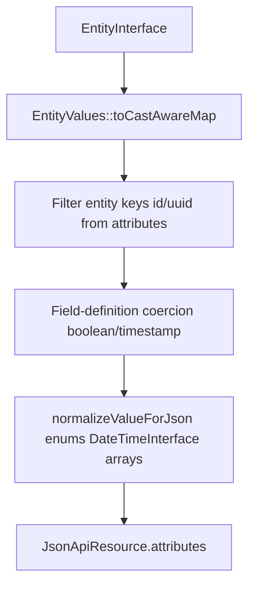

# JSON:API — cast-aware attributes

<!-- Spec reviewed 2026-04-09 ST-9 - cast-aware ResourceSerializer pipeline, alignment with entity-system (#1181) -->

This document covers **how entity field values become JSON:API `attributes`** under the casting + hydration architecture (#1181). Full CRUD routing, documents, errors, query parsing, and schema endpoints remain specified in **`docs/specs/api-layer.md`**.

## Status (primary API surface)

JSON:API is the framework's **primary API surface** as of mission `api-surface-consolidation-jsonapi-primary-01KSEFTV` (2026-05-25). Every new admin endpoint, mutation, and read model defaults to JSON:API. Distributions consuming Waaseyaa should expect JSON:API to be the long-term-supported surface.

**Canonical implementation:** `packages/api/` (L4). Controllers in `packages/api/src/Controller/`; routers in `packages/api/src/Http/Router/`; service-provider wiring in `packages/api/src/ApiServiceProvider::httpDomainRouters()`. Route registration via string-FQCN in `packages/foundation/src/Kernel/BuiltinRouteRegistrar.php`.

**Canonical consumer:** `packages/admin/app/composables/` (L6 Nuxt SPA). Recent extension examples: queue admin (M4B), notification channels (M4C), workflow guards (M4A-5), AI observability (M5A).

**Alternative surface:** `packages/graphql/` (L6) is the alternative protocol adapter, retained as **optional / experimental**. It is not bundled by `waaseyaa/full`. Distributions that need GraphQL install it explicitly. See `packages/graphql/README.md` for the alternative-protocol framing.

## Scope split

| Topic | Spec |
|-------|------|
| Routes, `JsonApiController`, sparse fieldsets, pagination, OpenAPI | `api-layer.md` |
| Attribute sourcing, `$casts`, JSON normalization for responses | This file + `entity-system.md` (Casting & hydration) |

## Attribute pipeline

`Waaseyaa\Api\ResourceSerializer` is the single authority for entity → `JsonApiResource` attributes.



### Invariants

1. **Cast-aware source:** Attributes are built from **`EntityValues::toCastAwareMap($entity)`** (internally: every key from `toArray()`, value from `get($key)`). This guarantees `EntityBase::$casts` apply before JSON shaping.
2. **Excluded keys:** Logical `id` and `uuid` column names from `EntityType::getKeys()` are omitted from `attributes`; they are represented as JSON:API `id` (UUID preferred, else numeric id as string; config entities use string machine name when UUID empty).
3. **Second pass — field definitions:** `castAttributes()` applies `boolean` and `timestamp`/`datetime` formatting on top of cast-aware values (e.g. `datetime_immutable` from `get()` → ISO string in payload).
4. **Third pass — JSON safety:** `normalizeAttributesForJson()` reduces `BackedEnum` to backing value, `UnitEnum` to name, `DateTimeInterface` to `ATOM`, recurses arrays and `JsonSerializable`.
5. **Field access:** When `EntityAccessHandler` + `AccountInterface` are both non-null, `filterFields(..., 'view', ...)` runs **after** the cast-aware map is built, on attribute keys.

### Anti-patterns

- Serializing from `$entity->toArray()` for public attributes when the entity defines `$casts` — enums and dates stay as raw storage scalars.
- Duplicating cast logic in controllers or the admin SPA — use API responses or shared server-side helpers (`EntityValues`).

### Example (conceptual)

```php
// Entity has protected array $casts = ['state' => MyBackedEnum::class];
// Storage / toArray(): state => 'active'
// JSON attribute after pipeline: "state" => "active" (backing value), not a PHP enum object
```

## Writes (`store` / `update`)

Incoming JSON:API attributes are applied with `$entity->set($field, $value)` (`JsonApiController::update`). **`set()` runs `castOut`**, so clients may send JSON-native scalars (strings, numbers, booleans) that match storage expectations; the entity persists storage-canonical values into `$values` before `toArray()` is snapshotted on save.

## JSON:API response shape (mission 1107)

The canonical JSON:API HTTP response is `Waaseyaa\Api\Http\JsonApiResponse`, a subclass of Symfony's `JsonResponse` introduced in mission 1107-api-symfony-decoupling under ratified contract C-001. App code constructs `JsonApiResponse` directly when a typed response is wanted; foundation routers continue to use `Waaseyaa\Foundation\Http\JsonApiResponseTrait::jsonApiResponse()` (the canonical helper) which still returns a base Symfony `JsonResponse`. Both paths produce the same wire shape:

- `Content-Type: application/vnd.api+json`
- Encoding flags `JSON_UNESCAPED_SLASHES | JSON_PRETTY_PRINT | JSON_THROW_ON_ERROR`

Per amended C-004 (foundation-canonical), the JSON:API response trait lives at `Waaseyaa\Foundation\Http\JsonApiResponseTrait`. Api-package consumers may import it directly — L4 → L0 is allowed by the layer rule. The previous duplicate `Waaseyaa\Api\JsonResponseTrait` (a plain JSON helper, not a JSON:API shape) was deleted as orphan.

## Related specs

- `docs/specs/entity-system.md` — `ValueCaster`, hydration, `EntityValues`, config entities
- `docs/specs/api-layer.md` — `ResourceSerializer` API surface, paired nullable access pattern, CRUD flow

## Feature parity matrix vs current GraphQL exposure

The following matrix enumerates every entity, query, and mutation exposed by `packages/graphql/` and the equivalent JSON:API surface in `packages/api/`. Populated by mission `api-surface-consolidation-jsonapi-primary-01KSEFTV` WP03.

| Entity / Operation | JSON:API surface | GraphQL surface | Gap (if any) | Follow-up mission |
|---|---|---|---|---|
| Entity — list (any registered type) | `GET /api/{entity_type}` → `JsonApiController::index()` | `{type}List(filter, sort, offset, limit)` → `EntityResolver::resolveList()` | — | — |
| Entity — single fetch by ID | `GET /api/{entity_type}/{id}` → `JsonApiController::show()` | `{type}(id: ID!)` → `EntityResolver::resolveSingle()` | — | — |
| Entity — create | `POST /api/{entity_type}` → `JsonApiController::store()` | `create{Type}(input)` → `EntityResolver::resolveCreate()` | — | — |
| Entity — update | `PATCH /api/{entity_type}/{id}` → `JsonApiController::update()` | `update{Type}(id, input)` → `EntityResolver::resolveUpdate()` | — | — |
| Entity — delete | `DELETE /api/{entity_type}/{id}` → `JsonApiController::destroy()` | `delete{Type}(id)` → `EntityResolver::resolveDelete()` | — | — |
| Schema introspection (entity type) | `GET /api/schema/{entity_type}` → `SchemaController` | GraphQL introspection via `__schema` / `__type` queries (native GraphQL) | — | — |
| OpenAPI schema | `GET /api/openapi.json` | not exposed | JSON:API only | — |
| Entity type registry — list | `GET /api/entity-types` | not exposed | JSON:API only | — |
| Entity type — enable/disable | `POST /api/entity-types/{entity_type}/enable\|disable` | not exposed | JSON:API only | — |
| Broadcast (SSE event push) | `GET /api/broadcast` → `BroadcastStorage` | not exposed | JSON:API only | — |
| Media upload | `POST /api/media/upload` | not exposed | JSON:API only | — |
| Search | `GET /api/search` | not exposed | JSON:API only | — |
| Discovery — hub/cluster/timeline/endpoint | `GET /api/discovery/{hub\|cluster\|timeline\|endpoint}/{entity_type}/{id}` | not exposed | JSON:API only | — |
| Workflow definitions — list + dry-run | `GET /api/workflow-definitions`, `POST /api/workflow-definitions/dry-run` | not exposed | JSON:API only | — |
| Queue — jobs (list/retry/discard) | `GET\|POST /api/queue/jobs[/{id}/retry\|discard]` | not exposed | JSON:API only | — |
| Scheduler — tasks (list/trigger) | `GET\|POST /api/scheduler/tasks[/{name}/trigger]` | not exposed | JSON:API only | — |
| Notification — channels (list/test) | `GET\|POST /api/notification/channels[/{channel}/test]` | not exposed | JSON:API only | — |
| Workflow guards — list | `GET /api/workflow-guards` | not exposed | JSON:API only | — |
| Telescope agent-context / codified-context sessions | `GET /api/telescope/…` | not exposed | JSON:API only | — |
| Mercure monitor — channels/events/subscribers | `GET /api/mercure/…` | not exposed | JSON:API only | — |
| Audit events — list | `GET /api/audit/events` | not exposed | JSON:API only | — |
| OIDC clients — CRUD + secret regeneration | `GET\|POST\|PATCH\|DELETE /api/oidc-clients[/{id}]` | not exposed | JSON:API only | — |
| Field auto-save | `PATCH /api/{entity_type}/{id}/fields/{key}` → `FieldAutoSaveController` | not exposed | JSON:API only | — |
| Translations | `TranslationController` | not exposed | JSON:API only | — |

<!-- Spec reviewed 2026-05-25 - api-surface-consolidation-jsonapi-primary-01KSEFTV - WP01 - JSON:API primary declaration + parity matrix -->
