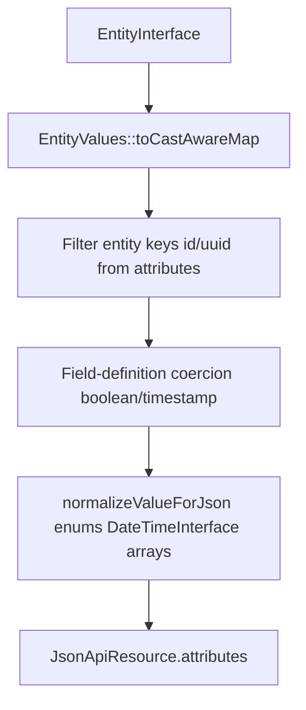

# JSON:API — cast-aware attributes

<!-- Spec reviewed 2026-08-24 - #2537: If-Match JSON:API mutation envelopes are owned
     by Waaseyaa\Api\Http\EntityMutationPrecondition. See docs/specs/api-layer.md. -->
<!-- Spec reviewed 2026-08-24 - #2493: purpose-built `/api/oidc-clients/{id}`
     PATCH/DELETE now share JsonApiRouter's strong If-Match fence; GET `{id}`
     emits ETag + meta.mutation_token. See docs/specs/api-layer.md. -->
<!-- Spec reviewed 2026-07-13 - CW-v1 WP-5 WP1 (#1920): parity matrix rows for the retired workflow
     dry-run endpoint and the workflow-guards endpoint are removed/collapsed (both deleted, no
     compat shim). "Workflow definitions — list + dry-run" is now "Workflow definitions — list";
     the "Workflow guards — list" row is dropped entirely. -->
<!-- Spec reviewed 2026-04-09 ST-9 - cast-aware ResourceSerializer pipeline, alignment with entity-system (#1181) -->

This document covers **how entity field values become JSON:API `attributes`** under the casting + hydration architecture (#1181). Full CRUD routing, documents, errors, query parsing, and schema endpoints remain specified in **`docs/specs/api-layer.md`**.

## Status (primary API surface)

JSON:API is the framework's **primary API surface** as of mission `api-surface-consolidation-jsonapi-primary-01KSEFTV` (2026-05-25). Every new admin endpoint, mutation, and read model defaults to JSON:API. Distributions consuming Waaseyaa should expect JSON:API to be the long-term-supported surface.

**Canonical implementation:** `packages/api/` (L4). Controllers in `packages/api/src/Controller/`; routers in `packages/api/src/Http/Router/`; service-provider wiring in `packages/api/src/ApiServiceProvider::httpDomainRouters()`. Route registration via string-FQCN in `packages/foundation/src/Kernel/BuiltinRouteRegistrar.php`.

**Canonical consumer:** `packages/admin/app/composables/` (L6 Nuxt SPA). Recent extension examples: queue admin (M4B), notification channels (M4C), AI observability (M5A).

**Alternative surface:** `packages/graphql/` (L6) is the alternative protocol adapter, retained as **optional / experimental**. It is not bundled by `waaseyaa/full`. Distributions that need GraphQL install it explicitly. See `packages/graphql/README.md` for the alternative-protocol framing.

## Scope split

| Topic | Spec |
|-------|------|
| Routes, `JsonApiController`, sparse fieldsets, pagination, OpenAPI | `api-layer.md` |
| Attribute sourcing, `$casts`, JSON normalization for responses | This file + `entity-system.md` (Casting & hydration) |

## Attribute pipeline

`Waaseyaa\Api\ResourceSerializer` is the single authority for entity → `JsonApiResource` attributes.


```mermaid
flowchart TD
  E[EntityInterface] --> M[EntityValues::toCastAwareMap]
  M --> F[Filter entity keys id/uuid from attributes]
  F --> A[Field-definition coercion boolean/timestamp]
  A --> N[normalizeValueForJson enums DateTimeInterface arrays]
  N --> J[JsonApiResource.attributes]
```

### Invariants

1. **Cast-aware source:** Attributes are built from **`EntityValues::toCastAwareMap($entity)`** (internally: every key from `toArray()`, value from `get($key)`). This guarantees `EntityBase::$casts` apply before JSON shaping.
2. **Excluded keys:** Logical `id` and `uuid` column names from `EntityType::getKeys()` are omitted from `attributes`; they are represented as JSON:API `id` (UUID preferred, else numeric id as string; config entities use string machine name when UUID empty).
3. **Second pass — field definitions:** `castAttributes()` applies `boolean` and `timestamp`/`datetime` formatting on top of cast-aware values (e.g. `datetime_immutable` from `get()` → ISO string in payload).
4. **Third pass — JSON safety:** `normalizeAttributesForJson()` reduces `BackedEnum` to backing value, `UnitEnum` to name, `DateTimeInterface` to `ATOM`, recurses arrays and `JsonSerializable`.
5. **Field access:** When `EntityAccessHandler` + `AccountInterface` are both non-null, `filterFields(..., 'view', ...)` runs **after** the cast-aware map is built, on attribute keys.

### Anti-patterns

- Serializing from `$entity->toArray()` for public attributes when the entity defines `$casts` — enums and dates stay as raw storage scalars.
- Duplicating cast logic in controllers or the admin SPA — use API responses or shared server-side helpers (`EntityValues`).

### Example (conceptual)

```php
// Entity has protected array $casts = ['state' => MyBackedEnum::class];
// Storage / toArray(): state => 'active'
// JSON attribute after pipeline: "state" => "active" (backing value), not a PHP enum object
```

## Representations: rendered vs editing (#2552)

A `GET` returns the **rendered** representation by default: HTML-bearing fields
(`RichTextSanitizer::HTML_FIELD_TYPES`, currently `text_long`) pass through the
sanitizer on the way out. Stored bytes are never modified — sanitization is a
read-time projection, and the write path stores author input verbatim.

That projection is lossy, and not only for unsafe markup. `allowSafeElements()`
also drops `class`, `style`, `data-*`, relative URLs, inline SVG and ARIA state,
and it normalizes structure (a bare `<tr>` gains a `<tbody>`). So a client that
reads a body, edits it, and writes it back destroys whatever the projection
dropped. That is what #2552 reported: a routine read-modify-write silently
stripped a site's `sfn-*` component hooks and broke public styling.

An authorized editor therefore opts into the **editing** representation:

```
GET /api/node/{id}?workingCopy=1&representation=editing
```

which returns the HTML field byte-for-byte as stored. Every response carries
`meta.representation`, so a client can tell which one it holds before writing
anything back.

The opt-in is gated, not merely declared:

- `representation=editing` requires `?workingCopy=1`, and the working copy is
  already gated on entity **update** access. Every HTML attribute that remains
  after internal-field, field-view, and sparse-fieldset projection must also
  pass the same field **edit** check PATCH uses. If any such field is forbidden,
  the whole request receives a generic 403 and no resource body. A view-hidden
  HTML field, a non-HTML read-only field, or an HTML field excluded by the
  request's sparse fieldset does not block the projection because no raw bytes
  for that field would be returned.
- It is refused on collections (`index`), where no single entity's update access
  has been established.
- An unsupported value is a 400 rather than a silent fallback.

**The shared sanitizer allowlist was deliberately NOT widened.** Admitting
`class` there would have widened anonymous JSON:API, GraphQL, the admin surface
and the markdown presenter simultaneously — and `class` cannot be admitted
without `allowRelativeLinks()`/`allowRelativeMedias()`, which also admit
protocol-relative `//host/…` URLs. Those carry no scheme, so `forceHttpsUrls()`
never sees them, and any author could plant a tracking pixel that fires for
every anonymous reader. The remedy is a gated projection for one authorized
caller, not a looser baseline for everyone.

### Mutation echoes (#2553)

`representation` applies to `POST` and `PATCH` too, selecting the projection of
the **response echo** only. It never influences what is written.

Keeping the mutation response as the next edit state is the normal SPA pattern,
so a lossless read alone is not enough: a sanitized echo makes the *following*
save destructive even when the first round trip was safe.

```
GET ?representation=editing   -> stored bytes            (sha A)
PATCH ?representation=editing -> stored bytes unchanged  (sha A)
      response body            -> stored bytes           (sha A)   <- #2553
next PATCH echoing that body  -> stored bytes            (sha A)
```

Three rules, and one difference from the read side:

- **A mutation is its own authorization anchor**, so `editing` does *not*
  additionally require `?workingCopy=1` on a write. That pairing exists only to
  bind the read to an entity-`update` gate; a successful `PATCH`/`POST` has
  already passed one, and `workingCopy` has no read-side meaning on a write.
- **An unrecognized value is a 400 before anything is written**, never a
  fallback and never a write followed by a complaint.
- **Every mutation response states `meta.representation`**, exactly as every
  single-entity read does, so a client keeping the body as its edit state can
  tell which projection it holds without inferring it from the request it
  thinks it made.

**A denied field downgrades the echo; it does not fail the write.** The
per-field `edit` gate still applies, but by the time the echo is built the
mutation has committed — failing the response would tell a client its
successful write failed. The response is served as `rendered` and says so, which
is what makes the downgrade detectable rather than silent.

**Why not always echo losslessly.** A caller that may `PATCH` already holds the
access the editing read is gated on, so an unconditional lossless echo would
disclose nothing new — but disclosure is not the only property at stake. The
sanitized projection is also what protects a client that renders the echo
directly, and every existing `PATCH` consumer was written against it. Making the
lossless echo unconditional would hand raw author HTML to consumers that never
asked for it. Opt-in keeps existing wire behaviour intact and puts the choice
with the client that knows what it does with the bytes.

**`FieldAutoSaveController` resolves the same way** (`PUT
{api}/{type}/{id}/field/{key}?representation=editing`), for a stronger reason:
that surface has already required field-`edit` access on the one field it
serves and has just written the caller's own bytes to it, so the lossless echo
returns exactly what the caller supplied. It does not mirror the structural 400
— refusing a completed single-field write over a query-string typo would be
worse than ignoring the typo — so an unrecognized value there is simply not the
opt-in, and `meta.representation` still states what was served.

**The admin SPA does not opt in, and re-read is not a remedy.**
`SchemaForm.vue` never hits JSON:API HTTP. It loads and saves through
`AdminSurfaceTransportAdapter` → `GenericAdminSurfaceHost`. That host already
serves the working copy to anyone who may `update` — there is no
`?workingCopy=1` for the SPA to adopt; that decision is already taken on this
host. Host GET still serializes without `losslessHtml`, and `handleUpdate` /
`handleCreate` call `JsonApiController::update()` / `store()` with the default
query, so this contract's echo opt-in never runs for the SPA. Form state is the
sanitized projection; the first save of a writable HTML field still strips
stored markup. Another host GET is still sanitized, so "re-read before editing"
cannot restore stored bytes.

Lossless GET plus mutation echo on `GenericAdminSurfaceHost` is a follow-up on
that host, not a CW-v1 pointer change and not a rider on this JSON:API
contract. Until that follow-up, the admin surface round-trips through the
sanitized projection, which is why the lossless projection remains opt-in
rather than a behaviour every client inherits.

Where sanitization belongs, stated plainly: **at each output boundary, not at
rest and not once centrally.** Storage keeps author bytes; every rendering
surface sanitizes for its own audience; the editing representation is the one
projection that deliberately does neither, and each raw HTML field is reachable
only by a caller who may already rewrite that field.

## Writes (`store` / `update` / `delete`)

Incoming JSON:API attributes are applied with `$entity->set($field, $value)` (`JsonApiController::update`). **`set()` runs `castOut`**, so clients may send JSON-native scalars (strings, numbers, booleans) that match storage expectations; the entity persists storage-canonical values into `$values` before `toArray()` is snapshotted on save.

### Committed mutation, failed post-commit side effects (#2999)

When a mutation-authority-backed `EntityRepository` completes the outer database
commit but a post-commit listener or completion callback fails, the repository
translates that outer `transaction()` call's post-commit `TransactionCompletionException`
into
`Waaseyaa\EntityStorage\Exception\EntityMutationCommittedSideEffectsFailedException`.
`UnitOfWork` itself still throws the public `TransactionCompletionException`
(stamped with that outer call's commitment token — rotated per outer
`transaction()`, stable for nested calls) so existing
`catch (TransactionCompletionException)` consumers remain compatible.

The repository translation applies **only** when
`TransactionCompletionException::committedByUnitToken()` matches the outer
repository call's UnitOfWork commitment token for that same outer transaction.
A completion failure from an independent nested repository write during
`PRE_SAVE` / `PRE_DELETE` (different connection / token), or a retained
tokenized failure from an earlier reuse of the same UnitOfWork object, is
rethrown as the bare completion exception after the outer mutation rolls back —
it is **not** this committed signal.

`JsonApiController` catches
`EntityMutationCommittedSideEffectsFailedException` **only at the repository
mutation boundary** (`store()` save, both `update()` save paths including
revision expectation / `saveWithExpectation()`, and `destroy()` delete) — never
around earlier validation, access, or transition work, and never as a global
classifier for arbitrary completion exceptions.

The JSON:API error envelope is:

| Member | Value |
|---|---|
| HTTP status | `500` |
| `errors[0].status` | `"500"` |
| `errors[0].title` | `"Committed mutation side effects failed"` |
| `errors[0].code` | `"COMMITTED_SIDE_EFFECTS_FAILED"` (`JsonApiController::COMMITTED_SIDE_EFFECTS_FAILED_CODE`) |
| `errors[0].detail` | Sanitized operator guidance only — **must not** echo callback messages, exception classes, stack traces, or submitted payloads |
| `errors[0].meta.committed` | `true` |
| `errors[0].meta.operation` | `"create"`, `"update"`, or `"delete"` |
| `errors[0].meta.resource_type` | The entity type id |
| `errors[0].meta.resource_id` | The persisted entity id known after the committed mutation |

This is **not** success (`2xx`), conflict (`409`), or validation/precondition
refusal (`422` / `428`). The detail states that retrying the same request is
unsafe: the durable row already exists (or, for delete, is already absent) while
downstream side effects may still need separate reconciliation. Pre-commit /
`PRE_SAVE` / `PRE_DELETE` guard failures — including a completion-shaped
exception or foreign-unit committed failure raised before this mutation's
commit — remain distinct: they roll back and must **not** emit
`COMMITTED_SIDE_EFFECTS_FAILED`.

`JsonApiRouter` and `ControllerDispatcher` pass the controller document through
unchanged; they do not remap this code to the generic uncaught-exception 500.

**Residual (#2999, out of scope for this contract):** MCP tool error mapping,
CLI governed-authoring exit semantics, recovery/reconciliation playbooks, and
caller-specific retry guidance for non-JSON:API surfaces remain open. The
publishing idempotency completion-signal slice (`FW-POST-COMMIT-OUTCOME-01`
slice 1) is unchanged. Repositories without mutation authority (non-UnitOfWork
composition) are also residual: they commit locally then dispatch POST/AFTER
events immediately, so listener failures escape as the original throwable after
a durable write; a local `commit()` that raises `TransactionCompletionException`
can be masked by the inactive-transaction rollback path — they do not emit
`EntityMutationCommittedSideEffectsFailedException`. Standard kernel JSON:API
composition always wires mutation authority and is covered by this contract.

## JSON:API response shape (mission 1107)

The canonical JSON:API HTTP response is `Waaseyaa\Api\Http\JsonApiResponse`, a subclass of Symfony's `JsonResponse` introduced in mission 1107-api-symfony-decoupling under ratified contract C-001. App code constructs `JsonApiResponse` directly when a typed response is wanted; foundation routers continue to use `Waaseyaa\Foundation\Http\JsonApiResponseTrait::jsonApiResponse()` (the canonical helper) which still returns a base Symfony `JsonResponse`. Both paths produce the same wire shape:

- `Content-Type: application/vnd.api+json`
- Encoding flags `JSON_UNESCAPED_SLASHES | JSON_PRETTY_PRINT | JSON_THROW_ON_ERROR`

Per amended C-004 (foundation-canonical), the JSON:API response trait lives at `Waaseyaa\Foundation\Http\JsonApiResponseTrait`. Api-package consumers may import it directly — L4 → L0 is allowed by the layer rule. The previous duplicate `Waaseyaa\Api\JsonResponseTrait` (a plain JSON helper, not a JSON:API shape) was deleted as orphan.

## Related specs

- `docs/specs/entity-system.md` — `ValueCaster`, hydration, `EntityValues`, config entities
- `docs/specs/api-layer.md` — `ResourceSerializer` API surface, paired nullable access pattern, CRUD flow

## Feature parity matrix vs current GraphQL exposure

The following matrix enumerates every entity, query, and mutation exposed by `packages/graphql/` and the equivalent JSON:API surface in `packages/api/`. Populated by mission `api-surface-consolidation-jsonapi-primary-01KSEFTV` WP03.

| Entity / Operation | JSON:API surface | GraphQL surface | Gap (if any) | Follow-up mission |
|---|---|---|---|---|
| Entity — list (any registered type) | `GET /api/{entity_type}` → `JsonApiController::index()` | `{type}List(filter, sort, offset, limit)` → `EntityResolver::resolveList()` | — | — |
| Entity — single fetch by ID | `GET /api/{entity_type}/{id}` → `JsonApiController::show()` | `{type}(id: ID!)` → `EntityResolver::resolveSingle()` | — | — |
| Entity — create | `POST /api/{entity_type}` → `JsonApiController::store()` | `create{Type}(input)` → `EntityResolver::resolveCreate()` | — | — |
| Entity — update | `PATCH /api/{entity_type}/{id}` → `JsonApiController::update()` | `update{Type}(id, input)` → `EntityResolver::resolveUpdate()` | — | — |
| Entity — delete | `DELETE /api/{entity_type}/{id}` → `JsonApiController::destroy()` | `delete{Type}(id)` → `EntityResolver::resolveDelete()` | — | — |
| Schema introspection (entity type) | `GET /api/schema/{entity_type}` → `SchemaController` | GraphQL introspection via `__schema` / `__type` queries (native GraphQL) | — | — |
| OpenAPI schema | `GET /api/openapi.json` | not exposed | JSON:API only | — |
| Entity type registry — list | `GET /api/entity-types` | not exposed | JSON:API only | — |
| Entity type — enable/disable | `POST /api/entity-types/{entity_type}/enable\|disable` | not exposed | JSON:API only | — |
| Broadcast (SSE event push) | `GET /api/broadcast` → `BroadcastStorage` | not exposed | JSON:API only | — |
| Media upload | `POST /api/media/upload` | not exposed | JSON:API only | — |
| Search | `GET /api/search` | not exposed | JSON:API only | — |
| Discovery — hub/cluster/timeline/endpoint | `GET /api/discovery/{hub\|cluster\|timeline\|endpoint}/{entity_type}/{id}` | not exposed | JSON:API only | — |
| Workflow definitions — list | `GET /api/workflow-definitions` | not exposed | JSON:API only | — |
| Queue — jobs (list/retry/discard) | `GET\|POST /api/queue/jobs[/{id}/retry\|discard]` | not exposed | JSON:API only | — |
| Scheduler — tasks (list/trigger) | `GET\|POST /api/scheduler/tasks[/{name}/trigger]` | not exposed | JSON:API only | — |
| Notification — channels (list/test) | `GET\|POST /api/notification/channels[/{channel}/test]` | not exposed | JSON:API only | — |
| Mercure monitor — channels/events/subscribers | `GET /api/mercure/…` | not exposed | JSON:API only | — |
| Audit events — list | `GET /api/audit/events` | not exposed | JSON:API only | — |
| OIDC clients — CRUD + secret regeneration | `GET\|POST\|PATCH\|DELETE /api/oidc-clients[/{id}]` (PATCH/DELETE require strong `If-Match`; GET `{id}` emits `ETag` + `meta.mutation_token`) | not exposed | JSON:API only | — |
| Field auto-save | `PATCH /api/{entity_type}/{id}/fields/{key}` → `FieldAutoSaveController` | not exposed | JSON:API only | — |
| Translations | `TranslationController` | not exposed | JSON:API only | — |

<!-- Spec reviewed 2026-05-25 - api-surface-consolidation-jsonapi-primary-01KSEFTV - WP01 - JSON:API primary declaration + parity matrix -->


## JSON:API metadata producer

JSON:API structural declarations can now be generated from RouteContributionContext entity/exposure inputs without a manager or service lookup. Existing CRUD, field-save, translation and workflow methods, route defaults/options and ordering are preserved. Compatibility registration compiles fresh routes from immutable cached definitions. Nonexposed entities retain opaque 404 responses for every previously supported method and nested path, independent of account. This generator API does not supply controller construction or bypass domain-router access, serialization and mutation preconditions.


ROUTE-METADATA-01 frozen API availability prerequisite: the existing neutral boot publication now copies boolean api.route.* facts with exposure, validates their namespace and types, and exposes them only after freeze. Duplicate, malformed and late publication poisons both views. API publishes only after its existing successful install gates and catalog construction, adding no probes or service resolutions. The kernel projects copied facts with existing service-presence inputs into snapshot identity. Optional publish arguments preserve callers; absent API supplies no API route facts. Full API admission and installed strict Bimaaji proof remain open.


ROUTE-METADATA-01 complete API admission: ApiServiceProvider contributes one pure table from finalized copied exposure, api.route availability and declared service presence. Fixed API rows and JsonApiRouteProvider structural rows share the same authority with bare compatibility replay through RouteMetadataCompiler. Canonical declarations identify explicitly bound, nonshared request adapters; no controller or domain-router construction occurs during inspection. The owned JSON structural generator is loaded during register, before cold reads. Canonical workflow inclusion uses declared TransitionService binding presence; an unhealthy selected dependency refuses execution rather than silently withdrawing routes. Bare compatibility retains its prior healthy-resolution gate and semantic controller/alias defaults until legacy callers migrate. OIDC admin inclusion uses copied entity presence. MCP permission/session/CSRF, retention roles/defaults, priorities and hidden opaque404 behavior remain unchanged. The stateless hidden handler accepts optional forwarded request/path arguments without service reads. Removal condition for semantic adapter mapping and bare replay is completion of legacy API callers under RM-06; owner waaseyaa/api. Admin Surface/FETDER producers and CLI/Bimaaji/installed strict export remain open.
