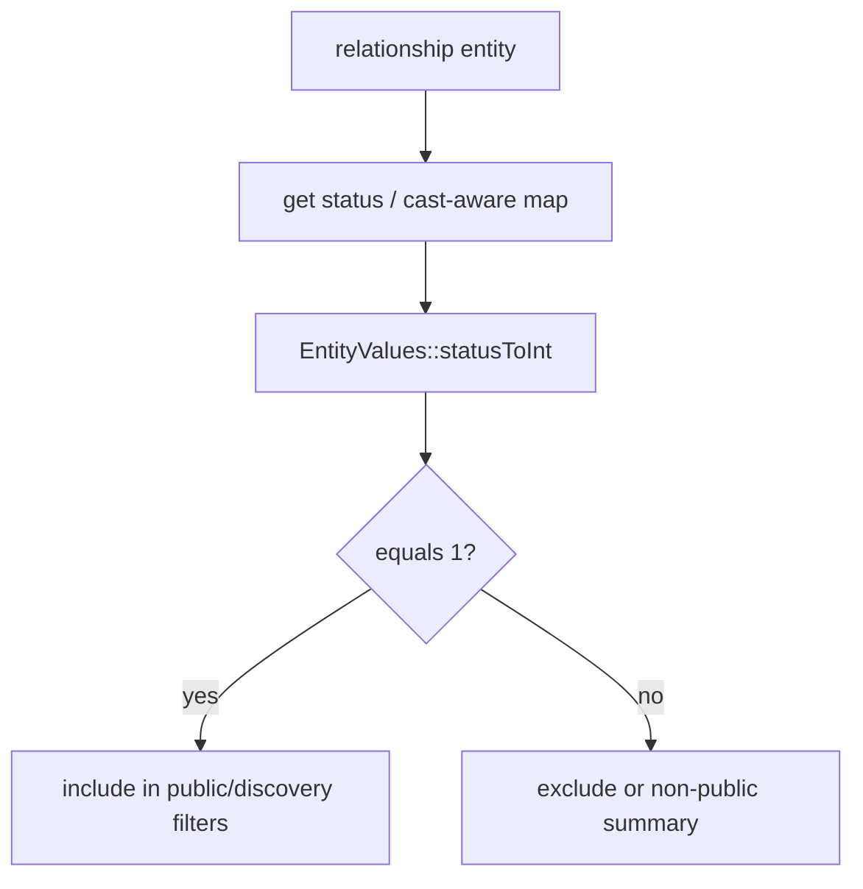

# Relationship Modeling (v0.6)

<!-- Spec reviewed 2026-06-04 - PR #1614 incidental: StubEntityTypeManager test fixture (packages/relationship/tests/Fixtures/) gained a stub `resolveFieldDefinitions(string $entityTypeId, ?string $bundle = null): array { return []; }` to satisfy the new bundle-aware `EntityTypeManagerInterface` method. No relationship contract or traversal semantic changed. -->
<!-- Spec reviewed 2026-05-19 - mission sql-entity-query-access-checking-01KRYP15 (#1495) incidental: `RelationshipValidator` and `RelationshipDeleteGuardListener` keep their `accessCheck(false)` bypass on internal integrity queries — gained inline justifications ("FK integrity check spans access boundaries; a user cannot be allowed to violate FKs because they cannot see the referenced entity"). Test fixtures `FixedResultEntityQuery` and `NullEntityQuery` got the new `EntityQueryInterface::setAccount()` method to satisfy the interface contract. No relationship contract or traversal semantic changed. -->
<!-- Spec reviewed 2026-05-12 - mission entity-storage-v2-01KRCDDC incidental: StubEntityTypeManager test fixture (packages/relationship/tests/Fixtures/) updated to satisfy new EntityTypeInterface::getPrimaryStorageBackend(): ?string method from WP07. No relationship contract or traversal semantic changed. -->
<!-- Spec reviewed 2026-05-02 - mission #1257 WP10 incidental: StubEntityTypeManager test fixture (packages/relationship/tests/Fixtures/) gained a stub `getTenancy(): ?array { return null; }` to satisfy the new EntityTypeInterface method. No relationship contract or traversal semantic changed. -->
<!-- Spec reviewed 2026-04-25 - Relationship entity: attribute-driven keys / constructor alignment only; traversal and discovery semantics unchanged -->
<!-- Spec reviewed 2026-04-24 - RelationshipTraversalService summary batching: numeric entity IDs normalized via filter_var(FILTER_VALIDATE_INT) instead of ctype_digit (PHP 8.4 deprecation); loadMultiple key resolution unchanged in intent -->
<!-- Spec reviewed 2026-04-11 - Relationship entity: widened constructor for duplicateInstance re-entry; modeling and traversal semantics unchanged (#alpha-119) -->
<!-- Spec reviewed 2026-04-11b - Package tests only: EntityTypeManagerInterface stubs implement getRepository() (#1128); no relationship domain change -->
<!-- Spec reviewed 2026-04-07 - RelationshipParameterValidator extracted from RelationshipDiscoveryService (579→442 lines); validation/normalization helpers in dedicated class, injected as constructor dependency; timelineSortDate converted to instance method for consistent injection -->
<!-- Spec reviewed 2026-04-09 - RelationshipTraversalService: combined relationship queries where applicable; timeline active-window predicates pushed into SQL; browse still merges/sorts hub/cluster slices in PHP with batched entity loads -->
<!-- Spec reviewed 2026-04-09k - traversal summaries, access policy, pre-save normalization, and discovery edge context use `EntityValues` / `get()` for cast-aware values (#1181 ST-8) -->
<!-- Spec reviewed 2026-04-09 ST-9 - status/visibility diagram + cast-aware invariants cross-link (#1181) -->

<!-- Spec reviewed 2026-04-20 - Package tests only: EntityTypeManagerInterface stubs now accept optional registrant provenance on registerEntityType/registerCoreEntityType; no relationship domain change (#1313) -->

## Decision

Relationships are modeled as **first-class entities**.

This is the canonical v0.6 design for Minoo and downstream AI/MCP traversal.

## Rationale

- Supports culturally rich many-to-many and directional links.
- Supports qualifiers and provenance per relationship.
- Works cleanly with semantic retrieval and MCP graph traversal.
- Avoids schema lock-in from embedded references.

## Entity Contract

Entity type: `relationship` (name subject to final bundle naming convention)

Required fields:

- `relationship_type`
- `from_entity_type`
- `from_entity_id`
- `to_entity_type`
- `to_entity_id`
- `directionality` (`directed` | `bidirectional`)
- `status`

Optional qualifiers:

- `weight` (numeric ranking hint)
- `start_date`
- `end_date`
- `confidence`
- `source_ref`
- `notes`

## Validation Contract

- **`Waaseyaa\Relationship\RelationshipParameterValidator`** — centralizes normalization and validation of relationship discovery inputs (filter shape, pagination limits, field allowlists) before `RelationshipDiscoveryService` runs graph reads, so the service stays orchestration-only.

- All required fields must be present.
- Endpoint entity references must resolve.
- `start_date <= end_date` when both are set.
- Duplicate-edge policy must be explicit (unique constraint or idempotent upsert).
- Self-link policy must be explicit by relationship type.

## Query/Traversal Contract

Traversal must support:

- direction filter (`outbound` | `inbound` | `both`)
- type filter (`relationship_type` in set)
- temporal filtering
- status visibility filtering

Implementation note: timeline-style browse applies temporal window constraints in SQL (overlap with `start_date` / `end_date`) where possible so PHP does not filter full edge sets only to discard them. Hub/cluster surfaces may still merge outbound and inbound slices before deterministic sort and pagination; facet totals should be interpreted with the cost/accuracy trade-offs documented on the issue/milestone for paged discovery.

Deterministic ordering contract:

- `status` visibility first
- `weight` descending
- `start_date` ascending
- stable tie-breaker by entity id

Visibility normalization invariant:

- Relationship/public discovery checks must use shared workflow/status normalization (`Waaseyaa\Workflows\WorkflowVisibility`) rather than per-surface custom logic, so `workflow_state` and fallback `status` semantics stay identical across SSR/search/MCP/relationship browse.

### Cast-aware status and traversal (#1181 ST-9)

Relationship edges carry `status` (and related flags) that may be stored as strings, ints, or bools, or as backed enums when entities define `$casts`. Framework code normalizes visibility using **`get('status')`** and **`EntityValues::statusToInt()`** — not raw `toArray()` slices — so enum-backed or string storage stays consistent.

**Invariants**

1. **`RelationshipAccessPolicy`** — uses `$entity->get('status')` + `EntityValues::statusToInt()` for access decisions.
2. **`RelationshipTraversalService` / discovery summaries** — endpoint `is_public` uses `EntityValues::toCastAwareMap($entity)` (or equivalent) when delegating to workflow/discovery visibility helpers.
3. **`RelationshipPreSaveListener`** — normalizes via `EntityValues::toCastAwareMap($event->entity)` before validation so validators see domain-shaped values where casts apply.

Full casting rules: `docs/specs/entity-system.md` (Casting & hydration architecture).

## Indexing Requirements

Minimum indexes:

- (`from_entity_type`, `from_entity_id`, `status`)
- (`to_entity_type`, `to_entity_id`, `status`)
- (`relationship_type`, `status`)
- temporal index for (`start_date`, `end_date`) filtering

## Inverse Semantics

- Relationship types that have logical inverses must declare them.
- `bidirectional` relationships must not create infinite duplicate pairs.
- Traversal responses must represent inverse semantics predictably.

## API/MCP/AI Alignment

- JSON:API shape for relationship entities must be stable.
- MCP traversal tools must consume relationship entities directly.
- Semantic indexing may include relationship context fields where relevant.

## Discovery Surfaces Contract (v0.9)

Relationship traversal powers reusable discovery composition primitives:

- Topic hub aggregation: deterministic, paginated edge lists with facet counts.
- Cluster composition: grouped neighborhoods keyed by `relationship_type + related_entity_type`.
- Timeline navigation: temporal edge listing with `direction`, `from`, `to`, and `at` filters.
- Endpoint pages: public endpoint contract exposing directional/inverse edge metadata and relationship edge context.
- Public discovery route payloads must preserve deterministic ordering under identical fixture input.
- Traversal browse composition reuses an in-request related-entity summary cache keyed by `{entity_type}:{entity_id}` so repeated edges to the same endpoint do not trigger duplicate entity loads.
- Browse edge materialization warms that cache by grouping distinct referenced endpoint IDs per `related_entity_type` and calling `EntityStorage::loadMultiple()` once per type per directional pass (outbound vs inbound), instead of `load()` per edge, so query count scales with distinct endpoints per type rather than raw edge count.

Deterministic ordering for hub/cluster composition:

- `relationship_type` ascending
- direction rank (`outbound` before `inbound`)
- `related_entity_type` ascending
- `related_entity_label` ascending (case-insensitive)
- stable tie-breaker by `related_entity_id`, then `relationship_id`

## Test Matrix

Unit:

- field validation and temporal constraints
- inverse/duplicate/self-link behavior
- deterministic ordering

Integration:

- multi-entity graph traversal (teachings/stories/clans/events)
- cycles and self-links
- status-filtered visibility

E2E/Contract:

- admin authoring of relationships
- MCP traversal contract coverage
- semantic regression corpus including relationship-aware queries

## Deterministic Fixtures

Fixture corpus must include:

- directed chain
- bidirectional pair
- cycle
- self-link edge case (allowed or forbidden by type)
- temporal-bounded relationship
- unpublished relationship
- mixed workflow node states (published/draft/archived) to verify visibility enforcement
- cross-bundle related targets for hub/cluster aggregation
- large-graph fanout set for traversal/discovery stress reads
- deterministic mutation scenarios for cache invalidation coverage

v0.9 adds shared framework fixtures in `tests/Support/WorkflowFixturePack.php`:

- `discoveryNodes()` for public/non-public node mixes with fixed timestamps.
- `discoveryRelationships()` for temporal + status-varied graph edges.
- `discoverySearchScenarios()` for stable query expectations.
- `performanceNodesLargeGraph()` and `performanceRelationshipsLargeGraph()` for high-fanout graph surfaces.
- `performanceTraversalScenarios()` and `performanceCacheInvalidationScenarios()` for perf/correctness scenario coverage.
- `corpusSnapshot()` and `corpusHash()` for deterministic hash regression gates.

Downstream integration suites consume this shared corpus directly (SSR/search/MCP/discovery) to avoid drift across package-level tests.

<!-- Last reviewed: 2026-03-30 — test file reorganization only, no spec changes needed -->

<!-- Spec reviewed 2026-05-17 - dead-code baseline reduction (#1493 / PR TBD): @api PHPDoc sweep on extension-point classes + WaaseyaaEntrypointProvider extended to recognize EntityBase/ContentEntityBase subclasses and their traits. No behavioural change. -->

<!-- Spec reviewed 2026-05-17 - dead-code Phase 3 Bucket 4: @api PHPDoc sweep on additional public-API classes. No behavioural change. -->
