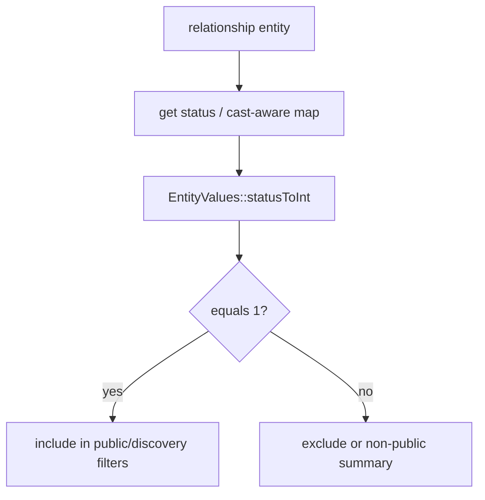

# Relationship Modeling (v0.6)

<!-- Spec reviewed 2026-07-19 - #2079 design revisions 2-3 add the exact-group ReBAC member-directory contract after fresh-context design attack. AuthorizedRelationshipTraversal::memberDirectory selects either the unchanged broad source-view branch or an isolated scoped branch. The scoped branch requires authenticated principal identity, strict true Protected group opt-in, active group, and the principal's live temporally active direct user->exact-group membership from one transaction/row set/evaluation instant; it returns only readonly MemberDirectoryEntry{userId, displayName} for active direct co-members. Generic group/relationship/user policies and edges() remain unchanged, email/Internal fields are never projected, and other groups, inactive/revoked/malformed edges, anonymous/non-members, inverse/bidirectional/chained/transitive paths, and missing/malformed opt-ins grant nothing. -->
<!-- Spec reviewed 2026-07-19 - #2079 keeps relationship endpoint selectors Protected and adds AuthorizedRelationshipTraversal as the public principal-scoped consumer seam. Consumers supply only a principal, source identity, and bounded domain options; the framework owns the fixed-shape topology query and account field-read scope. Results are immutable AuthorizedRelationshipEdge projections and include only active relationship rows for which the source, edge, and related endpoint are viewable. Missing or view-denied sources are concealed as an empty result. No arbitrary field selector, status-all switch, raw Relationship entity, or capability handle crosses the seam. -->
<!-- Spec reviewed 2026-07-14 - R24 relationship minor (#2020): closes R5 residual 2. RelationshipEndpointVisibilityPolicy now returns entity-level Forbidden for `view` when NEITHER endpoint is viewable, concealing the whole edge and its relationship type/status behind the canonical not-found response. If at least one endpoint is viewable the policy remains entity-neutral and its existing field-access behavior redacts only the hidden endpoint pair. Update/delete/create behavior and RelationshipAccessPolicy's ordinary publication/permission gate are unchanged. Acceptance: RelationshipEndpointVisibilityRestTest::both_endpoints_hidden_conceals_the_entire_edge plus isolated both-hidden and one-visible policy tests; boundary test was RED at 200 before the fix and GREEN at 404 after. -->
<!-- Spec reviewed 2026-07-13 - #1984: relationship traversal SQL now resolves every non-key field against the actual relationship table shape. Fresh sql-blob installs query the canonical `_data` JSON payload; upgraded installs that already carry historical dedicated columns continue querying those columns. Timeline overlap remains SQL-level on both shapes. A clean `db:init` + fresh-process SSR regression pins the fresh path, while the existing physical-column suite pins upgraded compatibility. -->
<!-- Spec reviewed 2026-07-05 - audit-remediation batch R7 WP2 (security, audit R5 residual #1): closed the discovery/browse-API half of R5's residual 1. `RelationshipTraversalService` gained OPTIONAL `?EntityAccessHandler $accessHandler` / `?AccountInterface $account` constructor params (independent of, and additive to, `$visibilityFilter`'s publish-status gate) — see the revised "Endpoint visibility (traverse and browse, fail-closed)" section. `DiscoveryApiHandler::createDiscoveryService(AccountInterface $account)` now threads the request account and the kernel's `EntityAccessHandler` into `RelationshipTraversalService`, so a published-but-access-restricted related/endpoint entity is withheld from `topicHub`/`clusterPage`/`timeline`/`endpointPage`/`relationshipEntityPage` (all route through `browse()`) exactly as it already was from JSON:API/entity.read/GraphQL (R5) and SSR nav (R6 PR2, a separate post-filter mechanism — left as-is, not migrated to this gate). `DiscoveryApiHandler::isDiscoveryEntityPublic()` (source-entity/own-identity gate for the discovery "endpoint" route) is likewise now access-aware given `$account`, signature changed to take the loaded `EntityInterface` instead of `(string $entityType, array $values)`. When `$accessHandler`/`$account` are not wired (any caller other than the discovery API — SSR, and any future `traverse()`/`browse()` consumer that doesn't opt in), the gate is OFF and behavior is unchanged. Cache-key generation bumped (`DiscoveryCachePrimitives::CACHE_KEY_GENERATION` 1->2) to bust pre-fix anonymous discovery-cache entries immediately on deploy rather than waiting out the 120s TTL. See the R5 section's residual-1 bullet, now updated to reflect closure. Acceptance: RelationshipTraversalServiceTest (4 new access-aware cases, RED against pre-fix code), DiscoveryRouterTest (3 new integration cases against real SQLite + EntityAccessHandler, RED against pre-fix code), DiscoveryCachePrimitivesTest (generation-bump key-diff case). -->
<!-- Spec reviewed 2026-07-03 - audit-remediation batch R5 (security): new `Waaseyaa\Relationship\RelationshipEndpointVisibilityPolicy` field-access policy closes the endpoint-identity leak on GET /api/relationship (collection+single), entity.read, and GraphQL — see new "Endpoint visibility (JSON:API / entity.read / GraphQL — field-access redaction, R5)" section. Registered via #[PolicyAttribute] + the two-phase AccessPolicyRegistry (SHARED boot path), so it wires on BOTH HttpKernel and ConsoleKernel — the ConsoleKernel path is load-bearing because entity.read runs under ai:run/queue:work; a HttpKernel-only configureHttpKernel() registration was rejected for exactly this reason. Two residuals documented, not fixed: (1) discovery/browse-API + SSR bypass the field-access plumbing (workflow-status-only VisibilityFilterInterface, not full AccessPolicyInterface); (2) both-endpoints-hidden still returns the edge with all four endpoint fields redacted (edge-existence metadata; closing it is entity-level, RelationshipAccessPolicy's job). No change to the existing traverse()/browse() publication-state gate. Acceptance: RelationshipEndpointVisibilityPolicyTest, RelationshipEndpointVisibilityRestTest, RelationshipEndpointVisibilityEntityReadTest, RelationshipEndpointVisibilityDiscoveryTest (boot-wiring guard — fails if reverted to configureHttpKernel); all RED against pre-fix wiring, GREEN after. -->
<!-- Spec reviewed 2026-07-01 - audit-remediation batch WP3 (security): (1) `RelationshipTraversalService::traverse()` now applies the SAME fail-closed endpoint-visibility gate as `browse()` — previously it returned raw `Relationship` entities filtered only by the relationship row's own `status`, leaking `to_entity_type`/`to_entity_id` of endpoints the viewer cannot see; see "Endpoint visibility" section. (2) `RelationshipDeleteGuardListener` generalized from hardcoded `'node'` to EVERY entity type and — for the first time — actually registered (RelationshipServiceProvider::boot() → EntityEvents::PRE_DELETE); see "Referential-Integrity Delete Guard" section. Adversarial-review follow-up same day: boot() resolves the dispatcher under the Symfony-contracts FQCN the kernel bus actually serves (foundation FQCN resolves null — the first cut silently registered nothing in a real boot); the guard matches endpoints by id OR uuid; traverse() with no filter wired returns no edges in unpublished mode too. Acceptance: RelationshipTraversalServiceTest::testTraversePublishedFailsClosedWithoutVisibilityFilter + testTraverseUnpublishedFailsClosedWithoutVisibilityFilter, RelationshipDeleteGuardListenerTest (incl. uuid-endpoint pin), RelationshipServiceProviderTest (bus stub mirrors the production key set). -->
<!-- Spec reviewed 2026-06-22 - WP06 (alpha245 security, audit #36): RelationshipTraversalService::isEntityPublic() defaulted to `true` when no VisibilityFilterInterface was wired, and BOTH live consumers (api DiscoveryApiHandler, ssr SsrPageHandler) built the service with no filter — so `browse()` in published mode leaked the labels/paths of related entities that are themselves unpublished to anonymous callers. The null default is now fail-CLOSED (`?? false`): an unwired filter withholds every related label/path. The two live consumers now pass `WorkflowVisibilityFilter`, so authorized published-content navigation is unchanged while drafts stay hidden. Traversal/discovery contract shapes unchanged. Acceptance: RelationshipTraversalServiceTest::testBrowsePublishedFailsClosedWithoutVisibilityFilter. Residual: the ai-agent `RelationshipTraverseTool` (separate audit item) returns raw edge values with no per-edge view check — tracked separately. -->
<!-- Spec reviewed 2026-06-04 - PR #1614 incidental: StubEntityTypeManager test fixture (packages/relationship/tests/Fixtures/) gained a stub `resolveFieldDefinitions(string $entityTypeId, ?string $bundle = null): array { return []; }` to satisfy the new bundle-aware `EntityTypeManagerInterface` method. No relationship contract or traversal semantic changed. -->
<!-- Spec reviewed 2026-05-19 - mission sql-entity-query-access-checking-01KRYP15 (#1495) incidental: `RelationshipValidator` and `RelationshipDeleteGuardListener` keep their `accessCheck(false)` bypass on internal integrity queries — gained inline justifications ("FK integrity check spans access boundaries; a user cannot be allowed to violate FKs because they cannot see the referenced entity"). Test fixtures `FixedResultEntityQuery` and `NullEntityQuery` got the new `EntityQueryInterface::setAccount()` method to satisfy the interface contract. No relationship contract or traversal semantic changed. -->
<!-- Spec reviewed 2026-05-12 - mission entity-storage-v2-01KRCDDC incidental: StubEntityTypeManager test fixture (packages/relationship/tests/Fixtures/) updated to satisfy new EntityTypeInterface::getPrimaryStorageBackend(): ?string method from WP07. No relationship contract or traversal semantic changed. -->
<!-- Spec reviewed 2026-05-02 - mission #1257 WP10 incidental: StubEntityTypeManager test fixture (packages/relationship/tests/Fixtures/) gained a stub `getTenancy(): ?array { return null; }` to satisfy the new EntityTypeInterface method. No relationship contract or traversal semantic changed. -->
<!-- Spec reviewed 2026-04-25 - Relationship entity: attribute-driven keys / constructor alignment only; traversal and discovery semantics unchanged -->
<!-- Spec reviewed 2026-04-24 - RelationshipTraversalService summary batching: numeric entity IDs normalized via filter_var(FILTER_VALIDATE_INT) instead of ctype_digit (PHP 8.4 deprecation); loadMultiple key resolution unchanged in intent -->
<!-- Spec reviewed 2026-04-11 - Relationship entity: widened constructor for duplicateInstance re-entry; modeling and traversal semantics unchanged (#alpha-119) -->
<!-- Spec reviewed 2026-04-11b - Package tests only: EntityTypeManagerInterface stubs implement getRepository() (#1128); no relationship domain change -->
<!-- Spec reviewed 2026-04-07 - RelationshipParameterValidator extracted from RelationshipDiscoveryService (579→442 lines); validation/normalization helpers in dedicated class, injected as constructor dependency; timelineSortDate converted to instance method for consistent injection -->
<!-- Spec reviewed 2026-04-09 - RelationshipTraversalService: combined relationship queries where applicable; timeline active-window predicates pushed into SQL; browse still merges/sorts hub/cluster slices in PHP with batched entity loads -->
<!-- Spec reviewed 2026-04-09k - traversal summaries, access policy, pre-save normalization, and discovery edge context use `EntityValues` / `get()` for cast-aware values (#1181 ST-8) -->
<!-- Spec reviewed 2026-04-09 ST-9 - status/visibility diagram + cast-aware invariants cross-link (#1181) -->

<!-- Spec reviewed 2026-04-20 - Package tests only: EntityTypeManagerInterface stubs now accept optional registrant provenance on registerEntityType/registerCoreEntityType; no relationship domain change (#1313) -->

## Decision

Relationships are modeled as **first-class entities**.

This is the canonical v0.6 design for Minoo and downstream AI/MCP traversal.

## Rationale

- Supports culturally rich many-to-many and directional links.
- Supports qualifiers and provenance per relationship.
- Works cleanly with semantic retrieval and MCP graph traversal.
- Avoids schema lock-in from embedded references.

## Entity Contract

Entity type: `relationship` (name subject to final bundle naming convention)

Required fields:

- `relationship_type`
- `from_entity_type`
- `from_entity_id`
- `to_entity_type`
- `to_entity_id`
- `directionality` (`directed` | `bidirectional`)
- `status`

Optional qualifiers:

- `weight` (numeric ranking hint)
- `start_date`
- `end_date`
- `confidence`
- `source_ref`
- `notes`

## Validation Contract

- **`Waaseyaa\Relationship\RelationshipParameterValidator`** — centralizes normalization and validation of relationship discovery inputs (filter shape, pagination limits, field allowlists) before `RelationshipDiscoveryService` runs graph reads, so the service stays orchestration-only.

- All required fields must be present.
- Endpoint entity references must resolve.
- `start_date <= end_date` when both are set.
- Duplicate-edge policy must be explicit (unique constraint or idempotent upsert).
- Self-link policy must be explicit by relationship type.

## Query/Traversal Contract

Traversal must support:

- direction filter (`outbound` | `inbound` | `both`)
- type filter (`relationship_type` in set)
- temporal filtering
- status visibility filtering

Implementation note: timeline-style browse applies temporal window constraints in SQL (overlap with `start_date` / `end_date`) where possible so PHP does not filter full edge sets only to discard them. Hub/cluster surfaces may still merge outbound and inbound slices before deterministic sort and pagination; facet totals should be interpreted with the cost/accuracy trade-offs documented on the issue/milestone for paged discovery.

Deterministic ordering contract:

- `status` visibility first
- `weight` descending
- `start_date` ascending
- stable tie-breaker by entity id

Visibility normalization invariant:

- Relationship/public discovery checks must use shared workflow/status normalization (`Waaseyaa\Workflows\WorkflowVisibility`) rather than per-surface custom logic, so `workflow_state` and fallback `status` semantics stay identical across SSR/search/MCP/relationship browse.

### Endpoint visibility (traverse and browse, fail-closed)

#### Principal-scoped application traversal

Relationship endpoint selectors remain Protected because graph topology can
disclose membership, affiliation, or other sensitive identity links. Ordinary
application consumers therefore use the container-provided
`AuthorizedRelationshipTraversal`, not endpoint-field capabilities and not a
raw `status: all` traversal call.

`edges()` takes an immutable `AuthorizationPrincipalInterface`, a source entity
type/id, and only bounded domain options: `direction`, `relationship_types`,
`at`, and `limit`. It establishes and restores the principal's field-read scope,
checks the source's `view` access, executes the framework-owned fixed-shape
topology lookup, and returns only active edges whose relationship entity and
related endpoint both pass `view` for the same principal. A missing,
unregistered, or view-denied source produces an empty list, preserving
concealment. Its result is a list of immutable `AuthorizedRelationshipEdge`
projections; consumers receive neither raw `Relationship` entities/value bags
nor field names, capability handles, or publication-bypass controls.

This facade is the supported ergonomic seam for membership lists and other
principal-facing graph traversal. `RelationshipTraversalService` and the private
typed topology/maintenance readers remain lower-level framework mechanisms for
existing discovery and system-context flows.

#### Exact-group member-directory ReBAC

`memberDirectory($principal, $groupId)` is a separate, purpose-specific method;
it accepts no traversal options. Generic source `group:view` selects the broad
branch, which retains the existing edge and endpoint checks and maps surviving
direct membership edges to the narrow directory DTO. When generic source view
is not allowed, the scoped branch requires an authenticated principal, an
active exact group whose Protected `members_can_view_directory` value is strict
`true`, and that principal's direct `user/{principal id} -> group/{group id}`
`group_membership` edge in the same live, temporally active row set being
enumerated.

The scoped invocation captures one evaluation second and materializes its exact
group state, opt-in, and membership graph authority in one database statement
inside a repeatable-read transaction; a database without that explicit
consistent-read capability fails closed. The authority reader supports both
fresh `_data` relationship storage and the historical dedicated-column shape.
Start and end bounds are inclusive; null is open;
malformed bounds make an edge inactive. Only direct
directed membership rows participate—no inverse interpretation, group-to-group
edge, inferred edge, or graph walk can confer authority. Transitivity is off;
adding it requires a separate product decision and contract.

Both branches return only readonly `MemberDirectoryEntry{userId,
displayName}` values for active user endpoints. The fixed endpoint projector
releases no email, roles, permissions, credentials, chronology, custom fields,
raw edge metadata, or value bag. The scoped grant is invocation-local and never changes
`edges()`, `EntityAccessHandler`, field classifications, the principal, or later
generic reads. Missing/false/malformed opt-in, inactive group/user, absent or
inactive caller membership, unknown entities, and read/transaction failures
produce an empty scoped result.

Both public read surfaces of `RelationshipTraversalService` gate on the *related endpoint's* publication visibility, not just the relationship row's own `status`:

- **`browse()`** — in `published` mode an edge is emitted only when the related endpoint is provably public via the wired `VisibilityFilterInterface`; `unpublished` mode inverts the check. With **no filter wired the service fails CLOSED** (`isEntityPublic()` → `false`): every related label/path is withheld (alpha245 fix, audit #36).
- **`traverse()`** — same contract since the 2026-07-01 WP3 fix, applied to the returned `Relationship` entities: in `published`/`unpublished` mode, EVERY non-source endpoint of a relationship must pass the visibility gate or the whole relationship is dropped. This is direction-independent and strictly at-least-as-closed as browse (a `Relationship` entity exposes both endpoint identities, so both are checked). Self-loops and empty endpoint slots expose nothing foreign and pass. The filter runs after the temporal/sort/limit step, matching browse's ordering (a limit can therefore return fewer visible rows than requested — browse parity). **With no filter wired, traverse() returns NO edges in BOTH modes** — a binary `is_public` cannot distinguish "provably draft" from "unknown", so unpublished mode fails fully closed rather than fail-open (adversarial-review hardening; this is deliberately stricter than browse's unwired unpublished mode, a pre-existing browse behavior left unchanged because both live browse consumers wire filters).
- **`status: 'all'`** performs NO endpoint filtering on either surface — callers opting into `all` own the exposure decision (system context). There is deliberately no separate unfiltered `@internal` traverse variant: `traverse(..., ['status' => 'all'])` already is the explicit system-context spelling, and no production consumer needed one (traverse had zero callers when the gate was added).
- **Per-ACCOUNT access gate (R7 WP2, additive, opt-in).** Both surfaces accept OPTIONAL `?EntityAccessHandler $accessHandler` / `?AccountInterface $account` constructor params, independent of `$visibilityFilter`. When BOTH are wired, every non-source endpoint must ALSO pass `EntityAccessHandler::check($endpoint, 'view', $account)->isAllowed()` — checked in addition to, never instead of, the publish-status gate above (an endpoint must be within the requested status scope AND viewable). This closes the gap the publish-status-only gate cannot: a PUBLISHED endpoint can still be access-restricted (a private node, a tenant-scoped entity), and `VisibilityFilterInterface` alone has no opinion on that. Fail-closed exactly like the publish-status gate: an endpoint with an empty id/type, an unregistered type, or a failed load is treated as NOT viewable. When either collaborator is `null` (the default — every caller except `DiscoveryApiHandler::createDiscoveryService()`), this gate is OFF and behavior is unchanged, so SSR (which applies its own independent post-filter, see `SsrPageHandler::canViewRelatedEndpoint()`/R6 PR2 below) and any other `traverse()`/`browse()` consumer are unaffected. The `status: 'all'` bypass above is NOT re-scoped by this gate for `filterByEndpointVisibility()` (traverse's early-return still skips it entirely for `all`), but IS applied unconditionally inside `browse()`'s `mapTraversalRelationships()` (so `all`-mode discovery results are still access-filtered — an admin's `administer nodes` bypass in `NodeAccessPolicy` keeps `status=all` discovery working for authorized callers).
- Storage-shape resolution: `queryRelationshipsForDirection()` keeps endpoint, status, type, and timeline filtering in SQL, but resolves each field against the actual table shape. A fresh canonical sql-blob table reads non-key fields through `json_extract(_data, ...)`; an upgraded table with historical dedicated columns reads those columns. Both shapes therefore produce identical traversal results without rewriting upgraded data.

### Endpoint visibility (JSON:API / `entity.read` / GraphQL — field-access redaction, R5)

The gate above (`browse()`/`traverse()`) is publication-STATE based and per-surface, not per-account, and it does not run at all on the generic entity read paths: `GET /api/relationship` (collection + single), the MCP `entity.read` tool, and GraphQL's generic entity resolver all reach a relationship edge through the SAME shared `EntityAccessHandler` field-access plumbing every entity type uses (`ResourceSerializer::filterFields()`, `JsonApiController::checkFieldAccess()`, `AbstractAgentTool::applyFieldAccessFilter()`, `GraphQlAccessGuard::filterFields()`) — none of which is publication-state aware, and `RelationshipAccessPolicy::access()` only gates the edge's OWN `status`/permission, never the endpoint's. Audit-remediation batch 2026-07-03 R5 closed the resulting gap: a viewable-but-unrelated edge disclosed a hidden/unpublished/access-restricted endpoint's identity (`to_entity_type`/`to_entity_id` or `from_entity_type`/`from_entity_id`) to any baseline caller on those three paths.

- **`Waaseyaa\Relationship\RelationshipEndpointVisibilityPolicy`** — a FIELD-only access policy (implements both `AccessPolicyInterface`, neutral on every operation, and `FieldAccessPolicyInterface`). For `view` on a `Relationship` entity, `fieldAccess()` loads the named endpoint via `EntityTypeManagerInterface::getRepository($type)->find($id)` and delegates to `EntityAccessHandler::check($endpoint, 'view', $account)`; the endpoint's (type, id) pair is redacted together (never just one of the two) whenever that check is not `isAllowed()`. Fail-closed: an empty id/type, an unregistered entity type, or a failed load is treated as NOT viewable.
- **Per-account, not publication-state.** This is deliberately a materially different contract from `browse()`/`traverse()`'s workflow-status gate above — it delegates to the endpoint's REAL `AccessPolicyInterface` (any reason an entity is hidden from an account: unpublished, access-restricted, tenant-scoped, etc.), not just a binary `is_public` flag.
- **Registered via ATTRIBUTE DISCOVERY**, `#[PolicyAttribute(entityType: 'relationship')]` with a `(EntityTypeManagerInterface, EntityAccessHandler)` constructor — so the SHARED-boot `AccessPolicyRegistry` (`AbstractKernel::discoverAccessPolicies()`) wires it on BOTH the `HttpKernel` AND the `ConsoleKernel`. The `ConsoleKernel` path is load-bearing: `entity.read` has real ConsoleKernel production callers (`ai:run --inline`, `queue:work` → `RunAgentHandler`), so a HttpKernel-only registration (an earlier `RelationshipServiceProvider::configureHttpKernel()` cut — a hook `ConsoleKernel` never invokes) would leave `entity.read` leaking in CLI/queue contexts. The apparent discovery-time cycle (the policy needs the `EntityAccessHandler` to delegate to endpoint entities) is resolved by the registry's two-phase algorithm: constructors typed for `EntityAccessHandler` are DEFERRED to phase 2 and receive the phase-1 preliminary handler (`KernelPolicyDependencyResolver`); `EntityTypeManagerInterface` is resolved off the kernel-services bus. This mirrors `Waaseyaa\Engagement\EngagementAccessPolicy` / `Waaseyaa\Messaging\MessagingAccessPolicy` (both handler-needing attribute-discovered policies), and is FIELD-level (per-account, all edges) versus `Waaseyaa\Genealogy\GenealogyRelationshipAccessPolicy`'s entity-level, genealogy-edge-scoped policy. For a genealogy edge specifically, genealogy's entity-level denial already hides the whole edge when an endpoint is hidden, so this field policy is belt-and-suspenders there; for any other edge type it is the sole protection. A boot-wiring guard test (`RelationshipEndpointVisibilityDiscoveryTest`) asserts the attribute is present and that the real `AccessPolicyRegistry->discover()` produces a redacting handler without hand-adding the policy — it fails if anyone reverts to a `configureHttpKernel`-style registration.
- **Coverage by read path:** JSON:API collection/single, MCP `entity.read`, and GraphQL are all covered because they share `EntityAccessHandler::filterFields()`/`checkFieldAccess()`. **Residual 1 CLOSED (R6 PR2 + R7 WP2):** the discovery/browse API and SSR's relationship-navigation context originally bypassed this plumbing entirely, relying solely on the `VisibilityFilterInterface` publish-status gate. SSR's `SsrPageHandler::buildRelationshipRenderContext()` was closed by R6 PR2 via an independent per-account POST-filter (`filterBrowseEndpoints()`/`canViewRelatedEndpoint()`, re-checking `EntityAccessHandler` on every disclosed endpoint after `browse()` returns — a different mechanism from the one below, deliberately left as-is). The discovery/browse API (`RelationshipTraversalService::browse()`/`traverse()`, `DiscoveryApiHandler`) was closed by R7 WP2 via the `$accessHandler`/`$account` constructor params documented in the "Endpoint visibility (traverse and browse, fail-closed)" section above — `DiscoveryApiHandler::createDiscoveryService(AccountInterface $account)` wires the kernel's real `EntityAccessHandler` and the request account into `RelationshipTraversalService`, and `isDiscoveryEntityPublic()` (the discovery "endpoint" route's own primary-entity gate) is likewise access-aware. `relationship.traverse` (the ai-tools MCP tool) was unaffected throughout since it already carries its own independent `canViewEndpoint()` fail-closed gate (a third, separate implementation — `RelationshipTraverseTool` queries the repository directly and never constructs `RelationshipTraversalService`). As of R7 WP2, every production construction site of `RelationshipTraversalService` is access-aware (directly or via an equivalent post-filter): `DiscoveryApiHandler` (this gate) and `SsrPageHandler` (R6 PR2's post-filter). No other production caller of `RelationshipTraversalService`/`RelationshipDiscoveryService` exists (GraphQL and bimaaji do not depend on `waaseyaa/relationship`; genealogy's own relationship-endpoint disclosure is gated separately and independently by the entity-level `Waaseyaa\Genealogy\Access\GenealogyRelationshipAccessPolicy`).
- **Both-endpoints-hidden edge-existence metadata (closed by #2020):** the endpoint visibility policy also participates at entity level for `view`. When NEITHER endpoint is viewable it returns Forbidden, so JSON:API and other access-handler readers conceal the entire edge (including id, `relationship_type`, and `status`) behind the same not-found response as an absent row. When at least one endpoint is viewable it remains entity-neutral and field access redacts only the hidden endpoint pair. `RelationshipAccessPolicy` continues to own the edge's ordinary publication/permission decision.

### Cast-aware status and traversal (#1181 ST-9)

Relationship edges carry `status` (and related flags) that may be stored as strings, ints, or bools, or as backed enums when entities define `$casts`. Framework code normalizes visibility using **`get('status')`** and **`EntityValues::statusToInt()`** — not raw `toArray()` slices — so enum-backed or string storage stays consistent.

```mermaid
flowchart TD
  R[relationship entity] --> G[get status / cast-aware map]
  G --> S[EntityValues::statusToInt]
  S --> V{equals 1?}
  V -->|yes| P[include in public/discovery filters]
  V -->|no| X[exclude or non-public summary]
```

**Invariants**

1. **`RelationshipAccessPolicy`** — uses `$entity->get('status')` + `EntityValues::statusToInt()` for access decisions.
2. **`RelationshipTraversalService` / discovery summaries** — endpoint `is_public` uses `EntityValues::toCastAwareMap($entity)` (or equivalent) when delegating to workflow/discovery visibility helpers.
3. **`RelationshipPreSaveListener`** — normalizes via `EntityValues::toCastAwareMap($event->entity)` before validation so validators see domain-shaped values where casts apply.

Full casting rules: `docs/specs/entity-system.md` (Casting & hydration architecture).

## Referential-Integrity Delete Guard

`RelationshipDeleteGuardListener` blocks deletion of any entity that is still referenced as a relationship endpoint, so deletes cannot silently orphan edge rows.

- **Scope: every entity type, both identifier forms.** Endpoints are free-form `(type, id)` pairs and `RelationshipValidator` accepts any registered entity type — and accepts a UUID in the id slot via its `entityExistsByUuid` fallback — so the guard matches the deleted entity's own `getEntityTypeId()` plus **id OR uuid** (`IN` condition) against `from_*` and `to_*` endpoint columns. (Until 2026-07-01 the guard was hardcoded to `'node'` — and was never registered at all, so it guarded nothing in production; the UUID form was added after adversarial review.)
- **Wiring:** `RelationshipServiceProvider::boot()` registers it on `EntityEvents::PRE_DELETE`. The dispatcher is resolved from the kernel-services bus under the **Symfony-contracts FQCN** (`Symfony\Contracts\EventDispatcher\EventDispatcherInterface`) and type-checked against the foundation contract — `ProviderRegistryKernelServices::get()` does NOT serve the foundation FQCN, and resolving it silently no-ops boot (adversarial review caught exactly this; pattern per `AuditServiceProvider::boot()`; `MediaServiceProvider`/`FieldServiceProvider` still carry the latent foundation-FQCN resolve — pre-existing, tracked separately). The throw (`RuntimeException` "Safe-delete blocked for {type} {id}: linked relationship IDs [...]") aborts `EntityRepository::delete()` before the row is removed. To delete a referenced entity, delete (or repoint) its relationships first; deleting a relationship entity itself is guarded only if it is in turn an endpoint of a meta-relationship.
- **Queries are system-context** — `getRepository('relationship')->getQuery()` with `accessCheck(false)` + inline justification (FK integrity spans access boundaries; a user cannot be allowed to orphan edges they cannot see). The entity-query path also makes the guard storage-shape tolerant: on a generic `_data`-blob relationship table the conditions compile to `json_extract()` instead of column references.
- **Known limits:** `deleteMany()` buffers lifecycle events until after commit (`UnitOfWork`), so only the single-`delete()` path is guarded. A blocked delete currently surfaces as a 500 through the API (mapping to 409 Conflict is an open follow-up). Cascade-delete semantics (auto-removing edges instead of blocking) were considered and deliberately not chosen — blocking is the fail-safe default.
- `RelationshipPreSaveListener` is registered by `RelationshipServiceProvider::boot()` on the production `PRE_SAVE` lifecycle event, so every repository relationship write is normalized and validated before persistence.

## Indexing Requirements

Minimum indexes:

- (`from_entity_type`, `from_entity_id`, `status`)
- (`to_entity_type`, `to_entity_id`, `status`)
- (`relationship_type`, `status`)
- temporal index for (`start_date`, `end_date`) filtering

## Inverse Semantics

- Relationship types that have logical inverses must declare them.
- `bidirectional` relationships must not create infinite duplicate pairs.
- Traversal responses must represent inverse semantics predictably.

## API/MCP/AI Alignment

- JSON:API shape for relationship entities must be stable.
- MCP traversal tools must consume relationship entities directly.
- Semantic indexing may include relationship context fields where relevant.

## Discovery Surfaces Contract (v0.9)

Relationship traversal powers reusable discovery composition primitives:

- Topic hub aggregation: deterministic, paginated edge lists with facet counts.
- Cluster composition: grouped neighborhoods keyed by `relationship_type + related_entity_type`.
- Timeline navigation: temporal edge listing with `direction`, `from`, `to`, and `at` filters.
- Endpoint pages: public endpoint contract exposing directional/inverse edge metadata and relationship edge context.
- Public discovery route payloads must preserve deterministic ordering under identical fixture input.
- Traversal browse composition reuses an in-request related-entity summary cache keyed by `{entity_type}:{entity_id}` so repeated edges to the same endpoint do not trigger duplicate entity loads.
- Browse edge materialization warms that cache by grouping distinct referenced endpoint IDs per `related_entity_type` and calling `EntityRepository::findMany()` (via `EntityTypeManager::getRepository($type)`) once per type per directional pass (outbound vs inbound), instead of `find()` per edge, so query count scales with distinct endpoints per type rather than raw edge count.
- **`status` is account-gated at the HTTP boundary, not inside `browse()`.** Per the note above, `RelationshipTraversalService` itself performs no per-account check — `status: 'all'` is the explicit "system context, unfiltered" spelling (no endpoint-visibility filtering at all) and `status: 'unpublished'` surfaces draft edges. Both are privileged views, so `Waaseyaa\Api\Http\Router\DiscoveryRouter::resolveDiscoveryStatus()` clamps the requested `status` query param to `'published'` for any caller that is not `isAuthenticated() && hasPermission('administer nodes')` (mirrors `RelationshipAccessPolicy`'s own admin bypass) before it ever reaches `topicHub()`/`clusterPage()`/`timeline()`/`endpointPage()`/`relationshipEntityPage()`. Without this clamp an anonymous caller could pass `?status=all` (or `unpublished`) and receive unpublished/private related-entity identities and edge metadata (audit R2 WP2, 2026-07-02).

Deterministic ordering for hub/cluster composition:

- `relationship_type` ascending
- direction rank (`outbound` before `inbound`)
- `related_entity_type` ascending
- `related_entity_label` ascending (case-insensitive)
- stable tie-breaker by `related_entity_id`, then `relationship_id`

## Test Matrix

Unit:

- field validation and temporal constraints
- inverse/duplicate/self-link behavior
- deterministic ordering

Integration:

- multi-entity graph traversal (teachings/stories/clans/events)
- cycles and self-links
- status-filtered visibility

E2E/Contract:

- admin authoring of relationships
- MCP traversal contract coverage
- semantic regression corpus including relationship-aware queries

## Deterministic Fixtures

Fixture corpus must include:

- directed chain
- bidirectional pair
- cycle
- self-link edge case (allowed or forbidden by type)
- temporal-bounded relationship
- unpublished relationship
- mixed workflow node states (published/draft/archived) to verify visibility enforcement
- cross-bundle related targets for hub/cluster aggregation
- large-graph fanout set for traversal/discovery stress reads
- deterministic mutation scenarios for cache invalidation coverage

v0.9 adds shared framework fixtures in `tests/Support/WorkflowFixturePack.php`:

- `discoveryNodes()` for public/non-public node mixes with fixed timestamps.
- `discoveryRelationships()` for temporal + status-varied graph edges.
- `discoverySearchScenarios()` for stable query expectations.
- `performanceNodesLargeGraph()` and `performanceRelationshipsLargeGraph()` for high-fanout graph surfaces.
- `performanceTraversalScenarios()` and `performanceCacheInvalidationScenarios()` for perf/correctness scenario coverage.
- `corpusSnapshot()` and `corpusHash()` for deterministic hash regression gates.

Downstream integration suites consume this shared corpus directly (SSR/search/MCP/discovery) to avoid drift across package-level tests.

<!-- Last reviewed: 2026-03-30 — test file reorganization only, no spec changes needed -->

<!-- Spec reviewed 2026-05-17 - dead-code baseline reduction (#1493 / PR TBD): @api PHPDoc sweep on extension-point classes + WaaseyaaEntrypointProvider extended to recognize EntityBase/ContentEntityBase subclasses and their traits. No behavioural change. -->

<!-- Spec reviewed 2026-05-17 - dead-code Phase 3 Bucket 4: @api PHPDoc sweep on additional public-API classes. No behavioural change. -->
